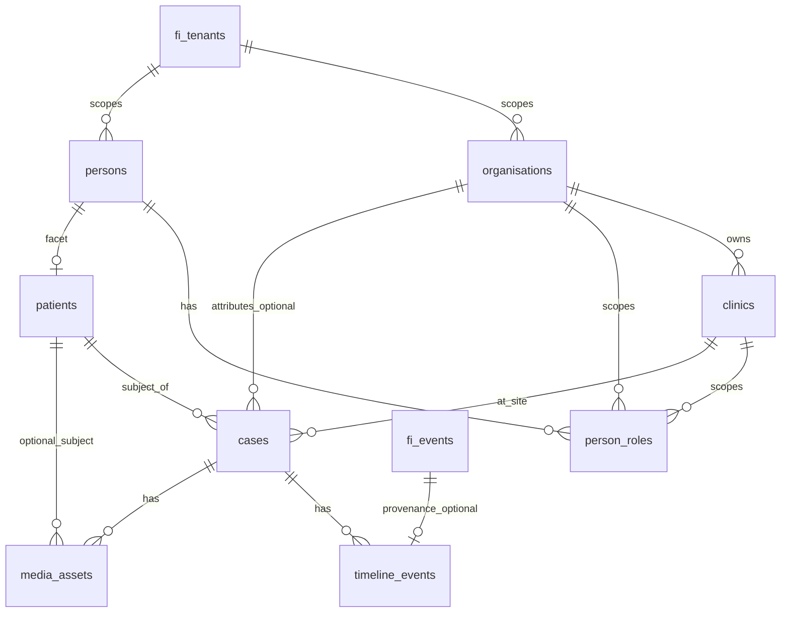

# Follicle Intelligence — Platform Foundation Layer (Architecture Specification)

**Status:** Architecture only — no implementation commitment in this document.  
**Scope:** Unified canonical model for cross-surface identity and structure across HairAudit, HLI, and IIOHR-aligned producers, aligned with FI’s rule that **source systems remain the system of record** (see [01-platform-architecture](./01-platform-architecture.md)).

---

## 1. Source schema review (in-repo + event contracts)

### 1.1 HairAudit (from `FiEventEnvelope` + payloads)

| Concept | Where it appears | Notes |
|--------|------------------|--------|
| Case | `identifiers.source_case_id`, `hairaudit.case.submitted` | Required for case submission handler. |
| Patient / subject | `identifiers.source_patient_id` (optional), `payload.case.*` | Demographics often on case payload (`patient_name`, `email`, `dob`, `sex`, …) when no stable patient id. |
| Doctor | `identifiers.source_doctor_id` | Declared on envelope; **not** persisted to dedicated FI tables today. |
| Clinic | `identifiers.source_clinic_id` | Declared on envelope; **not** persisted to dedicated FI tables today. |
| Media | `hairaudit.images.uploaded` | Typed image rows: `type`, `filename`, `storage_path`, `mime_type`, `size_bytes`. |

Operational HairAudit DB schemas are **not** in this repository; FI only sees **pushed events**.

### 1.2 HLI (from `FiEventEnvelope` + payloads)

| Concept | Where it appears | Notes |
|--------|------------------|--------|
| Case | `identifiers.source_case_id` (required for `hli.intake.submitted`) | Same resolution pattern as HairAudit. |
| Patient | `identifiers.source_patient_id` (optional), `payload.intake.*` | Intake carries **required** `full_name`, `email`, `dob`, `sex` in type contract. |
| Document / media | `hli.document.uploaded` | `document.kind`, `filename`, `storage_path`, optional `mime_type`, `size_bytes`. |

HLI operational schemas are **not** in this repository.

### 1.3 IIOHR

| Concept | In-repo evidence | Notes |
|--------|-------------------|--------|
| Any concrete schema | **None** in this workspace | Referenced in product/marketing copy as methodology, training, and governance alignment. |

**Assumption for this spec:** IIOHR-aligned systems will eventually emit events similar in shape to FI’s model (identifiers + payload) and will introduce concepts such as **training programs**, **review committees**, **methodology versions**, and **review packets**. These map cleanly to **organisations** (program owner / professional body), **person_roles** (reviewer, trainee, committee member), **cases** (review or certification “episode”), **timeline_events** (committee actions, milestones), and **media_assets** (exports, evidence bundles). Until contracts exist, treat IIOHR as a **future `source_system`** (e.g. `iiohr` or `iiohr_program_portal`) with TBD event types.

### 1.4 Overlapping concepts (cross-system)

| Unified concept | HairAudit signal | HLI signal | IIOHR (assumed) |
|-----------------|------------------|-----------|-----------------|
| Human identity | Case payload name/email; optional `source_patient_id` | Intake demographics; optional `source_patient_id` | Person + role in program |
| Episode / audit / intake | `source_case_id` | `source_case_id` | Review or program episode id |
| Site / operator | `source_clinic_id` (envelope) | Same field available | Institution or site |
| Clinician | `source_doctor_id` (envelope) | Same field available | Supervisor / reviewer |
| Files | Images upload event | Document upload event | Packet PDFs, annexes |

---

## 2. Canonical foundation entities (logical model)

Physical tables may keep the `fi_` prefix and existing naming conventions; this section defines **logical** entities requested for the foundation layer.

### 2.1 organisations

**Purpose:** Legal or governance container: clinic groups, enterprise white-label customers, **commercial partners** (see existing `fi_partners`), associations, or standards/program owners (IIOHR-scale).

**Suggested attributes:** `id`, `tenant_id` (FK — all FI rows remain tenant-scoped), `name`, `slug`, `organisation_type` (`clinical_network` | `commercial_partner` | `standards_program` | `internal` | …), `metadata` (jsonb), timestamps.

**Relationship:** Parent of **clinics** (where `clinic.organisation_id` is set); optional many-to-many if a clinic participates in multiple networks (use junction table in a later phase if needed).

### 2.2 clinics

**Purpose:** Operational site (HairAudit “clinic”, HLI-affiliated site). Maps to `identifiers.source_clinic_id` per source system.

**Suggested attributes:** `id`, `tenant_id`, `organisation_id` (nullable during migration), `display_name`, `metadata`, timestamps.

**Source resolution:** Table analogous to today’s conceptual `fi_global_clinic_sources` in [02-canonical-entity-model](./02-canonical-entity-model.md): `(tenant_id, source_system, source_clinic_id)` → `clinic_id`.

### 2.3 persons

**Purpose:** One human across portals and products **within a tenant** (and optionally linked across orgs via strict merge rules). Replaces the narrow “global patient stub” with a broader identity that can represent patients, doctors, and staff.

**Suggested attributes:** `id`, `tenant_id`, optional **PII vault** fields or **pseudonymous** record with PII in encrypted sidecar / omitted by default; `metadata`; timestamps.

**Design note:** Align naming with design doc “global_person” ([02](./02-canonical-entity-model.md)) while code today uses **`fi_global_patients`** ([`20260324000010_fi_events_global_foundation.sql`](../../supabase/migrations/20260324000010_fi_events_global_foundation.sql)) — see Section 7 conflicts.

### 2.4 person_roles

**Purpose:** Binds a **person** to an **organisation** and/or **clinic** with a **role** (`surgeon`, `reviewer`, `staff`, `trainee`, `patient_portal_user`, …), optional validity window, optional `source_system` + external id.

**Suggested attributes:** `id`, `tenant_id`, `person_id`, `organisation_id` (nullable), `clinic_id` (nullable), `role`, `source_system`, `source_person_role_id` (nullable), `starts_at`, `ends_at`, timestamps.

**Constraint:** At least one of `organisation_id` or `clinic_id` should be non-null unless role is purely tenant-global (e.g. tenant admin) — product decision.

### 2.5 patients

**Purpose:** The **care-subject facet** of a person: who longitudinal and clinical intelligence refers to, distinct from “user who logs in” when they differ.

**Suggested attributes:** `id`, `tenant_id`, `person_id` (FK), optional `primary_clinic_id`, `metadata`, timestamps.

**Source resolution:** Migrate the intent of `fi_global_patients` to `(tenant_id, source_system, source_patient_id)` → `patient_id`, with `patient.person_id` populated when identity is known.

### 2.6 cases

**Purpose:** Single **episode** under analysis (HairAudit audit case, HLI intake+case id, future IIOHR review episode). Unifies operational **`fi_cases`** pipeline row and **`fi_global_cases`** source mapping.

**Suggested attributes:** `id`, `tenant_id`, `patient_id` (nullable), `clinic_id` (nullable), `status`, `external_id` / source keys in `metadata` or companion table, timestamps.

**Relationship:** Many **timeline_events**, many **media_assets**; optional FK to **organisation** for attribution (e.g. partner-sponsored case).

### 2.7 timeline_events

**Purpose:** Append-only or insert-only **semantic timeline** for a case (and optionally patient/org): milestones, state transitions, ingest receipts, human review actions.

**Relationship to existing `fi_events`:**

- **Option A (recommended):** `timeline_events` stores **curated** rows with `fi_event_id` nullable FK for provenance; raw ingest remains in `fi_events`.
- **Option B:** Treat `fi_events` as the only append log; expose **`timeline_events` as a view** — fewer writes, weaker support for non-event milestones unless backfilled.

### 2.8 media_assets

**Purpose:** Normalized file metadata across HLI documents and HairAudit images (supersedes/normalizes **`fi_uploads`** variants).

**Suggested attributes:** `id`, `tenant_id`, `case_id` (nullable if org-level), `patient_id` (nullable), `asset_type`, `filename`, `storage_path`, `mime_type`, `size_bytes`, `source_system`, `source_asset_id`, `metadata`, timestamps.

---

## 3. ERD (entity relationship design)

**Cardinality notes**

- **Tenant** remains the isolation root (see Section 5).  
- **Person : Patient:** typically 0..1 **patient** row per person per tenant; multiple rows only if product explicitly supports split identities (not recommended).  
- **Patient : Case:** many cases per patient over time.  
- **Global mapping tables** (not drawn): `patient_source_ids`, `clinic_source_ids`, `person_source_ids`, `case_source_ids` for `(tenant_id, source_system, source_*)` uniqueness.

---

## 4. Supabase migration plan (phased)

All phases are **additive** until a cutover window; destructive drops are out of scope for early phases.

| Phase | Goal | Actions |
|-------|------|--------|
| **P0 — Document & contract freeze** | Align names before DDL | Reconcile `person` vs `patient` vs `fi_global_patients` naming (Section 7); align [03-event-ingestion-design](./03-event-ingestion-design.md) example (`source_person_id`) with code (`source_patient_id`). |
| **P1 — Organisations & clinics** | Persist clinic/doctor graph | Create `fi_organisations`, `fi_clinics`, `fi_clinic_source_mappings`; nullable FKs from `fi_cases` → `fi_clinics` when `source_clinic_id` first resolved. |
| **P2 — Persons & roles** | Doctors and staff first-class | Create `fi_persons`, `fi_person_roles`; backfill from envelope identifiers only where historical events store them in `payload_json` / metadata. |
| **P3 — Patients facet** | Split identity from “global patient stub” | Introduce `fi_patients` (or rename pipeline) linked to `fi_persons`; migrate `fi_global_patients` rows into `fi_patients` + `fi_persons` + mapping table; keep `fi_global_patients` as **view** or compatibility synonym during transition. |
| **P4 — Cases unification** | Single case spine | Add `patient_id`, `clinic_id`, `organisation_id` nullable FKs on `fi_cases`; align `fi_global_cases` to reference new `fi_patients.id` instead of `global_patient_id` **or** keep column but rename FK target via DB view. |
| **P5 — timeline_events** | Operational timeline | New `fi_timeline_events` with optional `fi_event_id`; optional trigger or app-layer writer on ingest. |
| **P6 — media_assets** | Unify uploads | New `fi_media_assets`; dual-write from HLI/HairAudit handlers next to `fi_uploads`; read path switches when stable. |
| **P7 — RLS & policies** | Production hardening | Enable RLS on all new tables (Section 5); service role for ingestion; JWT claims for tenant + role. |

Order **P2 before P3** if doctor/clinic resolution is required for correct patient-clinic association at ingest.

---

## 5. Multi-tenant security model

**Principles**

1. **`tenant_id` is mandatory** on every foundation table (consistent with [01-platform-architecture](./01-platform-architecture.md) and current migrations).
2. **Row Level Security (RLS):** policies restrict `SELECT`/`INSERT`/`UPDATE`/`DELETE` to rows where `tenant_id` matches the authenticated subject’s tenant claim (e.g. JWT custom claim `fi_tenant_id` or Supabase `auth.jwt()` → tenant membership table).
3. **Ingestion path:** server-side **service role** inserts events and foundation rows; it **must** validate `tenant_id` from signed server-to-server credentials, not from unauthenticated client-supplied trust.
4. **Cross-tenant joins:** forbidden in app queries; analytics use **ETL** to a separate warehouse with governance.
5. **Organisation-level sub-tenancy:** if a tenant contains multiple organisations, introduce `fi_user_organisation_memberships` and scope policies `(tenant_id, organisation_id)` — defer until product requires org-scoped admins inside one tenant.
6. **PII:** persons/patients/media hold sensitive data; restrict columns via **views** for analyst roles; audit reads on clinical identifiers.

---

## 6. Backward compatibility strategy

| Artifact | Compatibility approach |
|----------|---------------------------|
| `fi_events` | Unchanged append semantics; optional FK from `fi_timeline_events.fi_event_id`. |
| `fi_event_links` | Keep; extend with nullable `patient_id` / `clinic_id` later **or** derive from resolved case. |
| `fi_global_patients` / `fi_global_cases` | **Do not drop** in early phases; migrate via **dual-write** then **view** or trigger-maintained mirror until all readers use new tables. |
| `fi_intakes` | Retain as denormalized snapshot for pipeline; optional `person_id` / `patient_id` FK added later; ingestion continues to upsert intakes as today (`mapping.ts`). |
| `fi_cases.external_id` | Keep `source_system:source_case_id` convention (`mapping.buildCaseExternalId`). |
| `fi_partners` / `fi_referrals` | Model as **`organisations`** with `organisation_type = commercial_partner` in long term; short term keep table and add nullable `organisation_id` on `fi_partners` when `fi_organisations` exists. |
| Event API | No breaking change to envelope shape; add optional enriched identifiers as sources adopt them. |
| TypeScript types (`src/types/fi.ts`, `fi-events.ts`) | Add parallel types for new entities; deprecate fields gradually. |

---

## 7. Conflicts and gaps vs existing HairAudit / HLI / FI structures

| Topic | Conflict / gap | Resolution direction |
|-------|----------------|----------------------|
| **Person vs patient naming** | Design doc [02](./02-canonical-entity-model.md) specifies `fi_global_persons` + `source_person_id`; implemented table is **`fi_global_patients`** with `source_patient_id` ([migration `20260324000010`](../../supabase/migrations/20260324000010_fi_events_global_foundation.sql)). | Foundation layer uses **`persons`** + **`patients`**; migrate mapping semantics to **`person_source_mappings`** / **`patient_source_mappings`** with a one-time rename plan. |
| **Event schema doc vs DB** | [03](./03-event-ingestion-design.md) shows `global_*` columns on `fi_events`; actual **`fi_events`** has `payload_json` only — resolution lives in **`fi_event_links`**. | Either update doc to match DB **or** add columns in a future migration; avoid two sources of truth for resolution. |
| **Identifier name in JSON example** | Doc uses `source_person_id`; **`FiEventEnvelope`** uses `source_patient_id` (`src/types/fi-events.ts`). | Standardize on one name in API contract; support both during transition if needed. |
| **Clinic / doctor** | Envelope supports `source_clinic_id`, `source_doctor_id` but **no persistence** to global clinic/provider tables. | P1–P2 migrations close the gap. |
| **`fi_cases` evolution** | Early migration embedded patient fields on `fi_cases`; later split to **`fi_intakes`**; `patient_id` column on `fi_cases` **has no `fi_patients` table** in migrations reviewed. | Foundation **`patients`** table gives a real FK target for `patient_id`. |
| **`fi_uploads` drift** | Competing definitions: `kind` enum vs `type` enum ([`20250220000002_fi_cases_uploads.sql`](../../supabase/migrations/20250220000002_fi_cases_uploads.sql) vs [`20250220000003_fi_uploads.sql`](../../supabase/migrations/20250220000003_fi_uploads.sql)). | **`media_assets`** should define one canonical `asset_type` vocabulary; map legacy values in migration. |
| **IIOHR** | No schemas or events in repo. | Add **`iiohr`** (or agreed slug) to `FiSourceSystem` when contracts exist; extend foundation without breaking HLI/HairAudit. |

---

## 8. Data migration roadmap

1. **Inventory** — Export counts: `fi_global_patients`, `fi_global_cases`, `fi_cases`, `fi_intakes`, `fi_uploads`, `fi_events` / `fi_event_links`.  
2. **Clinic/doctor backfill** — Parse `fi_events.payload_json` and `fi_cases.metadata` for any stored `source_clinic_id` / `source_doctor_id`; expect **sparse** data — many rows will have `NULL` until producers send identifiers consistently.  
3. **Person creation** — For each `fi_global_patient`, create `fi_person` + `fi_patient` + mapping row; carry `metadata_json` forward.  
4. **Case linkage** — Set `cases.patient_id` from `fi_global_cases.global_patient_id` via migrated patient ids; preserve `fi_case_id` link.  
5. **Intake alignment** — Optionally link `fi_intakes` to `person_id` by email match **within tenant** (risky); prefer explicit `source_patient_id` path when present.  
6. **Media** — Copy `fi_uploads` → `fi_media_assets` with `asset_type` mapped from legacy `type`/`kind`.  
7. **Timeline** — Insert initial `timeline_events` from historical `fi_events` (`event_type`, `occurred_at`) per case for dashboard continuity.  
8. **Validation** — Row counts, FK integrity, random sample diff on PII fields; rollback = stop dual-write, keep old tables.

---

## 9. Risk assessment

| Risk | Severity | Mitigation |
|------|----------|------------|
| **False merges of persons** (same email, different people) | High | Merge only on strong keys (`source_patient_id` + source_system) or explicit admin merge; never auto-merge on email alone without rules. |
| **PII concentration** | High | Minimize columns on `persons`; encryption at rest; RLS; retention policy; DPIA for EU/UK patients. |
| **Dual-write inconsistency** | Medium | Transactions per ingest; idempotent upserts; reconciliation job. |
| **Performance (RLS + joins)** | Medium | Indexes on `(tenant_id, case_id)`; policy uses indexed expression; avoid N+1 in dashboards. |
| **Partner vs clinical org confusion** | Medium | Clear `organisation_type`; document that `fi_partners` is commercial attribution until merged. |
| **IIOHR unknowns** | Medium | Version foundation schema with `metadata` jsonb and extensible `person_roles.role` enum; avoid hard-coded IIOHR-only columns until contracts exist. |
| **Breaking API for producers** | Low | Additive envelope fields only; coordinate with HairAudit/HLI release notes. |

---

## 10. Deliverables checklist (this document)

| Deliverable | Section |
|-------------|---------|
| ERD | 3 |
| Supabase migration plan | 4 |
| Backward compatibility strategy | 6 |
| Multi-tenant security model | 5 |
| Data migration roadmap | 8 |
| Risk assessment | 9 |
| Conflicts with existing structures | 1, 7 |

---

## 11. Next steps (implementation — out of scope for this task)

1. Socialize **`persons` + `patients`** split with clinical/compliance stakeholders.  
2. Lock **`FiEventEnvelope`** identifier naming (`source_patient_id` vs `source_person_id`).  
3. Produce DDL sketches and RLS policy stubs in a follow-up task.  
4. When IIOHR technical contact is available, append **event catalog** and map to `timeline_events` / `person_roles`.
