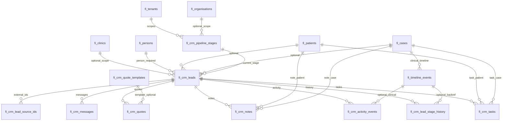

# CRM foundation architecture (Stage 1N)

## Purpose

This document specifies the **first CRM layer** for Follicle Intelligence (FI): a **multi-tenant**, **hair-restoration-aware** CRM/CMS **foundation** that sits on the existing **foundation layer** (persons, patients, cases, timeline, media, branding settings). It is **integration-first**: FI remains the system of record for **CRM semantics inside FI**, while **HubSpot** (or other CRMs) may remain the commercial CRM of record for many tenants until explicit sync is built.

**Non-goals for this stage:**

- No implementation code in this document.
- **Do not** assume a single vendor tenant (e.g. Evolved) is the only operator.
- **Do not** assume all clinics sell the same packages or price lists.
- **Do not** hard-code global pricing; monetary fields are optional and tenant-defined.
- **Do not** replace HubSpot; design for **idempotent mapping** and **eventual consistency** later.

**Goals:**

- Normalised **leads**, **pipeline**, **tasks**, **notes**, **messages**, **quotes** / **quote templates**, and **external lead IDs**.
- Clear **tenant / organisation / clinic** scoping aligned with `fi_tenants`, `fi_organisations`, `fi_clinics` and [14-tenant-configuration-branding.md](./14-tenant-configuration-branding.md) / [16-effective-branding-application.md](./16-effective-branding-application.md).
- **Timeline integration** with `fi_timeline_events` where the clinical record already exists.
- **RLS** and **migration sequencing** suitable for incremental rollout.

---

## Conceptual model

| Concept | Role |
|--------|------|
| **Lead** | Commercial / intake opportunity before or alongside a formal **case**. Anchors CRM activity; may reference `fi_persons` early, then `fi_patients` / `fi_cases` as the journey matures. |
| **Pipeline stage** | Tenant- (and optionally org-) scoped ordered stages; hair-restoration **defaults are seeded**, not enforced globally. |
| **Stage history** | Append-only audit of stage transitions for reporting and sync conflict resolution. |
| **Task** | Work item (call, follow-up, document request) tied to lead and/or case/patient. |
| **Note** | Free-text or structured note; visibility and authorship controlled later via RLS and roles. |
| **Message** | Log of outbound/inbound communications (email/SMS/portal/WhatsApp metadata); body storage policy is TBD (store hash + external ref vs full text). |
| **Quote template** | Reusable **structure** (sections, line item types, consent flags)—**not** a global price list. |
| **Quote** | Instance bound to a lead or case with **snapshot** JSON (optional amounts); status lifecycle independent of HubSpot. |
| **Lead source ID** | Maps external CRM/marketing IDs (`hubspot`, `meta`, `google_ads`, clinic form) to `fi_crm_leads.id`. |

---

## ERD (high level)

**Legend:** relationships reflect proposed FKs; `fi_crm_lead_stage_history` may store `fi_timeline_event_id` when a case-scoped timeline row was created ([Timeline integration](#crm-activity-and-fi_timeline_events)).

---

## Proposed tables (summary)

| Table | Primary purpose |
|-------|-----------------|
| `fi_crm_pipeline_stages` | Ordered stages per tenant (and optionally per organisation / pipeline variant). |
| `fi_crm_leads` | Core CRM entity; links to person/patient/case as available. |
| `fi_crm_lead_stage_history` | Append-only stage transitions. |
| `fi_crm_activity_events` | CRM-native activity stream (including pre-case); optional link to `fi_timeline_events` when a case-scoped clinical row exists. |
| `fi_crm_tasks` | Tasks tied primarily to leads; optional patient/case. |
| `fi_crm_notes` | Notes on lead and/or patient/case. |
| `fi_crm_messages` | Message log (metadata-first; body policy TBD). |
| `fi_crm_quote_templates` | Reusable quote **shape** per tenant/org/clinic. |
| `fi_crm_quotes` | Quote instances with JSON snapshot. |
| `fi_crm_lead_source_ids` | External system → `fi_crm_leads` mapping. |

**Suggested physical migration order** (dependencies):

1. `fi_crm_pipeline_stages` (depends on `fi_tenants`, optional `fi_organisations`)
2. `fi_crm_leads` (depends on tenants, optional org/clinic/person/patient/case, optional current stage)
3. `fi_crm_lead_stage_history` (depends on leads, stages)
4. `fi_crm_activity_events` (depends on leads, optional timeline/patient/case context)
5. `fi_crm_tasks`, `fi_crm_notes`, `fi_crm_messages` (depend on leads + optional patient/case)
6. `fi_crm_quote_templates` (tenant/org/clinic)
7. `fi_crm_quotes` (leads and/or cases, optional template)
8. `fi_crm_lead_source_ids` (leads)

---

## 1. `fi_crm_pipeline_stages`

**Purpose:** Define ordered funnel stages. Hair-restoration **suggested defaults** are **seed data per tenant** (or applied when a tenant opts in), not global application constants.

**Scoping:**

- `tenant_id` (required) → `fi_tenants(id)`.
- `organisation_id` (nullable) → `fi_organisations(id)`; `NULL` means **tenant-wide default** pipeline row set.
- Optional `clinic_id` (nullable) → `fi_clinics(id)` for clinic-specific pipelines later; v1 may keep `clinic_id` null and use org/tenant only.

**Suggested columns:**

| Column | Type | Notes |
|--------|------|--------|
| `id` | uuid PK | |
| `tenant_id` | uuid not null | |
| `organisation_id` | uuid null | Tenant default when null. |
| `clinic_id` | uuid null | Optional finer scope. |
| `pipeline_key` | text not null default `'hair_restoration_default'` | Allows multiple pipelines per scope (e.g. `referrals`, `direct`). |
| `slug` | text not null | Stable machine key: `lead`, `qualified`, … |
| `label` | text not null | Display label; can be overridden per tenant in DB. |
| `sort_order` | int not null | |
| `is_entry` | boolean not null default false | Exactly one entry per (tenant, org?, pipeline_key) enforced in app or partial unique index. |
| `is_won` | boolean not null default false | |
| `is_lost` | boolean not null default false | |
| `metadata` | jsonb not null default `{}` | SLA hints, HubSpot stage id mapping hints (see [HubSpot](#future-hubspot-sync-mapping)). |
| `created_at` / `updated_at` | timestamptz | |

**Uniqueness:** `unique (tenant_id, coalesce(organisation_id, '00000000-0000-0000-0000-000000000000'::uuid), pipeline_key, slug)` — in Postgres prefer **partial unique indexes** or a **generated** `organisation_id_norm` to avoid sentinel UUIDs in application code.

**Default hair restoration pipeline (seed suggestion, not product code):**

| `slug` (example) | Typical meaning |
|------------------|----------------|
| `new` | New inquiry / lead capture |
| `contacted` | First response |
| `qualified` | Fit / intent qualified |
| `consult_scheduled` | Consult booked |
| `consult_completed` | Consult occurred |
| `treatment_planning` | Clinical / graft planning in progress |
| `quote_sent` | Proposal issued (may pair with `fi_crm_quotes`) |
| `deposit_or_booked` | Commitment / surgery date |
| `in_treatment` | Active surgical or medical pathway |
| `won_closed` | Successful closure (non-pejorative; consider `completed` as label) |
| `lost` | Closed lost |
| `nurture` | Long-cycle follow-up |

Tenants may **rename labels**, **reorder**, **add** stages (e.g. trichology-only path), or **add pipelines** via `pipeline_key` without migrations.

---

## 2. `fi_crm_leads`

**Purpose:** Single CRM anchor for a commercial journey; links to foundation identities as they exist.

**Relationships:**

- `tenant_id` (required).
- `organisation_id`, `clinic_id` optional but recommended for white-label routing and reporting.
- **`person_id` is required** (Stage 1O); `patient_id` / `case_id` are optional and populated as the journey matures.
- `current_stage_id` → `fi_crm_pipeline_stages(id)` (nullable until first assignment).
- Optional `primary_owner_user_id` → future `fi_users` or auth reference (nullable in v1).
- Optional `intake_id` / `fi_events` reference later for provenance (not required in v1 schema).

**Suggested columns:**

| Column | Type | Notes |
|--------|------|--------|
| `id` | uuid PK | |
| `tenant_id` | uuid not null | |
| `organisation_id` | uuid null | |
| `clinic_id` | uuid null | |
| `person_id` | uuid not null → `fi_persons` | Required anchor; server creates/links person before insert (see [18-crm-foundation-implementation-checklist.md](./18-crm-foundation-implementation-checklist.md)). |
| `patient_id` | uuid null → `fi_patients` | |
| `case_id` | uuid null → `fi_cases` | When clinical case exists. |
| `current_stage_id` | uuid null → `fi_crm_pipeline_stages` | |
| `status` | text not null default `'open'` | `open`, `converted`, `archived`, … |
| `priority` | text null | Optional enum string. |
| `summary` | text null | Non-PII or minimised headline; detailed PII in notes/messages policy. |
| `metadata` | jsonb not null default `{}` | UTM, campaign, language, service interest codes **without** hard-coded global catalogue. |
| `created_at` / `updated_at` | timestamptz | |

**Indexes:** `(tenant_id, organisation_id, clinic_id, updated_at desc)`, `(tenant_id, patient_id)`, `(tenant_id, case_id)`, `(tenant_id, person_id)` where non-null.

---

## 3. `fi_crm_lead_stage_history`

**Purpose:** Immutable history of stage changes for analytics, audit, and sync.

**Columns:**

| Column | Type | Notes |
|--------|------|--------|
| `id` | uuid PK | |
| `tenant_id` | uuid not null | Denormalised for RLS performance. |
| `lead_id` | uuid not null → `fi_crm_leads` | |
| `from_stage_id` | uuid null | Null on first assignment. |
| `to_stage_id` | uuid not null | |
| `changed_at` | timestamptz not null default now() | |
| `changed_by` | uuid null | Auth user or service principal. |
| `reason` | text null | |
| `source` | text not null default `'user'` | `user`, `system`, `hubspot_sync`, … |
| `fi_timeline_event_id` | uuid null → `fi_timeline_events` | When a timeline row was created (see below). |
| `metadata` | jsonb not null default `{}` | |

**Indexes:** `(lead_id, changed_at desc)`.

---

## 4. `fi_crm_tasks`

**Purpose:** Operational tasks (calls, forms, imaging requests).

**Columns:**

| Column | Type | Notes |
|--------|------|--------|
| `id` | uuid PK | |
| `tenant_id` | uuid not null | |
| `lead_id` | uuid null → `fi_crm_leads` | Primary CRM anchor; may be null only if task is case-only—**open**: require `lead_id` always vs allow case-only tasks. |
| `patient_id` | uuid null | Denormalised convenience. |
| `case_id` | uuid null | |
| `title` | text not null | |
| `description` | text null | |
| `task_type` | text not null default `'follow_up'` | Tenant-extensible string, not global enum table in v1. |
| `status` | text not null default `'open'` | `open`, `done`, `cancelled`. |
| `due_at` | timestamptz null | |
| `completed_at` | timestamptz null | |
| `assignee_user_id` | uuid null | |
| `metadata` | jsonb not null default `{}` | |
| `created_at` / `updated_at` | timestamptz | |

**Relationship rule (design decision):** Prefer **`lead_id` required** whenever the task is CRM-scoped; allow **`case_id` without lead** only for pure clinical tasks—if that split is undesirable, require both `lead_id` and `case_id` once a case exists (stricter, easier RLS).

---

## 5. `fi_crm_notes`

**Purpose:** Free-text or structured notes (clinical + commercial). Visibility layers later.

**Columns:**

| Column | Type | Notes |
|--------|------|--------|
| `id` | uuid PK | |
| `tenant_id` | uuid not null | |
| `lead_id` | uuid null | |
| `patient_id` | uuid null | |
| `case_id` | uuid null | |
| `author_user_id` | uuid null | |
| `visibility` | text not null default `'team'` | `team`, `clinical`, `internal`—semantics enforced in app/RLS later. |
| `body` | text not null | Encryption / redaction TBD. |
| `metadata` | jsonb not null default `{}` | |
| `created_at` / `updated_at` | timestamptz | |

**Constraint:** at least one of `lead_id`, `patient_id`, `case_id` non-null.

---

## 6. `fi_crm_messages`

**Purpose:** Channel-agnostic message log for CRM timeline and future sync.

**Columns:**

| Column | Type | Notes |
|--------|------|--------|
| `id` | uuid PK | |
| `tenant_id` | uuid not null | |
| `lead_id` | uuid null | |
| `patient_id` | uuid null | |
| `case_id` | uuid null | |
| `channel` | text not null | `email`, `sms`, `whatsapp`, `portal`, `phone_log`, … |
| `direction` | text not null | `inbound`, `outbound`. |
| `subject` | text null | |
| `body_preview` | text null | Truncated preview; full body optional. |
| `body_storage_ref` | text null | Pointer to object storage / vault. |
| `external_thread_id` | text null | Provider thread id. |
| `external_message_id` | text null | Idempotency for sync. |
| `sent_at` / `received_at` | timestamptz null | |
| `metadata` | jsonb not null default `{}` | Raw provider payload subset. |
| `created_at` | timestamptz | |

**PII / retention:** document retention classes per tenant; default to **metadata-first** for v1.

---

## 7. `fi_crm_quote_templates`

**Purpose:** Reusable **package structure** for hair restoration (e.g. sections: consultation, procedure, aftercare) **without** global pricing.

**Scoping:** `tenant_id` required; `organisation_id`, `clinic_id` optional for white-label variants (different consent text, different line item groups).

**Columns:**

| Column | Type | Notes |
|--------|------|--------|
| `id` | uuid PK | |
| `tenant_id` | uuid not null | |
| `organisation_id` | uuid null | |
| `clinic_id` | uuid null | |
| `slug` | text not null | Unique per scope. |
| `name` | text not null | |
| `description` | text null | |
| `schema_version` | int not null default 1 | For JSON evolution. |
| `line_items_schema` | jsonb not null default `[]` | Array of `{ code, label, optional, quantity_editable, metadata }` — **no required `unit_price`**. |
| `terms_ref` | text null | Pointer to legal doc / URL in tenant settings, not hard-coded. |
| `metadata` | jsonb not null default `{}` | Locale, currency **hint** only. |
| `created_at` / `updated_at` | timestamptz | |

**Package design:** clinics define their own templates; some may share org-level templates. Amounts on **quotes** (instances), not templates.

---

## 8. `fi_crm_quotes`

**Purpose:** Issued proposal bound to a lead or case with **snapshot** for immutability after send.

**Columns:**

| Column | Type | Notes |
|--------|------|--------|
| `id` | uuid PK | |
| `tenant_id` | uuid not null | |
| `lead_id` | uuid null → `fi_crm_leads` | |
| `case_id` | uuid null → `fi_cases` | When quote is clinical-case-scoped. |
| `quote_template_id` | uuid null → `fi_crm_quote_templates` | |
| `status` | text not null default `'draft'` | `draft`, `sent`, `accepted`, `rejected`, `expired`. |
| `currency` | text null | ISO 4217; optional. |
| `line_items_snapshot` | jsonb not null default `[]` | Copy of structure + **optional** `unit_amount`, `total` filled at issuance. |
| `subtotal_amount` | numeric null | Optional; tenant may omit entirely. |
| `total_amount` | numeric null | Optional. |
| `valid_until` | timestamptz null | |
| `sent_at` / `responded_at` | timestamptz null | |
| `metadata` | jsonb not null default `{}` | |
| `created_at` / `updated_at` | timestamptz | |

**Constraint:** at least one of `lead_id`, `case_id` non-null.

---

## 9. `fi_crm_lead_source_ids`

**Purpose:** Same pattern as `fi_person_source_ids` / `fi_patient_source_ids`: map external lead keys to `fi_crm_leads`.

**Columns:**

| Column | Type | Notes |
|--------|------|--------|
| `id` | uuid PK | |
| `tenant_id` | uuid not null | |
| `lead_id` | uuid not null → `fi_crm_leads` | |
| `source_system` | text not null | e.g. `hubspot`, `meta_lead_ads`, `typeform`, `clinic_site`. |
| `source_lead_id` | text not null | External primary key. |
| `created_at` | timestamptz | |

**Uniqueness:** `unique (tenant_id, source_system, source_lead_id)`.

---

## CRM activity and `fi_timeline_events`

Today, `fi_timeline_events` requires **`case_id` not null** (see `20260605140007_fi_timeline_events.sql`). CRM activity often exists **before** a case exists.

**Recommended approach (phased):**

1. **Phase A (foundation-aligned):** When `fi_crm_leads.case_id` is set, a CRM service **dual-writes** curated timeline rows, e.g. `event_kind` values such as `crm.lead.stage_changed`, `crm.quote.sent`, `crm.task.completed`, with `detail` JSON containing `lead_id`, `quote_id`, etc., and `fi_event_id` null unless tied to ingest.
2. **Phase B (optional schema):** If product requires clinical timeline before case creation, a separate migration could add **`fi_crm_activity_events`** (tenant-scoped, lead-scoped, no case) **or** relax `fi_timeline_events.case_id` to nullable with strict RLS—**higher risk** to existing consumers; prefer a dedicated CRM activity stream until requirements are clear.

**Link:** `fi_crm_lead_stage_history.fi_timeline_event_id` set when a matching `fi_timeline_events` row is created (Phase A only).

---

## Future HubSpot sync mapping

| HubSpot concept | FI target | Notes |
|-----------------|-----------|--------|
| Contact / Lead id | `fi_crm_lead_source_ids` | `source_system = 'hubspot'`, `source_lead_id` = HubSpot object id. |
| Deal pipeline + stage | `fi_crm_pipeline_stages.metadata` | Store `hubspot_pipeline_id` / `hubspot_stage_id` on stage rows **per tenant** mapping table optional later. |
| Deal → case | `fi_crm_leads.case_id` | Manual or rule-based when surgical case opens. |
| Deal property changes | `fi_crm_lead_stage_history` + optional timeline | Inbound sync appends history with `source = 'hubspot_sync'`. |
| Notes / emails | `fi_crm_notes` / `fi_crm_messages` | Idempotent on `external_message_id`. |
| Quotes | `fi_crm_quotes` | HubSpot “quotes” may map to snapshot + status only. |

**Conflict policy (open):** last-writer-wins vs source-priority (HubSpot vs FI) per field group—document in sync spec later, not in v1 migrations.

---

## Multi-tenant and white-label

- All CRM tables carry **`tenant_id`**; org/clinic nullable columns align with [14-tenant-configuration-branding.md](./14-tenant-configuration-branding.md) cascade for **UI**, not for row security alone.
- **Branding** for portals/CMS is read from `fi_tenant_settings` / `fi_organisation_settings` / `fi_clinic_settings`; CRM rows reference org/clinic for **routing** (which team owns the lead) and **reporting**.
- **No single-tenant assumptions** in seeds: apply default pipeline seeds **per tenant** when the tenant is provisioned or when CRM module is enabled.
- **Package diversity:** quote templates are scoped and editable per clinic/org; no shared global `packages` table with fixed prices.

---

## RLS strategy (intent)

Mirror foundation pattern ([06-foundation-layer-architecture.md](./06-foundation-layer-architecture.md)):

- **`authenticated`:** `SELECT` (and later scoped `INSERT`/`UPDATE`) where `fi_users.auth_user_id = auth.uid()` and `fi_users.tenant_id` matches row `tenant_id`, with optional org/clinic membership checks when those columns exist.
- **No broad authenticated write in v1** unless product adds tenant-admin roles; initial writes may be **service_role** + server actions (same trust model as [15-configuration-admin-editing.md](./15-configuration-admin-editing.md)).
- **`service_role`:** bypass for ingestion, sync workers, and FI Admin tools.
- **Sensitive tables:** `fi_crm_notes`, `fi_crm_messages` may warrant stricter policies or column-level encryption later.

**Indexes for RLS:** denormalised `tenant_id` on all CRM tables to simplify policies and avoid extra joins where possible.

---

## Migration sequencing (concrete)

| Order | Migration topic | Depends on |
|-------|-----------------|------------|
| 1 | `fi_crm_pipeline_stages` | `fi_tenants`, `fi_organisations`, `fi_clinics` (existing) |
| 2 | Lazy default pipeline stages for a tenant (application / Stage 3 helpers), **not** a blanket migration across all tenants | 1 |
| 3 | `fi_crm_leads` | 1, `fi_persons`, `fi_patients`, `fi_cases` |
| 4 | `fi_crm_lead_stage_history` | 3, 1 |
| 5 | `fi_crm_activity_events` | 3, `fi_timeline_events` (optional FK) |
| 6 | `fi_crm_tasks`, `fi_crm_notes`, `fi_crm_messages` | 3 |
| 7 | `fi_crm_quote_templates` | existing tenant/org/clinic |
| 8 | `fi_crm_quotes` | 7, 3, `fi_cases` |
| 9 | `fi_crm_lead_source_ids` | 3 |
| 10 | Optional: trigger or app-layer **timeline dual-write** when `case_id` present | `fi_timeline_events` |

Pipeline seeding is superseded by lazy tenant seeding per docs/design/18-crm-foundation-implementation-checklist.md.

Avoid circular FKs: `fi_timeline_events` must not require `fi_crm_*` in v1.

---

## Relationship to `fi_media_assets`

Not a separate CRM table in this list: **attach CRM context via metadata** on `fi_media_assets` (e.g. `lead_id` in `metadata`) **or** add a nullable `lead_id` FK to `fi_media_assets` in a **later** migration once CRM is stable. Prefer **metadata first** to avoid churn on a hot table.

---

## Risks and open questions

1. **`fi_timeline_events.case_id` NOT NULL:** ~~How to represent pre-case CRM activity~~ — **resolved in [18-crm-foundation-implementation-checklist.md](./18-crm-foundation-implementation-checklist.md):** use **`fi_crm_activity_events`** for pre-case activity; timeline dual-write when `case_id` exists.
2. **Lead identity invariant:** ~~Whether to require `person_id`~~ — **resolved in doc 18:** **`person_id` required**; create/link person on lead creation.
3. **Task model:** ~~Whether tasks must always have `lead_id`~~ — **resolved in doc 18:** **`lead_id` NOT NULL**; optional `patient_id` / `case_id`.
4. **Message body storage:** Vault vs DB vs provider-only reference; retention and cross-border residency.
5. **HubSpot as SoR:** Which fields are read-only in FI vs writable; conflict resolution and delete/tombstone rules.
6. **RLS complexity:** Org/clinic sub-roles vs flat tenant membership for CRM writes.
7. **Performance:** High-volume message sync may need partitioning or archive tables later.
8. **Quote amounts:** If `numeric` is used, precision/rounding rules per currency—tenant-level config later.

---

## Related documents

- [06-foundation-layer-architecture.md](./06-foundation-layer-architecture.md) — foundation ERD and principles.
- [14-tenant-configuration-branding.md](./14-tenant-configuration-branding.md) — settings cascade.
- [15-configuration-admin-editing.md](./15-configuration-admin-editing.md) — admin mutation pattern.
- [16-effective-branding-application.md](./16-effective-branding-application.md) — FI Admin branding.
- [18-crm-foundation-implementation-checklist.md](./18-crm-foundation-implementation-checklist.md) — Stage 1O: phased checklist and locked CRM implementation decisions.

---

## Document status

**Stage 1N — design only.** Implementation should follow [18-crm-foundation-implementation-checklist.md](./18-crm-foundation-implementation-checklist.md); remaining open questions are listed above where not superseded by Stage 1O.
