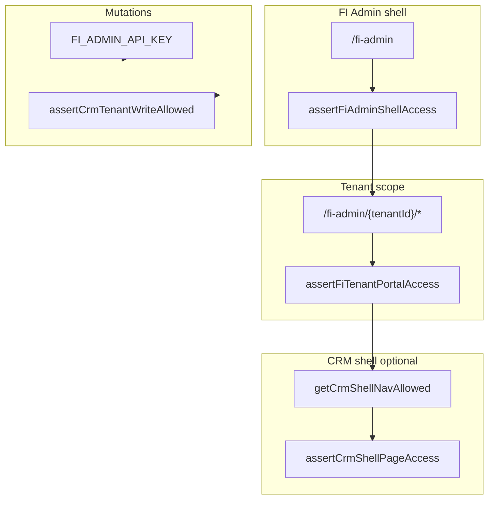

# FI OS — current state audit and dashboard roadmap

**Status:** design / audit only — do not treat as implementation spec for code changes until reviewed.

**Note on numbering:** This document shares the `19-` prefix with `19-booking-calendar-foundation.md` (bookings/calendar domain). Rename later if the design index should stay strictly unique.

---

## Executive summary

The Follicle Intelligence **FI Admin** surface today is a single Next.js app segment under `/fi-admin`, with **tenant-scoped** routes under `/fi-admin/[tenantId]/*`. Access is layered: **shell** (`assertFiAdminShellAccess`), **tenant portal** (`assertFiTenantPortalAccess`), optional **CRM shell** (`assertCrmShellPageAccess` / `getCrmShellNavAllowed`), and **mutations** gated by **`FI_ADMIN_API_KEY`** and/or **`assertCrmTenantWriteAllowed`** (admin key or specific `fi_users.role` values). Foundation tables use **conservative RLS** (tenant-member `SELECT` only for most foundation entities), including **`fi_cases`** (tenant-member `SELECT` for `authenticated`; case writes use **service role** on the server behind explicit gates). The same service-role pattern applies to foundation org/clinic creation and settings upserts.

**Stable foundation (do not regress):** tenant/org/clinic creation and configuration flows, directory search, cases index filters and loaders, foundation integrity read model, `FI_ADMIN_API_KEY` behaviour, CRM gate policy constants, and existing RLS posture.

**Gaps for a “daily clinic” product:** no dedicated **home** route per tenant; several APIs (e.g. audit queue) trust **caller-provided `tenant_id`** without mirroring the layout’s auth checks.

---

## 1. Routes

### 1.1 App routes under `/fi-admin/[tenantId]`

There is **no** `app/.../fi-admin/[tenantId]/page.tsx` — the default entry after picking a tenant is **`/fi-admin/[tenantId]/cases`** (links from `/fi-admin`).

| Route | Purpose | Primary user | Read / write | Data touched (high level) | Admin-only vs daily workflow |
| --- | --- | --- | --- | --- | --- |
| `/fi-admin/[tenantId]/cases` | Cases worklist: search, filters, pagination, links to detail and first-case wizard | Tenant member (portal) | Read via server loaders (`supabaseAdmin`); no writes on page | `fi_cases`, extensions (patients, clinics, orgs, CRM hints per loaders) | **Daily** candidate; today still “FI Admin” chrome |
| `/fi-admin/[tenantId]/cases/new` | First patient / first case wizard (clinic + person fields + case) | Tenant member | Read clinics list; **write** via `createFirstPatientCaseWizardAction` using **`assertCrmTenantWriteAllowed`** (signed-in `fi_admin` / `admin` / `crm_operator`, or optional **`FI_ADMIN_API_KEY`**) | `fi_persons`, `fi_patients`, `fi_cases`, `fi_timeline_events` | **Clinical / CRM staff** with mutation role; optional admin key override in UI |
| `/fi-admin/[tenantId]/cases/[caseId]` | Case profile: readiness, timeline, surgery plan, procedure day, post-op, patches | Tenant member | Read loaders; writes via server actions using **`assertCrmTenantWriteAllowed`** (admin key **or** `fi_admin` / `admin` / `crm_operator` role) | `fi_cases`, `fi_intakes`, foundation joins, `fi_case_surgery_plans`, `fi_case_procedures`, `fi_case_post_op_tracking`, `fi_case_follow_ups`, timeline extras | **Mixed** — clinical ops want it; sensitive fields and keys confuse normal users |
| `/fi-admin/[tenantId]/cases/[caseId]/summary` | Printable / summary document view | Tenant member | Read | Same as case detail | **Daily** candidate (read-only) |
| `/fi-admin/[tenantId]/audit` | HairAudit-style **audit queue** list (client fetch) | Tenant member | Read (`/api/fi/audit/queue?tenant_id=`) | `fi_reports`, `fi_intakes` | **Auditor / internal**; queue API has **no auth check** (see gaps) |
| `/fi-admin/[tenantId]/audit/[reportId]` | Report approve/reject workflow | Tenant member | Read + POST to FI audit APIs | `fi_reports`, audits | **Auditor / internal** |
| `/fi-admin/[tenantId]/directory` | Foundation directory search + **create org/clinic** tools | Tenant member | Read search; **writes** gated by **`FI_ADMIN_API_KEY`** | `fi_organisations`, `fi_clinics`, search across persons/patients/cases | **Directory search**: can become **daily**; **org/clinic creation** stays **admin-only** |
| `/fi-admin/[tenantId]/configuration` | Tenant / org / clinic **settings & branding** editor + preview | Tenant member | Read overview; **writes** via **`FI_ADMIN_API_KEY`** | `fi_tenant_settings`, `fi_organisation_settings`, `fi_clinic_settings` | **Branding preview** useful broadly; **raw settings + API key** remain **admin-only** |
| `/fi-admin/[tenantId]/foundation-integrity` | Metrics / integrity view for dual-write and foundation coverage | Tenant member | Read (panel + optional API) | Integrity metrics over events, globals, foundation tables | **Internal / owner**; optional read-only tile on a future home |
| `/fi-admin/[tenantId]/patients` | Patient directory (filters) | **Bookings operator session** (`getBookingsOperatorPageSession`: CRM shell roles **or** `member` with active `fi_staff`) | Read | `fi_patients`, persons metadata, etc. | **Clinical / scheduling** staff |
| `/fi-admin/[tenantId]/patients/[patientId]` | Universal patient + profile tabs | Same bookings-operator gate | Read; writes via patient actions + admin key / CRM roles | `fi_patients`, `fi_patient_clinical_details`, `fi_patient_images`, … | **Clinical / CRM** staff |
| `/fi-admin/[tenantId]/crm` | CRM leads index, pipeline, create lead | **CRM shell** (`getCrmShellPageSession` / `fi_users.role` in CRM shell set) | Read + CRM actions | `fi_crm_leads`, stages, etc. | **CRM operators** |
| `/fi-admin/[tenantId]/crm/leads/[leadId]` | Lead detail | Same CRM shell gate | Read + mutations | CRM tables | **CRM operators** |
| `/fi-admin/[tenantId]/bookings` | Bookings operator UI | **Bookings operator session** (same predicate as PatientOS layout) | Read + booking actions | `fi_bookings` | **Front-desk / scheduling** |
| `/fi-admin/[tenantId]/calendar` | Calendar view over bookings | **Bookings operator session** for operator flows; nav visibility may differ by chrome | Read | `fi_bookings` | **Front-desk / scheduling** |
| `/fi-admin/[tenantId]/system-status` | System / integration readiness | Same CRM shell gate | Read | Loader-defined | **Owner / admin** |

**Primary nav (tenant layout):** `FiAdminTenantNav` (legacy dark bar) or **`ClinicOsShell`** when `NEXT_PUBLIC_FI_CLINIC_OS_SHELL=true` at build time (`app/(fi-admin)/fi-admin/[tenantId]/layout.tsx`, `src/lib/fiAdmin/clinicOsShellConfig.ts`). Both enumerate FI OS modules; **LeadFlow** and some ClinicOS links require CRM or bookings-board flags from `crmShellAccess.ts`. **FoundationOS** is a first-class module (not nested under Settings). **Settings** holds Staff (when eligible), Services, Configuration, Reminders.

Global search (⌘K / Ctrl+K in shell) calls **`GET /api/tenants/[tenantId]/clinic-os/global-search`**, which requires the same shell flag and production tenant-portal checks — see `docs/fi-os-access-production.md`.

### 1.2 `/cases`, `/crm`, `/patients` at app root

- **`/cases`:** **Not present** as a top-level App Router route. Case UX lives under **`/fi-admin/[tenantId]/cases`**.
- **`/crm`:** **Not present** at root. CRM is **`/fi-admin/[tenantId]/crm`** (gated).
- **`/patients`:** **Not present** at root. Patients are **`/fi-admin/[tenantId]/patients`** (gated).

### 1.3 `/fi/[tenantId]/...` (future “clinic app”)

- **No** `app/fi/...` routes in the repository today. Any “FI Home” under `/fi/[tenantId]/home` would be **net-new**.

### 1.4 `/api/tenants` and `/api/tenants/[tenantId]/*`

| Area | Example routes | Purpose | Auth / gate pattern |
| --- | --- | --- | --- |
| Tenant list | `GET /api/tenants` | FI Admin home: tenants for session (or dev fallback) | `resolveFiAdminTenantDirectory` |
| Clinic OS global search | `GET /api/tenants/[tenantId]/clinic-os/global-search` | Workspace search (shell); patients/cases/leads | `NEXT_PUBLIC_FI_CLINIC_OS_SHELL` + `checkFiTenantPortalApiAccess` (production) |
| Foundation integrity | `GET /api/tenants/[tenantId]/foundation-integrity` | JSON metrics | Service role; tenant existence check only (no user gate in handler) |
| Cases | `.../cases`, `.../cases/[caseId]`, `submit`, `run-model`, `uploads` | Case CRUD / pipeline | Per-route (see handlers); often service role |
| CRM | `.../crm/pipeline-stages`, `.../crm/leads`, nested lead notes/tasks/comms/convert/activity/stage/messages | CRM REST surface | **`assertCrmTenantReadAllowed` / `assertCrmTenantWriteAllowed`** + optional admin key extraction |
| Patients | `.../patients/[patientId]`, `clinical-details`, `images`, … | Patient API | CRM gate patterns |
| Bookings | `.../bookings`, `.../bookings/[bookingId]`, cancel, complete | Bookings API | CRM write gate |
| Other | `seed`, `tick-jobs` | Ops / jobs | Treat as **internal** |

**Implication:** Tenant APIs are the **preferred** integration surface for future dashboards that need JSON; new UI should call **existing gated** patterns or add **new routes** that reuse `crmGate` / portal checks — do not weaken existing handlers.

### 1.5 Other relevant FI APIs (outside `/api/tenants`)

- **`/api/fi/audit/queue`** — audit backlog list (**tenant_id** query param, service role, **no session verification** in route).
- **`/api/fi/cases`**, **`/api/fi/uploads`**, **`/api/fi/events`**, partners, report, submit, run-model — legacy / cross-product FI endpoints (keep stable; not the focus of this audit).

---

## 2. Database tables (FI OS–relevant)

Legend: **tenant_id** = row scoped to `fi_tenants.id` where applicable. **RLS** summarised from migrations; service role bypasses RLS.

### 2.1 Tenants and membership

| Table | Columns (core) | Required / constraints | tenant_id | RLS / writes | UI creation |
| --- | --- | --- | --- | --- | --- |
| `fi_tenants` | `id`, `name`, `slug`, timestamps | `name`, `slug` unique | N/A (root) | Not covered by foundation RLS file | SQL / ops; not FI Admin UI |
| `fi_users` | `id`, `tenant_id`, `auth_user_id`, `email`, `role` | Unique `(tenant_id, auth_user_id)` | FK | Legacy table; portal checks use service role | Provisioning outside this shell |

### 2.2 Organisations and clinics

| Table | Columns (core) | tenant_id | RLS | UI creation |
| --- | --- | --- | --- | --- |
| `fi_organisations` | `id`, `tenant_id`, `name`, `slug`, `organisation_type`, `metadata`, timestamps | Yes | Authenticated **SELECT** only (member) | **Directory** + `createFiOrganisationAction` (**admin key**) |
| `fi_clinics` | `id`, `tenant_id`, `organisation_id`, `display_name`, `metadata`, timestamps | Yes | Same | **Directory** + `createFiClinicAction` (**admin key**) |
| `fi_clinic_source_ids` | Maps external clinic ids | Yes | SELECT member | No dedicated UI |

### 2.3 Settings (branding / operational)

| Table | Columns (core) | tenant_id | RLS | UI creation |
| --- | --- | --- | --- | --- |
| `fi_tenant_settings` | Branding + `default_timezone` + `metadata` | Yes | SELECT member; **no** authenticated INSERT/UPDATE in migration | Upsert via **`upsertTenantSettingsAction`** (**admin key**) |
| `fi_organisation_settings` | Branding + `website_url`, etc. | Yes | SELECT member | **`upsertOrganisationSettingsAction`** |
| `fi_clinic_settings` | `display_name`, URLs, phone, email, address, timezone, `metadata` | Yes | SELECT member | **`upsertClinicSettingsAction`** |

### 2.4 Persons and patients

| Table | Columns (core) | tenant_id | RLS | UI creation |
| --- | --- | --- | --- | --- |
| `fi_persons` | `id`, `tenant_id`, `metadata` (PII in metadata in wizard) | Yes | SELECT member | Wizard, CRM lead creation, APIs |
| `fi_person_source_ids` | External person map | Yes | SELECT member | Ingest / API |
| `fi_person_roles` | Staff roles facet | Yes | SELECT member | Not exposed in audited pages |
| `fi_patients` | `person_id`, `primary_clinic_id`, `metadata`, **`patient_status`**, **`admin_note`** | Yes | SELECT member | Wizard; CRM conversion; patient admin actions |
| `fi_patient_source_ids` | External patient map | Yes | SELECT member | Ingest |

### 2.5 Cases and intakes

| Table | Columns (core) | tenant_id | RLS | UI creation |
| --- | --- | --- | --- | --- |
| `fi_cases` | `patient_id` (legacy), `status` (**includes `consultation`**), `metadata`, **`clinic_id`**, **`organisation_id`**, **`foundation_patient_id`**, **`treatment_type`**, **`planning_notes`**, `latest_report_id`, `partner_id`, … | Yes | **RLS:** tenant-member `SELECT` for `authenticated`; DML via **service_role** routes / ingestion | Ingest, APIs, first-case wizard, CRM flows |
| `fi_intakes` | PII intake per case | Yes | Legacy | Intake flows |

### 2.6 CRM

| Table | Role | tenant_id | RLS (typical) | UI |
| --- | --- | --- | --- | --- |
| `fi_crm_pipeline_stages` | Funnel definition | Yes | CRM migrations | CRM shell |
| `fi_crm_leads` | Commercial anchor | Yes | SELECT member + service DML | CRM shell |
| `fi_crm_lead_stage_history` | Stage audit | Yes | Append via server | CRM |
| `fi_crm_activity_events` | CRM activity | Yes | CRM RLS pattern | CRM |
| `fi_crm_tasks` | Tasks | Yes | CRM | CRM |
| `fi_crm_notes` | Notes | Yes | CRM | CRM |
| `fi_crm_messages` | Message log metadata | Yes | CRM | CRM |
| `fi_crm_lead_communications` | Contact log | Yes | SELECT member; service DML | CRM |
| `fi_crm_quote_templates`, `fi_crm_quotes` | Quotes | Yes | CRM | Mostly future |
| `fi_crm_lead_source_ids` | External lead ids | Yes | CRM | API |

### 2.7 Timeline / events / media

| Table | Role | tenant_id | RLS | UI |
| --- | --- | --- | --- | --- |
| `fi_timeline_events` | Curated case timeline | Yes | SELECT member | Case detail; wizard |
| `fi_events` | Raw ingest | Yes | Legacy ingest | Integrity / backfill |
| `fi_event_links` | Event to global/case links | Yes | Ingest | Integrity |
| `fi_global_patients`, `fi_global_cases` | Legacy global resolution | Yes | Ingest | Integrity / directory |
| `fi_media_assets` | Normalised file metadata | Yes | SELECT member | Integrity / future |

### 2.8 Bookings

| Table | Role | tenant_id | RLS | UI |
| --- | --- | --- | --- | --- |
| `fi_bookings` | Scheduled appointments | Yes | SELECT member; **INSERT/UPDATE/DELETE service_role only** | Bookings + calendar pages (CRM shell) |

### 2.9 Patient clinical / images / case extensions

| Table | Role | tenant_id | RLS | UI |
| --- | --- | --- | --- | --- |
| `fi_patient_clinical_details` | Structured clinical summary | Yes | SELECT member; writes service | Patient profile |
| `fi_patient_images` | Image metadata + storage path | Yes | RLS in migration | Patient profile |
| `fi_case_surgery_plans` | One row per case | Yes | Service writes via actions | Case detail |
| `fi_case_procedures` | Procedure day | Yes | Service writes | Case detail |
| `fi_case_post_op_tracking`, `fi_case_follow_ups` | Post-op | Yes | Service writes | Case detail |

### 2.10 Platform identities

| Table | Role | tenant_id | RLS | UI |
| --- | --- | --- | --- | --- |
| `fi_os_identities` | `auth_user_id` → `os_role` (`fi_admin`, `fi_auditor`, `fi_clinic_admin`, …) | N/A | **RLS enabled; no client policies** | Server-only; cross-tenant directory in prod |

### 2.11 Audits / reports (HairAudit lineage)

| Table | Role | tenant_id | Notes |
| --- | --- | --- | --- |
| `fi_reports`, related audits | Report queue | Yes | Used by audit queue UI and APIs |

---

## 3. Server actions and APIs (classification)

### 3.1 Foundation bootstrap and configuration

| Action / API | Stable | Incomplete | Admin-only | Safe to reuse | Do not touch casually |
| --- |:---:|:---:|:---:|:---:|:---:|
| `createFiOrganisationAction`, `createFiClinicAction` | ✅ | | ✅ (admin key) | ✅ (new flows call same) | Changing gates or validation |
| `upsertTenantSettingsAction`, `upsertOrganisationSettingsAction`, `upsertClinicSettingsAction` | ✅ | | ✅ (admin key) | ✅ | Same |
| `backfillFoundationFromProcessedEventsAction` | ✅ | | ✅ | ✅ read path only | Backfill semantics |
| `GET /api/tenants`, tenant directory resolution | ✅ | | | ✅ | |

### 3.2 Cases and clinical extensions

| Action | Stable | Incomplete | Admin-only | Safe to reuse | Notes |
| --- |:---:|:---:|:---:|:---:|:---|
| `createFirstPatientCaseWizardAction` | ⚠️ new / wizard | Partial UX | Key **or** CRM roles (`assertCrmTenantWriteAllowed`) | ✅ | Do not remove rollback of person/patient on case failure |
| `updateCaseProfileAction` | ✅ | | Key **or** CRM roles | ✅ | Uses `assertCrmTenantWriteAllowed` |
| `upsertCaseSurgeryPlanningAction`, `upsertCaseProcedureDayAction`, post-op actions | ✅ | | Key **or** CRM roles | ✅ | Same gate |

### 3.3 CRM

| `fi-crm-actions` (all exports) | ✅ | | Key **or** `fi_admin` / `admin` / `crm_operator` | ✅ | CRM HTTP routes mirror schemas |

### 3.4 Patients and media

| `updatePatientAdminDetailsAction`, clinical, image actions | ✅ | | Same CRM write gate | ✅ | |

### 3.5 Bookings

| `createBookingAction`, `updateBookingAction`, `cancelBookingAction`, `completeBookingAction` | ✅ | | CRM write gate | ✅ | |

### 3.6 Auth shell

| `fiOsPasswordSignInAction`, reset, sign-out | ✅ | | | ✅ | Portal entry |

### 3.7 Misc

| `getTenant` | ✅ | | | ✅ | Simple read |

---

## 4. Current UX audit (screens)

### 4.1 FI Admin landing (`/fi-admin`)

| Dimension | Observation |
| --- | --- |
| Understandable | Yes: pick a tenant. |
| Confusing | Production vs dev messaging is dense but accurate. |
| Missing | No “home” or onboarding checklist per tenant. |
| Hide from clinic users? | Whole shell is **internal** branding today; future **clinic app** should not expose raw tenant list without role rules. |

### 4.2 Directory

| Dimension | Observation |
| --- | --- |
| Understandable | Search across entities is clear for operators. |
| Confusing | Mix of **read-only** search and **powerful** org/clinic creation in one page. |
| Missing | No patient/case **create** here (by design — wizard elsewhere). |
| Hide from clinic users? | **Search** can be daily; **foundation writes** should stay elevated. |

### 4.3 Configuration

| Dimension | Observation |
| --- | --- |
| Understandable | Branding preview is strong. |
| Confusing | **`FI_ADMIN_API_KEY`** per save is not a clinic-user pattern. |
| Missing | Role-based “view branding only” mode. |
| Hide from clinic users? | **Full page** mostly **admin**; preview could be extracted. |

### 4.4 Foundation integrity

| Dimension | Observation |
| --- | --- |
| Understandable | For engineers / operators. |
| Confusing | High domain jargon (events, globals, dual-write). |
| Missing | None for its intended audience. |
| Hide from clinic users? | **Yes** (or show a single health score on home). |

### 4.5 Cases (index + detail + summary)

| Dimension | Observation |
| --- | --- |
| Understandable | Index is a workable worklist; detail is rich. |
| Confusing | Multiple panels and admin-key fields for mutations. |
| Missing | Guided “next step” for new clinics; **home** entry. |
| Hide from clinic users? | **Index + read-only case** = daily; **integrity-style** subpanels optional. |

### 4.6 Audit queue

| Dimension | Observation |
| --- | --- |
| Understandable | Simple table. |
| Confusing | Unclear who may approve; **API trust** not obvious. |
| Missing | Authz on `/api/fi/audit/queue` aligned with portal. |
| Hide from clinic users? | **Yes** for queue management; auditors only. |

### 4.7 CRM shell (patients, CRM, bookings, calendar, system status)

| Dimension | Observation |
| --- | --- |
| Understandable | Operators with CRM training. |
| Confusing | Hidden nav unless role allows — good, but no in-app explanation when missing. |
| Missing | “Ask admin for CRM role” empty state from Cases. |
| Hide from clinic users? | **Partially** — bookings/calendar might become daily for reception. |

### 4.8 First case wizard (`/cases/new`)

| Dimension | Observation |
| --- | --- |
| Understandable | Step flow is clear; create uses session + CRM mutation role, with optional admin key under “Advanced”. |
| Confusing | (Reduced) staff need the correct `fi_users.role` or they see the standard CRM write denial. |
| Missing | Optional CRM lead creation link; post-create checklist. |
| Hide from clinic users? | Useful for **fi_admin** / **admin** / **crm_operator** without pasting `FI_ADMIN_API_KEY`. |

---

## 5. Proposed safe build structure (design only)

### 5.A FI Home Dashboard

**Route options (pick one in implementation phase 0):**

1. **`/fi-admin/[tenantId]`** — add `page.tsx` as dashboard (minimal route churn; keeps one shell).
2. **`/fi-admin/[tenantId]/home`** — explicit home subpath; default redirect from `/fi-admin/[tenantId]` later.
3. **`/fi/[tenantId]/home`** — new clinic-facing segment; requires new layout, auth mirror, and nav strategy.

**Suggested sections (all can start as read-only compositions of existing loaders):**

1. **Setup progress** — counts from existing data: orgs, clinics, settings rows, first case, CRM stages seeded.
2. **Recommended next action** — rule-based (e.g. “Create clinic”, “Complete branding”, “Open first case”).
3. **Today’s activity** — placeholder → later: bookings + CRM activity query.
4. **Patients** — placeholder → deep link to `/patients` if role allows.
5. **Cases** — shallow stats + link to existing cases index (**do not** duplicate filter logic).
6. **Bookings** — placeholder → link to bookings/calendar for CRM shell roles.
7. **Tasks** — placeholder → CRM tasks API when ready.

### 5.B First patient / first case workflow

**Current implementation path:** `/fi-admin/[tenantId]/cases/new` + `FirstCaseWizardClient` + `createFirstPatientCaseWizardAction`.

**Authorisation:** same as other clinical writes — `assertCrmTenantWriteAllowed` (tenant member with `fi_admin`, `admin`, or `crm_operator`, or valid optional `FI_ADMIN_API_KEY`).

**Target flow (steps):**

1. Select clinic (from `fi_clinics` for tenant).
2. Create `fi_person` (+ metadata).
3. Create `fi_patients` (+ `primary_clinic_id`).
4. Create `fi_cases` (+ foundation FKs, `treatment_type`, `status`).
5. Optional `fi_timeline_events` row.
6. Navigate to **`/fi-admin/[tenantId]/cases/[caseId]`**.

**Optional parallel route:** `/fi-admin/[tenantId]/patients/new` as alias redirect to the same wizard to match mental model (“new patient”).

### 5.C Role-based future dashboards

Map **existing** mechanics to **future** roles:

| Role | Source today | Dashboard emphasis |
| --- | --- | --- |
| **Admin** | `fi_os_identities.os_role = fi_admin` + tenant tools | Setup, configuration links, integrity |
| **Owner** | `fi_users.role` ≈ owner (convention TBD) | KPIs, bookings, cases |
| **Consultant** | OS `fi_consultant` / tenant role TBD | Pipeline, consultations, tasks |
| **Nurse** | OS `fi_nurse` | Procedure day, post-op |
| **Doctor** | OS `fi_doctor` | Surgery plan, procedure |
| **Auditor** | OS `fi_auditor` | Audit queue, reports |

**Note:** `fi_users.role` today drives CRM shell (`fi_admin`, `crm_operator`); `fi_os_identities` drives cross-tenant and HairAudit hub. A future role model should **unify** without breaking existing string checks.

---

## 6. Safety rules (for implementation)

**Do not change without explicit design + QA:**

- Existing **RLS policies**, including **`fi_cases`** tenant-member `SELECT`.
- **Foundation creation** semantics (org/clinic insert rules, slug validation).
- **`FI_ADMIN_API_KEY`** gates on configuration, directory writes, backfill (first-case wizard uses role-based write + optional admin key; not admin-key-only).
- **Configuration** action field validation and service-role write paths.
- **Directory search** query semantics (`searchFoundationRecords` and URL params).
- **Cases index** parsing, filter application, sort, pagination, and redirect-on-page behaviour (`parseCasesIndexQuery`, `applyCasesWorklistFilters`, etc.).

**Prefer additive work:**

- New **loaders** for dashboard metrics (compose existing queries).
- New **pure helpers** for “next best action” (no DB side effects).
- New **presentational components** (cards, placeholders).
- New **routes** under a clearly named segment if splitting clinic vs admin.
- New **server actions** only when an operation cannot reuse an existing gated action.

---

## 7. Deliverables checklist — implementation phases and acceptance criteria

### Phase 0 — Decision log (no code)

- [ ] Choose home route strategy (`/fi-admin/[tenantId]` vs `/home` vs `/fi/...`).
- [ ] Define which roles see which nav items (superset of today’s CRM shell).
- [x] First-case wizard uses `assertCrmTenantWriteAllowed`; admin key is optional break-glass only.

**Acceptance:** Written ADR or section appended here; stakeholders sign off.

### Phase 1 — Read-only home

- [ ] Dashboard page renders for all `assertFiTenantPortalAccess` users.
- [ ] Sections use **only** read queries or existing public loaders; **no** new writes.
- [ ] Deep links reuse existing routes (Cases, Directory, Configuration, CRM if allowed).

**Acceptance:** No change in RLS; no regression in cases index integration tests / manual smoke; Lighthouse optional.

### Phase 2 — Setup progress + next action

- [ ] Deterministic setup checklist (orgs ≥1, clinics ≥1, settings rows present, optional first case).
- [ ] “Next action” points to existing screens.

**Acceptance:** Checklist matches manual ops reality; no false greens on empty tenants.

### Phase 3 — First patient workflow hardening (optional auth change)

- [ ] Optional future work: narrower clinical-only role than CRM mutation set — **documented** if implemented (wizard and case actions today share `assertCrmTenantWriteAllowed`).
- [ ] Wizard still rolls back person/patient on case insert failure.

**Acceptance:** Security review; CRM gate unit tests extended.

### Phase 4 — Role-specific home variants

- [ ] CRM shell users see bookings/tasks placeholders with real counts.
- [ ] Non-CRM users see friendly copy (no dead nav).

**Acceptance:** Role matrix manual test grid passes.

### Phase 5 — API hardening (parallel track)

- [ ] `/api/fi/audit/queue` (and similar) enforce same tenant auth as UI or move behind BFF with session.

**Acceptance:** Unauthenticated caller cannot read arbitrary tenant queue.

---

## Appendix — current state map (mermaid)

---

## References (in-repo)

- `docs/fi-os-access-production.md` — production gates, shell rollout, global search API.
- `src/lib/fiOs/fiOsPortalGate.server.ts` — portal gates.
- `src/lib/crm/crmGate.ts`, `crmGatePolicy.ts`, `crmShellAccess.ts` — CRM read/write and nav.
- `lib/server/fiAdminKeyGate.ts` — admin key validation.
- `lib/actions/*` — server actions inventory.
- `docs/design/07-foundation-migration-specification.md`, `15-configuration-admin-editing.md`, `18-crm-foundation-implementation-checklist.md`.
- Supabase migrations under `supabase/migrations/` — source of truth for columns and RLS.
