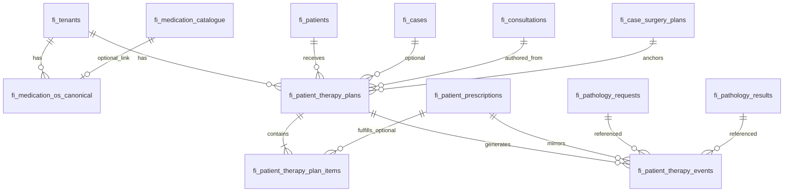

# MedicationOS — architecture design (v1)

**Status:** Design only — no implementation in this change.  
**Related:** [DoctorOS 1A — Prescribing](./doctoros-1a-prescribing.md) (`fi_medication_catalogue`, `fi_patient_prescriptions`, `fi_prescription_items`, `fi_prescription_status_events`, `fi_medication_reorder_requests`).

---

## 1. Goals

MedicationOS provides a **tenant-scoped, patient-centric model** for:

1. **Hair restoration pharmacotherapy** — Finasteride, Dutasteride, oral / topical Minoxidil, Spironolactone, Saw palmetto (and future analogues).
2. **Procedural adjuncts** — PRP, PRF, Exosomes, Iron infusions (documented as **therapy episodes**, not compound-pharmacy line items unless you explicitly map them to catalogue rows).
3. **Post-operative medication protocols** — Antibiotics, Prednisolone, pain medications as **time-bounded protocol templates** applied to a surgery context.

It must integrate with **foundation timeline** (`fi_timeline_events`), **consultations**, **pathology**, **surgery planning / case**, and **Patient Twin**, without replacing **DoctorOS prescribing** as the system of record for dispensed **prescriptions** sent to pharmacy.

---

## 2. Design principles

| Principle | Implication |
|-----------|-------------|
| **Dual tracks** | **Prescriptions** (`fi_patient_prescriptions`) remain the legal/pharmacy workflow. MedicationOS adds **plans** (intent / regimen) and **clinical events** (what happened clinically), with optional FK to a prescription when the two align. |
| **Append-only clinical events** | State changes for therapy (start, stop, hold, complete session) are recorded as **`fi_patient_therapy_events`** (new table); timeline rows may mirror the most clinically meaningful subset. |
| **Canonical vocabulary** | Named drugs and procedures map to **stable codes** (`canonical_code`) for analytics, rules, and Twin — display labels remain tenant-localisable. |
| **Surgery-relative scheduling** | Post-op items reference **anchor** = surgery date or encounter id, not wall-clock only. |

---

## 3. Canonical therapy vocabulary (MedicationOS)

Logical registry (seeded per tenant or global reference table). **Not** a replacement for `fi_medication_catalogue` rows used for pricing — use **`catalogue_id` nullable FK** where a sellable catalogue line exists.

### 3.1 Hair restoration — pharmacologic

| Display | Suggested `canonical_code` | Typical `therapy_track` |
|---------|---------------------------|-------------------------|
| Finasteride | `hair.finasteride` | `maintenance` |
| Dutasteride | `hair.dutasteride` | `maintenance` |
| Oral minoxidil | `hair.minoxidil_oral` | `maintenance` |
| Topical minoxidil | `hair.minoxidil_topical` | `maintenance` |
| Spironolactone | `hair.spironolactone` | `maintenance` |
| Saw palmetto | `hair.saw_palmetto` | `maintenance` (often OTC / supplement — flag `risk_tier` in metadata) |

### 3.2 Procedural

| Display | Suggested `canonical_code` | `therapy_track` |
|---------|---------------------------|-----------------|
| PRP | `proc.prp` | `procedural` |
| PRF | `proc.prf` | `procedural` |
| Exosomes | `proc.exosomes` | `procedural` |
| Iron infusions | `proc.iron_infusion` | `procedural` |

### 3.3 Post-operative

| Display | Suggested `canonical_code` | `therapy_track` |
|---------|---------------------------|-----------------|
| Antibiotics (class) | `postop.antibiotic` | `post_operative` |
| Prednisolone | `postop.prednisolone` | `post_operative` |
| Pain medications | `postop.analgesic` | `post_operative` |

Post-op rows should support **`generic_class`** vs **`specific_agent`** (e.g. `amoxicillin_clavulanate`) in metadata when prescribed.

---

## 4. Tables (new)

### 4.1 `fi_medication_os_canonical` (reference)

Tenant-scoped or **tenant_id nullable** for global defaults with tenant overrides.

| Column | Type | Notes |
|--------|------|--------|
| `id` | uuid PK | |
| `tenant_id` | uuid FK `fi_tenants` nullable | Null = install-wide default row copy per tenant on bootstrap |
| `canonical_code` | text UNIQUE per tenant | e.g. `hair.finasteride` |
| `display_name` | text | |
| `therapy_track` | text CHECK | `maintenance` \| `procedural` \| `post_operative` |
| `default_route` | text nullable | oral, topical, iv, intradermal, … |
| `catalogue_id` | uuid FK `fi_medication_catalogue` nullable | When DoctorOS catalogue line represents this product |
| `metadata` | jsonb | contraindication hints, sex-specific flags, pregnancy category placeholder |
| `active` | boolean | |
| `created_at` / `updated_at` | timestamptz | |

**Relationships:** optional M:1 to `fi_medication_catalogue`. Many plan lines and events point here (or store denormalised `canonical_code` for immutability).

---

### 4.2 `fi_patient_therapy_plans` (header — “what we intend”)

| Column | Type | Notes |
|--------|------|--------|
| `id` | uuid PK | |
| `tenant_id` | uuid FK | |
| `patient_id` | uuid FK `fi_patients` | foundation patient |
| `case_id` | uuid FK `fi_cases` nullable | |
| `consultation_id` | uuid FK `fi_consultations` nullable | authoring consultation |
| `surgery_plan_id` | uuid FK `fi_case_surgery_plans` nullable | when plan is peri/post-op anchored |
| `plan_type` | text CHECK | `maintenance` \| `peri_procedural` \| `post_operative` \| `mixed` |
| `title` | text | e.g. “Post-FUE week 1 protocol” |
| `status` | text CHECK | `draft` \| `active` \| `superseded` \| `cancelled` |
| `valid_from` / `valid_until` | date or timestamptz nullable | |
| `surgery_anchor_date` | date nullable | denormalised for post-op templates when encounter date known |
| `source` | text | `manual` \| `consultation_completion` \| `surgery_template` \| `pathology_rule` |
| `metadata` | jsonb | version, template id, completion_summary snapshot ref |
| `created_by_fi_user_id` | uuid nullable | |
| `created_at` / `updated_at` | timestamptz | |

**Relationships:**

- N:1 `fi_patients`, optional `fi_cases`, optional `fi_consultations`, optional `fi_case_surgery_plans`.
- 1:N **`fi_patient_therapy_plan_items`**.

---

### 4.3 `fi_patient_therapy_plan_items` (lines)

| Column | Type | Notes |
|--------|------|--------|
| `id` | uuid PK | |
| `tenant_id` | uuid | |
| `plan_id` | uuid FK `fi_patient_therapy_plans` | on delete cascade |
| `canonical_code` | text not null | denormalised from `fi_medication_os_canonical` |
| `role` | text CHECK | `continuous` \| `taper` \| `course` \| `prn` \| `single_session` \| `multi_session` |
| `dosing_summary` | text | human-readable; structured taper in `metadata` |
| `sessions_planned` | int nullable | PRP / PRF course = 3, etc. |
| `sessions_completed` | int not null default 0 | denormalised from events for UI speed |
| `day_offset_start` / `day_offset_end` | int nullable | relative to `surgery_anchor_date` for post-op |
| `prescription_id` | uuid FK `fi_patient_prescriptions` nullable | when line is fulfilled via DoctorOS Rx |
| `pathology_gate` | text nullable | e.g. `requires_normal_lft` — evaluated in app layer v1 |
| `sort_order` | int | |
| `metadata` | jsonb | drug class for antibiotics, max daily dose, etc. |

---

### 4.4 `fi_patient_therapy_events` (append-only clinical log)

| Column | Type | Notes |
|--------|------|--------|
| `id` | uuid PK | |
| `tenant_id` | uuid | |
| `patient_id` | uuid FK `fi_patients` | |
| `case_id` | uuid nullable | |
| `plan_id` | uuid nullable FK plan | |
| `plan_item_id` | uuid nullable FK plan item | |
| `prescription_id` | uuid nullable | link to Rx when event is dispensed/signed mirror |
| `event_type` | text CHECK | `plan_created` \| `plan_activated` \| `plan_superseded` \| `therapy_started` \| `therapy_stopped` \| `therapy_on_hold` \| `dose_changed` \| `session_completed` \| `adverse_event_logged` \| `pathology_gate_cleared` \| `postop_day_completed` |
| `canonical_code` | text nullable | |
| `occurred_at` | timestamptz not null | |
| `actor_fi_user_id` | uuid nullable | |
| `consultation_id` | uuid nullable | |
| `pathology_request_id` | uuid nullable | |
| `pathology_result_id` | uuid nullable | |
| `surgery_plan_id` | uuid nullable | |
| `detail` | jsonb | structured deltas, session index, vital signs snippet ids |

**Index:** `(tenant_id, patient_id, occurred_at desc)`; optional `(plan_id)`.

This table is the **authoritative MedicationOS audit stream**. Timeline and Twin read from here and/or mirrored `fi_timeline_events`.

---

### 4.5 `fi_postop_protocol_templates` (optional v1.1 — can fold into `metadata` on plans v1)

If you want reusable post-op bundles:

| Column | Type | Notes |
|--------|------|--------|
| `id` | uuid PK | |
| `tenant_id` | uuid | |
| `name` | text | e.g. “Standard FUE post-op” |
| `surgery_type_tag` | text nullable | match to case metadata / procedure |
| `template_json` | jsonb | ordered list of `{ canonical_code, day_start, day_end, role }` |
| `active` | boolean | |

`fi_patient_therapy_plans.metadata` can hold `template_id` when instantiated.

---

## 5. Entity relationships (summary)

---

## 6. Timeline integration (`fi_timeline_events`)

**Policy:** Mirror **high-signal** MedicationOS transitions into `fi_timeline_events` for Patient Twin foundation timeline and case-centric views (same pattern as consultation completion dual-write).

Suggested `event_kind` values (prefix `medication.` or `therapy.` — pick one namespace and document):

| Trigger | `event_kind` | `title` (example) | `detail` keys |
|---------|----------------|-------------------|---------------|
| Plan activated | `therapy.plan_activated` | Therapy plan activated | `plan_id`, `plan_type`, `canonical_codes[]` |
| Maintenance therapy started | `therapy.maintenance_started` | Started maintenance therapy | `plan_item_id`, `canonical_code` |
| Procedural session completed | `therapy.procedure_session_completed` | PRP session completed | `plan_item_id`, `session_index`, `canonical_code` |
| Post-op protocol completed | `therapy.postop_protocol_completed` | Post-op medication course completed | `plan_id`, `surgery_plan_id` |
| Plan stopped / safety | `therapy.plan_stopped` | Therapy stopped | `reason_code`, `canonical_code` |

**Rules:**

- Insert timeline row only when **`case_id`** is non-null **or** when product policy allows patient-only timeline rows (today Patient Twin loads by patient **or** case — both paths exist in `patientRecord.ts`).
- Set **`fi_event_id`** null (internal) or link if ever emitted via FI event bus.
- **Dedupe:** same `plan_id` + `event_type` + `occurred_at` day in `detail` if idempotent replays occur.

---

## 7. Consultation integration

| Flow | Behaviour |
|------|-----------|
| **Guided completion → plan draft** | On `completeConsultationFormInstance`, optional step (feature-flagged): create **`fi_patient_therapy_plans`** (`status=draft`, `source=consultation_completion`, `consultation_id`) with items derived from `ConsultationCompletionSummary` (e.g. `recommendedTreatments`, outcome). Mirrors [consultation handoff pattern](../audits/consultation-automation-plan.md). |
| **Structured consultation data** | Store `medication_plan_id` on `fi_consultations.structured_data` or add nullable **`medication_plan_id`** column in a later migration once FK stable. |
| **CRM** | Optional `appendCrmActivityEvent` (`therapy.plan_drafted_from_consultation`) — consistent with other handoffs. |

---

## 8. Pathology integration

| Use case | Mechanism |
|----------|-----------|
| **Gate before start** | `fi_patient_therapy_plan_items.pathology_gate` stores a declarative tag; application evaluates against latest **`fi_pathology_results`** / items (existing tables). |
| **Audit trail** | On gate transition, insert **`fi_patient_therapy_events`** (`event_type=pathology_gate_cleared` or `therapy_on_hold`) with `pathology_result_id` in `detail`. |
| **Timeline** | Mirror “cleared to start Finasteride” as `therapy.pathology_gate_cleared` timeline row when clinically warranted. |
| **Twin** | Surface “active gates” and last clearing result in Twin **Medications** section (see §10). |

**Future:** `fi_pathology_medication_rules` (tenant rules engine) — out of v1 schema minimum.

---

## 9. Surgery integration

| Use case | Mechanism |
|----------|-----------|
| **Anchor** | `fi_patient_therapy_plans.surgery_plan_id` + `surgery_anchor_date` set when surgery date confirmed (from booking, manual entry, or `fi_case_surgery_plans`). |
| **Post-op template apply** | When surgery plan reaches `scheduled` / `completed` (per your case state machine), instantiate **`fi_postop_protocol_templates`** → new plan (`plan_type=post_operative`, `day_offset_*` on items). |
| **Peri-op procedural** | Plan lines with `therapy_track=procedural` linked to same `surgery_plan_id`; events `session_completed` drive `sessions_completed`. |
| **Surgery plan row** | Optional: write summary pointers in `fi_case_surgery_plans.metadata` (`active_therapy_plan_id`) for SurgeryOS UI tabs. |

---

## 10. Patient Twin integration

Today Twin **`clinical.medications`** is **`null`** (placeholder in `patientTwinTypes.ts` / loader).

**V1 read model extensions:**

1. **`clinical.medications`** (structured):  
   - `active_plan_count`, `active_items[]` (`canonical_code`, `display_name`, `role`, `next_review_at`), `postop_phase` (derived from anchor + calendar).  
   - Source: `fi_patient_therapy_plans` + items where `status=active` and date bounds valid.

2. **`clinical.therapy_events_preview`**: last N rows from `fi_patient_therapy_events` (bounded, non-sensitive titles).

3. **Foundation timeline:** already includes mirrored `fi_timeline_events`; no Twin schema change for timeline **items** if §6 is implemented.

4. **Provenance:** add `fi_patient_therapy_plans`, `fi_patient_therapy_plan_items`, `fi_patient_therapy_events`, `fi_medication_os_canonical` to `SOURCE_TABLES_USED` in `patientTwinLoader.server.ts` when implemented.

5. **Pathology card synergy:** optional cross-link line “Therapy gated on LFT — see pathology” using same `pathology` section ids.

---

## 11. DoctorOS prescribing alignment

| MedicationOS | DoctorOS |
|--------------|----------|
| Plan item `prescription_id` set when clinician generates Rx from a plan line | `fi_patient_prescriptions` + `fi_prescription_items` remain authoritative for pharmacy transmission and reorder portal. |
| Catalogue overlap | Seed / link `fi_medication_os_canonical.catalogue_id` for Finasteride, topical Minoxidil, etc., so pricing and MedicationOS analytics stay aligned. |
| Procedural therapies | Typically **no** `catalogue_id` (unless you sell PRP as a billable catalogue line); `therapy_track=procedural` distinguishes. |

---

## 12. Migration and rollout strategy (design)

1. **Phase A:** `fi_medication_os_canonical` + seed rows for the 13 named concepts (§3).  
2. **Phase B:** `fi_patient_therapy_plans` + items + events (empty).  
3. **Phase C:** Consultation → draft plan bridge (optional, behind tenant flag).  
4. **Phase D:** Timeline mirroring from events.  
5. **Phase E:** Twin loader + UI sections.  
6. **Phase F:** Surgery template instantiation + pathology gate evaluation.

---

## 13. Non-goals (v1)

- Drug–drug interaction engine, dose optimisation ML, or regulatory **e-prescribing** networks (continue DoctorOS scope).
- Inventory / stock management.
- Replacing `fi_prescription_status_events`.

---

## 14. Open decisions (for product / clinical governance)

1. **Saw palmetto** — supplement vs prescribed drug; consent and documentation standard.  
2. **Spironolactone** — monitoring requirements (K+, BP) and sex-specific use; link to pathology for monitoring bundle.  
3. **Pain medications** — controlled drug schedules by jurisdiction; may remain **free-text + class** only in v1.  
4. **Iron infusions** — often facility-based; events may be **`session_completed`** at external site with manual log.

---

*End of MedicationOS v1 design.*
