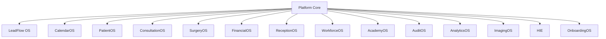
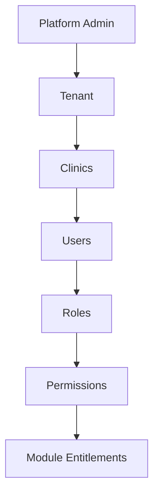
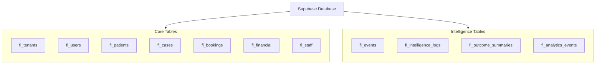
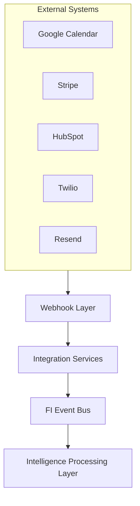

# FI OS — Platform Architecture Diagrams

**Status:** Reference diagrams. Complements the [module registry](./README.md) and marketing map (`components/platform/PlatformArchitectureMap.tsx`).

---

## Diagram 1 — Platform Overview

Layered view from user personas through external integrations.

```mermaid
flowchart TB
  subgraph UserLayer["User Layer"]
    direction LR
    U1["Clinic Staff"]
    U2["Surgeons"]
    U3["Reception"]
    U4["Consultants"]
    U5["Admins"]
    U6["Enterprise Operators"]
  end

  subgraph AppLayer["Application Layer"]
    direction LR
    A1["FI Admin Portal"]
    A2["Staff PIN Access"]
    A3["Marketing Site"]
    A4["Patient Interfaces"]
  end

  subgraph CoreLayer["Core Platform Layer"]
    direction LR
    C1["LeadFlow"]
    C2["ClinicOS"]
    C3["CalendarOS"]
    C4["PatientOS"]
    C5["ConsultationOS"]
    C6["SurgeryOS"]
    C7["FinancialOS"]
    C8["ReceptionOS"]
  end

  subgraph IntelLayer["Intelligence Layer"]
    direction LR
    I1["VIE"]
    I2["HIE"]
    I3["AnalyticsOS"]
    I4["Event Bus"]
    I5["AI Engines"]
  end

  subgraph ExtLayer["External Systems"]
    direction LR
    E1["HairAudit"]
    E2["HLI"]
    E3["IIOHR"]
    E4["HubSpot"]
    E5["Google Calendar"]
    E6["Stripe"]
    E7["Twilio"]
    E8["OpenAI"]
  end

  UserLayer --> AppLayer
  AppLayer --> CoreLayer
  CoreLayer --> IntelLayer
  IntelLayer --> ExtLayer
```

---

## Diagram 2 — Module Architecture

Every OS module under Platform Core.

---

## Diagram 3 — Multi-Tenant Architecture

Isolation and entitlement hierarchy from platform admin to module access.

---

## Diagram 4 — Data Architecture

Supabase schema groups: core operational tables and intelligence tables.

---

## Diagram 5 — External Integration Layer

Inbound integrations flow through webhooks and services into the FI Event Bus and intelligence pipeline.

