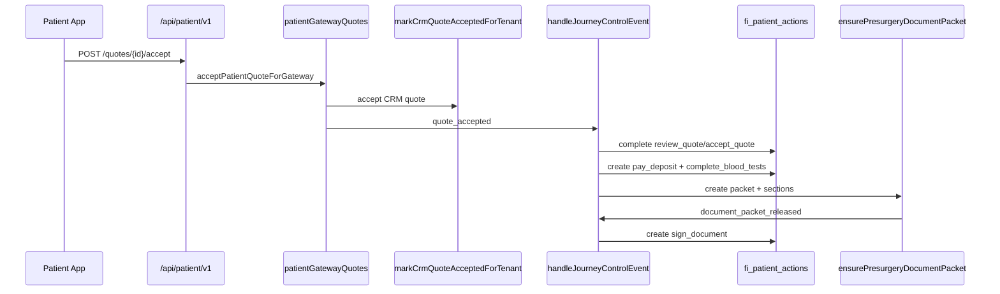

# FI-PATIENT-APP-P1 — Journey Control (Architecture Lock)

**Ticket:** FI-PATIENT-APP-P1  
**Phase:** Slice 0–1 foundation  
**Date:** 2026-07-29  
**Repo:** `G:\follicleintelligence` (SoR)  
**Consumer:** `G:\follicle-intelligence-patient` (thin client)

## Principles

1. **FiOS is source of truth** — milestones, actions, quotes, documents, pathology, and notifications live in FiOS tables + domain libs.
2. **Patient-safe projection** — gateway mappers strip `internalNote`, abnormal flags, AI interpretations, and staff hrefs.
3. **Events drive everything** — domain events create/complete actions, upsert milestones, and enqueue in-app + push notifications.
4. **One task engine** — Action Centre and clinic readiness read the same `fi_patient_actions` rows.

## Contracts

Canonical enums live in `src/lib/patientJourneyControl/patientJourneyControlContracts.ts`:

| Catalog | Count / notes |
|---------|----------------|
| `PATIENT_JOURNEY_MILESTONE_KEYS` | 11 keys (`consultation_completed` … `patient_cleared_for_surgery`) |
| Milestone statuses | `not_started` · `action_required` · `in_progress` · `waiting_on_patient` · `waiting_on_clinic` · `completed` · `blocked` |
| `PATIENT_ACTION_KINDS` | review/accept quote, deposit, blood, documents, awaits, … |
| `PATIENT_JOURNEY_DOMAIN_EVENTS` | quote/deposit/blood/pathology/document/surgery events |
| `PATIENT_JOURNEY_NOTIFICATION_EVENTS` | feed + push event types |
| `PATIENT_DOCUMENT_SECTION_KEYS` | 13 pre-surgery sections + labels |
| `QUOTE_ACCEPTED_FOLLOW_ON_ACTIONS` | `pay_deposit`, `complete_blood_tests` |

## Sequence (quote accepted)

## Modules

| Module | Role |
|--------|------|
| `patientJourneyMilestoneCore.ts` | Pure milestone derivation + leak guard |
| `patientActionEngineCore.ts` | Pure action create/map/bucket + nextAction type |
| `patientActionEngine.server.ts` | CRUD on `fi_patient_actions` / history |
| `patientNotificationFeed.server.ts` | In-app feed + `sendPatientNotificationBestEffort` |
| `patientJourneyControlEvents.server.ts` | Domain event switch + document packet ensure |
| `patientGatewayQuotes.server.ts` | List/get/accept/decline/deliver |
| `patientGatewayDocuments.server.ts` | Packet sections save/sign/reject |
| `patientGatewayPathology.server.ts` | Patient-safe pathology (approved summary only) |
| `patientActionEscalation.server.ts` | Overdue escalation |
| `clinicJourneyReadiness.server.ts` | Staff readiness projection |

## Persistence

Migration: `supabase/migrations/20261101120001_fi_patient_journey_control_p1.sql`

- Tables: `fi_patient_journey_milestones`, `fi_patient_actions`, `fi_patient_action_history`, `fi_patient_notifications`, `fi_patient_document_packets`, `fi_patient_document_sections`
- Alters: `fi_crm_quotes` delivery/decline/patient_id; `fi_pathology_results` patient-safe summary/clearance; `fi_pathology_requests` issue workflow fields
- RLS: tenant-member SELECT; `service_role` write

## Gateway routes

Under `/api/patient/v1/`:

- `GET actions`, `GET actions/{actionId}`
- `GET notifications`, `PATCH notifications/{notificationId}/read`
- `GET/POST quotes…` accept · decline · questions · pdf
- `GET/PATCH/POST documents…` sections · sign
- `GET pathology`, `POST pathology/results-upload`

Identity is always resolved by `requirePatientGatewayContext` — clients never authorize with `patientId` / `tenantId`.

## Hard rules

- Never auto-release abnormal findings or AI interpretations without `patient_summary_approved_at` + `patient_safe_summary`.
- Incompleteness messaging must name **exact** missing document sections (`formatMissingDocumentSections`).
- Push routing uses `eventType` + `resourceId` / `actionId` only.