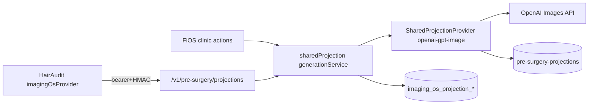

# FI-SURGERY-PROJECTION-PROVIDER-ACTIVATION-1C

**Date:** 2026-08-07  
**Predecessor:** FI-SURGERY-PROJECTION-SHARED-FOUNDATION-1B  
**Paid clinical-image generation:** not executed in this evidence pack (no allowlisted approved case at write time)

---

## Status (report separately)

| Surface | Status | Notes |
|---|---|---|
| Shared provider activation | **AMBER→GREEN pending deploy** | Shared OpenAI adapter extracted behind `SharedProjectionProvider` and registry-wired; requires env + DPIA gates in runtime |
| Cross-product synchronisation | **AMBER** | Unique `(tenant_id, idempotency_key)` + product_refs + HA ImagingOS consumer path; live dual-product proof needs shared allowlisted case |
| FiOS Photorealistic Projected Outcome | **RED** | UI + preflight ready; no new FiOS-approved natural looking output yet |
| Patient sharing | **RED** | Deferred / capability always denied |

**Pilot decision this ticket:** stop at **READY FOR CONTROLLED PILOT** unless an allowlisted tenant/case with approved plan+hairline exists.

---

## 1. Deployment boundary



| Item | Value |
|---|---|
| Runtime / location | Follicle Intelligence ImagingOS server modules (`src/lib/imaging-os/sharedProjection/`) |
| Deployment | Existing Next.js / Vercel app deploy (in-process) |
| Authentication | Clinic: session + surgery projection capabilities; HairAudit: `HAIRAUDIT_PROJECTION_SERVICE_TOKEN` + HMAC |
| Environment config | `FI_SHARED_PROJECTION_*` + `OPENAI_API_KEY`; fail closed |
| Caller allowlisting | Products `fios` \| `hairaudit`; tenants via `FI_SHARED_PROJECTION_PILOT_TENANT_IDS` |
| Health / readiness | Gateway health + `buildSharedProjectionHealth` (`realProviderConnected`, `dpiaStatus`) |
| Ownership | ImagingOS / shared projection; HA retains review/report/sharing |

---

## 2. Extraction / move inventory

Canonical code now under:

`src/lib/imaging-os/sharedProjection/openai/`

| Module | Status |
|---|---|
| openaiGptImageProvider.ts | Extracted → implements `SharedProjectionProvider` |
| openaiGptImageStorage.server.ts | Extracted |
| treatmentMask.ts | Extracted (FiOS polygons) |
| maskContainmentComposite.ts | Extracted + soft feather |
| openaiEditPrompt.ts | Extracted → prompt **v3** |
| openaiEditGeometry.ts | Extracted |
| outcomeValidation.ts | Extracted + seam detectors |

HairAudit `openaiGptImageProvider.ts` marked **@deprecated**; prefer `HA_PRE_SURGERY_PROJECTION_PROVIDER=imagingos`.

**Proof no second FiOS OpenAI tree:** test asserts absence of `src/lib/cases/surgeryProjection/openai` and single shared tree.

---

## 3. Provider configuration

`provider_id = openai-gpt-image`  
`model = gpt-image-2`  
`artifact_type = illustrative_projected_outcome`

See `.env.example` `FI_SHARED_PROJECTION_*`. Missing/invalid config → refuse; never overlay fallback.

---

## 4. DPIA

Document: [`docs/privacy/FI-SURGERY-PROJECTION-DPIA-1C.md`](../privacy/FI-SURGERY-PROJECTION-DPIA-1C.md)

**Decision: APPROVED WITH CONDITIONS**

Conditions encoded in `assertProviderConfigAllowsGeneration` + DPIA status env.  
Production open enablement remains blocked until pilot allowlist + conditions.

---

## 5–6. Validation + idempotency

`requestSharedIllustrativeGeneration`:

- plan/hairline approval, frontal + planned, checksums, DPIA, tenant allowlist, cost ceiling
- transactional insert on unique idempotency key; concurrent loser → `idempotent_hit` (0 provider charge)
- correction attempt token namespaces a new key; prior generation immutable

---

## 7–8. Rejected HA asset + seam repair

Asset `2791b827-…` remains isolated in `externalAssetPolicy` with seam-at-boundary analysis.  
Prompt v3 + stronger mask feather + soft composite restore. Seam flags route to `technical_review_required` — never auto-approve.

---

## 9. Controlled pilot

Preflight action returns **READY FOR CONTROLLED PILOT** with tenant/case/plan/hairline/source/mask/graft/cost.  
Paid confirm requires cost acknowledgment + gates.  
**No paid patient image sent** in this evidence pack (no suitable allowlisted approved case verified).

---

## 10–12. Validation routing / FiOS UI / HA consumer

Technical routes: `clinician_review` | `technical_review_required` | `technically_rejected` — never approved/shareable from service.  
FiOS `ProjectedOutcomeTab`: Original vs Outcome slider, mask toggle, zoom, versions, warnings, cost/latency, Approve/Reject/Correction (FiOS-local via product_refs).  
HA: ImagingOS HTTP client documented as preferred consumer; gateway resolves `openai-gpt-image` to shared provider.

---

## 13. Audit / usage

`imaging_os_projection_usage_events` records attempt/completed/failed/idempotent_hit with estimated cost metadata. Logs avoid images/URLs/credentials/names.

---

## 14. Tests

```bash
npm run test:surgery-projection-1c
```

Covers: single provider tree, fail-closed DPIA/disable, allowlist/cost, permission/sharing deny, overlay ban, sequential + concurrent idempotency keys, correction key, seam flags, rejected asset isolation.

---

## 15. Evidence checklist

| Evidence | Location / note |
|---|---|
| Deployment diagram | §1 above |
| Extract inventory | `HAIRAUDIT_EXTRACT_INVENTORY` + §2 |
| No second OpenAI impl | test + paths |
| DPIA decision | `docs/privacy/FI-SURGERY-PROJECTION-DPIA-1C.md` |
| Config | `.env.example` |
| Concurrent idempotency | unique constraint + tests |
| Rejected asset | `externalAssetPolicy` |
| FiOS UI | `ProjectedOutcomeTab` |
| Screenshots | Capture post-deploy with pilot case |
| Paid generation / cost / latency | Pending allowlisted case |
| Remaining blockers | Below |

---

## Remaining blockers

1. Deploy with `FI_SHARED_PROJECTION_*` + DPIA status + pilot tenant UUIDs  
2. Named allowlisted tenant/case with approved plan + photo-bound hairline + real frontal photo  
3. Operator confirmation of preflight + cost before first paid call  
4. Live FiOS↔HA concurrent idempotency demo on that case  
5. Clinician review of a natural looking output → outcome surface GREEN  
6. Patient sharing remains intentionally RED  

---

## Key paths

- `src/lib/imaging-os/sharedProjection/`
- `src/lib/imaging-os/sharedProjection/openai/`
- `packages/projection-core/`
- `lib/actions/fi-surgery-projection-actions.ts`
- `src/components/fi-admin/cases/surgery-projection/ProjectedOutcomeTab.tsx`
- `docs/privacy/FI-SURGERY-PROJECTION-DPIA-1C.md`
- `tests/surgeryProjectionProviderActivation1c.test.ts`
