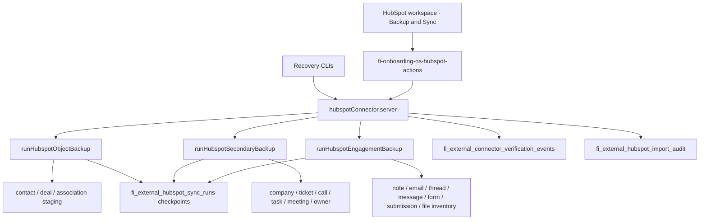

# FI-HUBSPOT-BACKUP-1 — Stage P0 operational baseline

**Evidence classification:** Privacy-safe operational metadata only  
**Date:** 2026-07-16  
**Milestone:** Stage P0 (operational baseline and incremental-backup readiness)  
**Machine-readable:** `evidence-fi-hubspot-stage-p0-operational-baseline.json`  

> **Superseded for programme status (2026-07-16):** FI-HUBSPOT-BACKUP-1 is closed **GREEN — COMPLETE** in `evidence-fi-hubspot-backup-1-final-closeout.md`. This P0 AMBER baseline (including “no incremental entry point”) remains valid as interim Stage P planning evidence only.

**Phase O precondition (accepted, not reopened):**

| Control | State |
|---------|--------|
| Phase O dataset verdict | GREEN WITH DOCUMENTED LIMITATIONS |
| Production deployment | READY |
| Authenticated production smoke | 11/11 GREEN |
| Production PASS | CLAIMED |
| Production gate evidence | `docs/audits/evidence-fi-hubspot-phase-o-production-gate.md` |
| Phase O closeout | `docs/audits/evidence-fi-hubspot-phase-o-closeout.md` (+ `.json`) |
| Production evidence commit | `062d7d12` |
| Phase O closeout commit | `cfdf08c4067c1f3a80c95c4398efc9c42b9a7ce6` |
| Recovery implementation commit | `c0f1c06a` |
| Optional non-blocking follow-up | FI-HUBSPOT-CONTACT-ASSOCIATION-ENRICHMENT-1 |

**P0 scope:** Repository review and planning only.  
**Explicit no-production-write statement:** This Stage P0 task did **not** create HubSpot records, did **not** run a production backup, did **not** add schedules, did **not** deploy, and did **not** change production environment variables.

---

## 1. Current architecture

HubSpot backup today is a **full-history, resumable pagination pipeline** into **restricted FI staging**. It is **not** an incremental watermark pipeline.



| Layer | Implementation |
|-------|----------------|
| Orchestration | `src/lib/onboarding-os/hubspotConnector.server.ts` |
| Primary engine | `hubspotBackupEngine.server.ts` — contacts + deals |
| Secondary engine | `hubspotSecondaryBackupEngine.server.ts` |
| Engagement engine | `hubspotEngagementBackupEngine.server.ts` |
| UI | HubSpot workspace tab `backup-sync` → `HubSpotConnectorPanel` |
| Destination | Restricted staging tables only (`promotion_enabled: false`) |
| Canonical CRM promotion | Separate import centre path — **out of Stage P backup scope** |
| Historical operator cutoff | Manual export package `FI-HUBSPOT-BACKUP-1` anchored at **`2026-07-15T08:42:00.000Z`** (reconciliation only; **not** engine state) |

Hardcoded Evolved recovery CLI targets:

- Tenant: `c2615b95-b707-4485-aa5f-be8f78ec868a`
- Integration: `ade8a7d0-ad45-4fd7-8d53-61d4806b95f6`

---

## 2. Command and endpoint inventory

### A. Full backup / resume / probe

| Entry | Command / route | Source | Required environment | Production-safe? | Writes data? | Auto-resume? | Fixed cutoff? |
|-------|-----------------|--------|----------------------|------------------|--------------|--------------|---------------|
| Primary full backup (UI) | **Sync now** → `runHubspotSyncAction` → `runHubspotSync` → `runResumableHubspotBackup` | `lib/actions/fi-onboarding-os-hubspot-actions.ts`; `hubspotConnector.server.ts` | Authenticated FI session | HubSpot read-only; writes FI staging | Yes (staging + sync_runs + import audit) | Yes — latest `status='started'` | **No** |
| Primary CLI | `node -r ./scripts/patch-server-only-for-scripts.cjs ./node_modules/tsx/dist/cli.mjs scripts/hubspot-live-credential-and-sync-recovery.ts` [`--probe-only`] | `scripts/hubspot-live-credential-and-sync-recovery.ts` | `FI_HUBSPOT_RECOVERY_ACTOR_AUTH_USER_ID`; encrypted connector credential; admin DB | Operator-gated; Evolved IDs hardcoded | Yes unless `--probe-only` | Via same resumable path | **No** |
| Secondary full backup (UI) | **Back up secondary objects** → `runHubspotSecondaryBackupAction` | actions + connector | Session auth | Same pattern | Yes | **No** — blocks if secondary `started` exists (“already running”) | **No** |
| Secondary CLI | `…/tsx … scripts/hubspot-secondary-object-backup.ts` | `scripts/hubspot-secondary-object-backup.ts` | `FI_HUBSPOT_RECOVERY_ACTOR_AUTH_USER_ID` | Operator-gated | Yes | **No** (same gate) | **No** |
| Secondary live probe (UI) | **Check live backup access** → `verifyHubspotSecondaryCapabilitiesLive` | connector | Session | Probe-only | Verification events + scopes | N/A | N/A |
| Engagement full backup (UI) | Engagement backup button → `runHubspotEngagementBackupAction` | actions + connector | Session | Same; `promotion_enabled: false` | Yes | Server resumes engagement `started`; **UI hides button while active** | **No** |
| Engagement CLI | `…/tsx … scripts/hubspot-engagement-communications-backup.ts` [`--probe-only`] | `scripts/hubspot-engagement-communications-backup.ts` | `FI_HUBSPOT_RECOVERY_ACTOR_AUTH_USER_ID` | Operator-gated | Yes unless probe | **Yes** for engagement `started` (CLI forces gate `activeRun: false`) | **No** |
| Engagement probe | `--probe-only` or UI capability check | connector | Actor / session | Probe-only | Verification events | N/A | N/A |

### B. Incremental backup

| Entry | Status |
|-------|--------|
| Incremental CLI / UI / API | **Does not exist** |
| `--since` / `--cutoff` / watermark flags | **Not implemented** (repo grep over HubSpot engines/scripts: no matches) |
| Current “catch-up” behaviour | Re-run full-history pagination; upserts overwrite by HubSpot ID |

### C. Reconciliation / verification / smoke / cleanup

| Entry | Command / route | Source | Writes? | Notes |
|-------|-----------------|--------|---------|-------|
| Form ID reconcile | `node scripts/audits/reconcile-hubspot-form-ids.mjs` (+ related audit scripts) | `scripts/audits/*` | Evidence files / local | Offline; not engine watermark |
| Authenticated production smoke | `npm run test:e2e:hubspot-production-smoke` | `e2e/hubspot-production-smoke/*`; GH workflow | **None** (non-mutating contract) | Production-safe |
| LeadFlow HubSpot cron | `GET /api/cron/leadflow/process-hubspot-events` | `app/api/cron/leadflow/process-hubspot-events/route.ts`; `vercel.json` `*/5 * * * *` | LeadFlow queue / CRM path | **Not a backup job** |
| CRM import scripts | `npm run hubspot:import-*` / rollback | `scripts/hubspot-import-*.ts` | Yes (import centre) | **Not staging backup** |
| Cleanup / finalise CLI | — | — | — | **None found** |
| Dedicated resume CLI | — | — | — | Resume = re-invoke backup while `started` |

Backup CLIs are **not** registered as `package.json` scripts (except smoke + import helpers). Invoke via `tsx` + `patch-server-only-for-scripts.cjs` as above.

---

## 3. Watermark behaviour

**Finding: no timestamp watermark model exists in the backup engines.**

| Question | Actual behaviour |
|----------|------------------|
| Watermark field | **None.** Closest artifacts are **page cursors** in JSON checkpoint blobs (`active` / `archived` / `after` / `message_after` / `form_id_cursor` / `current_thread_id`) |
| Source timestamp fields (stored, not filtered) | HubSpot `createdAt` / `updatedAt` → `hubspot_created_at` / `hubspot_updated_at`; notes/emails also `hs_timestamp` → `activity_timestamp`; submissions `submittedAt` → `hubspot_created_at` |
| List filter | Full HubSpot list pagination; **no** `updatedAfter` / `since` / cutoff query |
| Inclusive / exclusive boundary | N/A for engine; operator reconcile uses export cutoff `2026-07-15T08:42:00.000Z` as a **documentation anchor only** |
| Timezone | `timestamptz` / ISO UTC via `toISOString()` |
| Storage location | `fi_external_hubspot_sync_runs.{contacts_checkpoint,deals_checkpoint,secondary_checkpoints,engagement_checkpoints}` + `last_checkpoint_at` |
| Per-dataset vs global | **Per object kind** inside checkpoint JSON |
| Equal timestamps | N/A for watermark; upserts key on HubSpot IDs |
| Updated historical records | Invisible until another **full** scan includes them |
| Partial run | Checkpoints persist; run may remain `started` or finalize `partial` / `failed` |
| Advance vs verification | N/A — no sliding watermark. Run status / `*_complete` flags set at **finalize after paging** |

**Skip-after-failure risk (current full-history model):** Cursor checkpoints can leave a run stuck; they do **not** advance a time watermark past unverified data. The Stage P risk is the **absence** of a verified watermark advance rule once incremental is built — that rule must advance **only after** successful verification (P1 requirement).

---

## 4. Dataset idempotency table

| Dataset | Source ID | Destination table | Upsert `onConflict` | Duplicate prevention | Same-range rerun safe? |
|---------|-----------|-------------------|---------------------|----------------------|------------------------|
| Contacts | `hubspot_contact_id` | `fi_external_hubspot_contact_staging` | `tenant_id,integration_id,hubspot_contact_id` | Unique + upsert | Yes (overwrite) |
| Deals | `hubspot_deal_id` | `fi_external_hubspot_deal_staging` | matching | Unique + upsert | Yes |
| Associations | from/to compound | `fi_external_hubspot_association_staging` | `tenant_id,integration_id,from_object_type,from_hubspot_id,to_object_type,to_hubspot_id` | Unique + upsert | Yes |
| Companies / tickets / calls / tasks / meetings | `hubspot_record_id` | secondary `*_staging` | `tenant_id,integration_id,hubspot_record_id` | Unique + upsert | Yes |
| Owners | `hubspot_owner_id` | `fi_external_hubspot_owner_inventory` | `tenant_id,integration_id,hubspot_owner_id` | Unique + upsert | Yes |
| Notes / emails | `hubspot_record_id` | `fi_external_hubspot_note_staging` / `_email_staging` | `tenant_id,integration_id,hubspot_record_id` | Unique + upsert | Yes |
| Threads | `hubspot_thread_id` | `fi_external_hubspot_conversation_thread_staging` | `tenant_id,integration_id,hubspot_thread_id` | Unique + upsert | Yes |
| Messages | `hubspot_message_id` + thread | `fi_external_hubspot_conversation_message_staging` | `tenant_id,integration_id,hubspot_thread_id,hubspot_message_id` | Unique + upsert | Yes |
| Forms | `hubspot_form_id` (`guid`/`id`) | `fi_external_hubspot_form_definition_staging` | `tenant_id,integration_id,hubspot_form_id` | Unique + upsert | Yes |
| Form submissions | `conversionId ?? submissionId ?? id` → `hubspot_submission_id` | `fi_external_hubspot_form_submission_staging` | `tenant_id,integration_id,hubspot_form_id,hubspot_submission_id` | Unique + upsert; Phase O: 0 duplicate groups | Yes |
| Files metadata | `hubspot_file_id` | `fi_external_hubspot_file_inventory` | `tenant_id,integration_id,hubspot_file_id` | Unique + upsert | Yes (metadata only; `content_backed_up` always 0) |

**Note:** Upserts refresh `sync_run_id` on existing rows, so “which run first discovered this ID” is not preserved. Safe for staging correctness; weak for incremental delta audit unless P1 adds first-seen metadata.

---

## 5. Checkpoint / resume behaviour

| Aspect | Behaviour |
|--------|-----------|
| Granularity | Page cursor per kind; phases `active` → `archived` → `complete`. Nested for messages (per thread) and submissions (per form) |
| Storage | JSON on `fi_external_hubspot_sync_runs` + `last_checkpoint_at` |
| Run status | `started` \| `completed` \| `partial` \| `failed` |
| Per-kind checkpoint status | `pending` \| `in_progress` \| `complete` \| `skipped_missing_scope` |
| Primary resume | Reloads **any** latest `status='started'` for tenant/integration — **no milestone filter** |
| Engagement resume | Finds engagement `started` (milestone / `engagement_capabilities`); sets `detail.resumed_at`; **reloads row from DB** before continuing |
| Secondary resume | **Absent** — refuses new run while secondary `started` exists; failed runs leave checkpoints unused on next insert |
| Same cutoff on resume | N/A (no cutoff); resume continues **same cursors** |
| Finalise double-safety | Finalize updates `.eq("id", run.id).eq("status", "started")` — concurrent finalize loses the race |
| Stale checkpoint contamination | **AMBER/HIGH:** primary resume can attach to a non-primary `started` row (engagement/secondary) because milestone is not filtered |
| UI vs CLI | Engagement UI hides backup while active; CLI can still resume |

Stalled cursor guard: `resolvePagingPhase` completes a phase when `nextAfter === currentAfter`.

---

## 6. Current scheduler state

| Scheduler | Schedule | Enabled? | Role |
|-----------|----------|----------|------|
| Vercel cron `/api/cron/leadflow/process-hubspot-events` | `*/5 * * * *` | Present in `vercel.json` | LeadFlow webhook drain — **not backup** |
| GitHub Actions `hubspot-production-smoke.yml` | `workflow_dispatch`; optional `workflow_run` after CI if `vars.FI_HUBSPOT_SMOKE_AFTER_CI == 'true'` | Opt-in | Read-only UI smoke |
| Supabase cron for HubSpot backup | — | **None** | — |
| HubSpot backup schedule | — | **None** | Manual UI or CLI only |
| Backup concurrency lock / overlap guard | — | **None** dedicated | Secondary blocks on `started`; primary/engagement can race |
| Backup failure alerting | — | **None** dedicated | No Slack/email/pager for backup finalize failures |

**P0 did not create any new schedule.**

---

## 7. Verification-event coverage

### Primary evidence sources

| Source | What it records |
|--------|-----------------|
| `fi_external_hubspot_sync_runs` | Start/complete timestamps, status, counters, checkpoints, `detail.manifest`, `engagement_complete` / `secondary_complete`, health score |
| `fi_external_hubspot_import_audit` | Primary actions e.g. `sync_started` / `sync_completed` / `sync_failed` with operator attribution |
| Staging row counts + unique HubSpot IDs | Destination truth for reconcile |

### Secondary evidence sources

| Source | What it records |
|--------|-----------------|
| `fi_external_connector_verification_events` | Live probes (`live_probe_secondary_objects`, `live_probe_engagement_communications`, credential live) — outcome, mode, capabilities; **no response bodies retained** |
| Operator audit markdown/JSON under `docs/audits/` | Phase O reconciles, production gate, closeouts |
| Manual export tree `FI-HUBSPOT-BACKUP-1/` | Historical baseline package |

### Privacy-safe UI (`loadHubspotAuditEvidence`)

- Verification: `outcome`, `occurredAt`, `type` — no payloads/identities
- Audit: `action`, `occurredAt`; operator redacted to `"operator recorded"` / `"system"`
- Backup & Sync cards: counts/status/timestamps only

### Per-run coverage matrix (today)

| Signal | Recorded? |
|--------|-----------|
| Start | Yes (`started_at`, audit `sync_started` for primary) |
| Completion | Yes (`completed_at`, status) |
| Partial / failure | Yes (`partial` / `failed` + safe error detail) |
| Counts | Yes (engine counters + manifest) |
| Cutoff | **No** (not in engine) |
| Watermark | **No** |
| Operator | Yes on verification events / import audit; redacted in UI |
| Reconciliation | Yes in engagement counters (`reconciliation_status`, `export_difference` vs hardcoded baselines) |
| Verification result | Probe events separate from run finalize; run finalize is not a verification-event row |

`engagement_complete` is **false** when any capability is missing (including files listing **405**), even when metadata inventory completed — boolean is not a clean “data complete” gate for Stage P.

`content_backed_up` remains **0 by design** (file bodies out of scope).

---

## 8. Proposed P2 test record

**Selected object: HubSpot CRM Note** (`notes` engagement kind).

| Criterion | Assessment |
|-----------|------------|
| Stable canonical ID | `hubspot_record_id` (single-column unique) |
| Reliable creation timestamp | `createdAt` → `hubspot_created_at`; `hs_timestamp` → `activity_timestamp` |
| Existing backup coverage | Implemented; Phase O notes baseline exact (244) |
| Safe production creation | Create one note with body prefix `[FI-HUBSPOT-STAGE-P2-TEST]` via HubSpot UI or approved write path — **no patient/enquiry content** |
| Safe verification | Count staging rows for that `hubspot_record_id` before/after; expect exactly 1 after first incremental; still 1 after rerun |
| Safe cleanup | Archive/delete note in HubSpot and/or leave permanent TEST label; staging row may remain labeled by note body metadata — no destructive mass cleanup |
| Avoid | Form submissions (compound ID + baseline politics); files (405 listing); contacts (PII / import coupling); uncontrolled full-history catch-up |

**P2 procedure (only after P1 ships fixed-cutoff incremental):**

1. Create one controlled non-patient TEST note; record HubSpot ID + `createdAt`.
2. Capture pre-run destination count for that ID (= 0).
3. Run **one** incremental engagement backup with **fixed cutoff** ≤ note `createdAt` (exclusive lower / inclusive upper as P1 defines).
4. Verify staging row appears exactly once.
5. Rerun the **same** incremental range.
6. Verify no duplicate (still one row).
7. Verify sync_run audit + watermark advance **after** verification.
8. Archive/delete or permanently label the TEST note.

**Runner-up:** secondary **task** (`hubspot_record_id`, `hs_timestamp`) if engagement stack must stay frozen.

**Do not use:** real patient data, real enquiry details, email matching, fuzzy matching, destructive cleanup without evidence, or “backup everything since forever”.

---

## 9. Exact P1–P5 plan (repository-grounded)

### P1 — Incremental engine + deterministic boundary (blocking before P2)

1. Add per-dataset watermark storage on `fi_external_hubspot_sync_runs` or a dedicated watermark table (tenant + integration + dataset).
2. Implement HubSpot list/search filters using a documented source timestamp (prefer `hs_lastmodifieddate` / `updatedAt` for updates; `createdAt`/`submittedAt` where list APIs require it).
3. Add CLI/UI flags: `--cutoff-from` / `--cutoff-to` (or equivalent) with **UTC ISO**, inclusive/exclusive rules written into run `detail`.
4. Advance watermark **only after** successful verification of the run (counts + idempotent upsert OK); never on start or mid-page.
5. Preserve fixed cutoff on resume (checkpoint must store the same boundary).
6. Harden primary resume to filter by primary milestone (fix cross-contamination with engagement/secondary `started` rows).
7. Add secondary resume **or** an explicit operator finalize/abort path for stuck `started` runs.
8. Unit/integration tests: equal timestamps, empty range, partial failure does not advance watermark, rerun idempotency.

### P2 — Controlled production incremental proof

1. Deploy P1 to production (separate gate; not part of P0).
2. Execute the notes TEST procedure in §8 against Evolved only.
3. Capture evidence JSON/MD: IDs, counts, cutoff, watermark before/after, duplicate check.
4. No forms/submissions/files reopen unless a new defect appears.

### P3 — Schedule, concurrency, alerting

1. Add a dedicated backup cron **or** documented operator cadence (choose one; do not overload LeadFlow cron).
2. Add concurrency lock (one active backup per tenant/integration/milestone).
3. Emit failure notification (log intent + optional alert channel) on `failed` / unexplained `partial`.
4. Secrets checklist for scheduler: `FI_HUBSPOT_RECOVERY_ACTOR_AUTH_USER_ID`, connector master key, TLS/CA as used by recovery CLIs.

### P4 — Operations runbook + monitoring

1. Runbook: full vs incremental, resume, stuck-run repair, watermark inspection SQL, TEST note procedure.
2. Backup & Sync UI: show last watermark, last cutoff, last verification outcome (privacy-safe).
3. Retention/label policy for TEST objects.

### P5 — Stage P closeout

1. Evidence that incremental catch-up after historical cutoff works exactly-once.
2. Scheduler health (if enabled) or signed manual cadence attestation.
3. Alert drill.
4. Stage P verdict + residual limitations (files bodies still out of scope; contact-association enrichment still optional).

---

## 10. Risk register

| Risk | Class | Notes |
|------|-------|-------|
| No incremental entry point / no fixed-cutoff support | **RED** | Blocks P2 as designed until P1 |
| Watermark advances before verification | **GREEN** (N/A today) | Must stay GREEN in P1 design |
| Updated historical records missed by create-only watermark | **AMBER** | P1 must include update/lastmodified strategy or document accepted lag |
| Timestamp collisions | **AMBER** | Mitigate with inclusive/exclusive + HubSpot ID tie-break |
| Duplicate upserts on rerun | **GREEN** | Unique constraints + upserts proven in Phase O |
| Partial status cannot recover (secondary) | **AMBER** | Stuck `started` blocks; no resume |
| Primary resume milestone contamination | **AMBER** | Can attach to wrong `started` run |
| Scheduler overlaps / no concurrency lock | **AMBER** | No backup schedule yet; risk rises in P3 |
| No backup alerting | **AMBER** | Operator must watch CLI/UI today |
| Secrets unavailable in scheduler | **AMBER** | Relevant when P3 adds cron |
| Local TLS / system CA dependency | **AMBER** | Recovery often uses `run-with-system-ca` / Node CA patterns |
| Excessive file count in deployment | **GREEN** | Staging metadata only; bodies out of scope |
| Production TEST record cannot be safely created | **AMBER** | Notes path is feasible with strict labeling; no in-repo approved write helper yet |
| Hardcoded Evolved tenant in CLIs | **AMBER** | Fine for Evolved P2; not multi-tenant ready |
| Full rerun used as fake incremental | **RED** if attempted for P2 | Would re-scan entire history; forbidden for P2 proof |
| Cross-tenant overwrite | **GREEN** for Evolved-scoped ops | Upserts keyed by tenant_id + integration_id |

---

## 11. P0 verdict

### **AMBER**

P2 is feasible only after a **P1 repair** that adds a real incremental entry point with a **fixed deterministic cutoff** and **post-verification watermark advance**. Foundational pieces already exist and are strong:

- Idempotent upserts across datasets
- Engagement/primary page-cursor resume
- Restricted staging + privacy-safe audit surfaces
- Production smoke path
- Clear TEST object candidate (notes)

GREEN is not met because incremental entry point and fixed cutoff do **not** exist. RED is not claimed for overall Stage P0 because existing full backups do not advance a time watermark past unverified data and reruns do not duplicate rows — but the **RED risk “no fixed-cutoff support”** explicitly blocks P2 until P1 lands.

---

## 12. Required changes before P2

1. Implement incremental backup with fixed UTC cutoff flags (P1).
2. Persist and advance watermarks only after verification (P1).
3. Ensure resume preserves the same cutoff (P1).
4. Fix primary resume milestone filtering (P1).
5. Define secondary stuck-run recovery (resume or abort) (P1).
6. Document exact inclusive/exclusive timestamp rules and update-vs-create behaviour (P1 docs).
7. Provide an approved production-safe TEST note creation procedure (manual HubSpot UI is acceptable if scripted write is not yet approved).
8. Do **not** start P2 with a full-history engagement backup as a substitute for incremental.

Non-blocking for P2 (may land in P3): scheduled cron, alerting, multi-tenant CLI generalization.

---

## 13. Explicit no-production-write statement

During Stage P0:

- No HubSpot objects were created, updated, archived, or deleted.
- No production backup, probe-against-write, or import was executed.
- No Vercel/GitHub/Supabase schedules were added or modified.
- No production environment variables were changed.
- No deployment was performed.
- Forms, form submissions, files, and contact-association reconciliation were **not** reopened.

This artifact is **evidence and planning only**.

---

## Validation performed in P0

| Check | Result |
|-------|--------|
| Grep HubSpot engines/scripts for `watermark` / `updatedAfter` / `incremental` / `--cutoff` | No engine support found |
| Inventory CLI scripts + UI actions + `package.json` hubspot scripts | Documented in §2 |
| `vercel.json` crons | Only LeadFlow HubSpot path; not backup |
| GH HubSpot smoke workflow | Read-only; opt-in after CI |
| Phase O closeout / production gate references | Accepted as precondition |
| Code changes | **None** (evidence docs only) |
| Typecheck / backup unit tests | Not required — no code changed |

---

## Rollback

If this evidence commit must be removed:

```bash
git revert <commit-sha>
```
