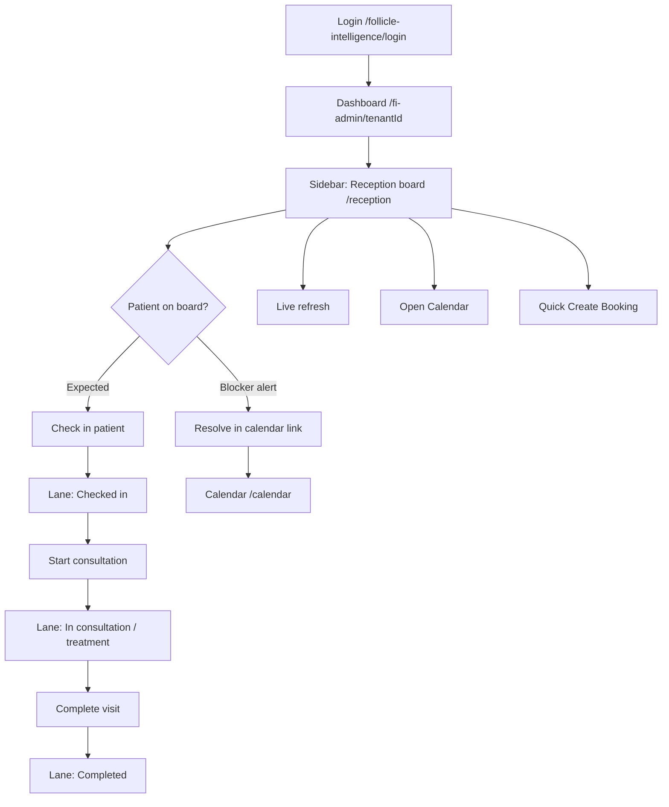
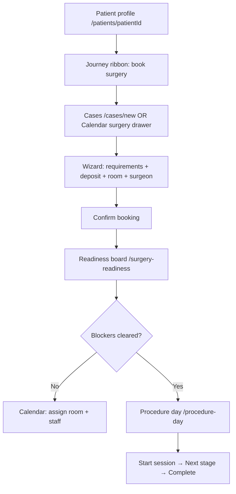
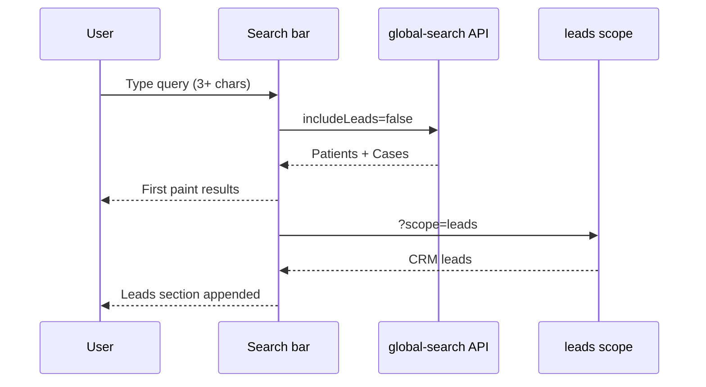

# FI OS Workflow Maps

Click-path workflows verified against deployed routes and action labels.  
Use with [02-ui-terminology-dictionary.md](./02-ui-terminology-dictionary.md) for exact button text.

---

## 1. Clinic day — reception flow



**API:** `POST` reception flow via `/api/tenants/{tenantId}/reception-board` (status transitions).

**Staff PIN:** may run all flow actions except **Cancel appointment**; restricted routes redirect to Calendar.

---

## 2. New patient enquiry → consult

```mermaid
flowchart TD
  A[Quick create: New enquiry] --> B[LeadFlow /leadflow#fi-os-crm-create-lead]
  B --> C[Create lead form]
  C --> D[CRM workspace /crm]
  D --> E[Convert lead OR Quick create: New patient]
  E --> F[New patient /patients/new]
  F --> G[Quick create: New consultation]
  G --> H[/consultations/new]
  H --> I[Calendar booking from consult]
  I --> J[/calendar]
```

**Roles:** CRM steps require CRM shell nav (`crm_operator`, `admin`, `fi_admin`).

---

## 3. Surgery booking → procedure day



**Sidebar path:** Cases → Procedure day

---

## 4. Pathology result → patient record

```mermaid
flowchart TD
  A[Sidebar: Pathology → Results inbox] --> B[/pathology/inbox]
  B --> C[Match document to patient]
  C --> D[Extract / Promote to result]
  D --> E[Patient blood result /patients/id/blood-results/resultId]
  E --> F[Clinical review on patient profile]
```

**Email ingestion:** Configuration → Email routes `/configuration/pathology-email`

---

## 5. Global search (first paint)



---

## 6. Staff PIN kiosk day

```mermaid
flowchart TD
  A[/staff-pin-login] --> B[Enter PIN]
  B --> C[Calendar /calendar]
  C --> D[Reception board /reception]
  D --> E[Check in patient / Start consultation / Complete visit]
  E --> F{Try restricted route?}
  F -->|/crm, /procedure-day, /settings| G[Redirect to Calendar]
```

**Allowed permissions:** `calendar.view`, `calendar.quick_book`, `patient.check_in`, `reception.board_flow`, `appointment.notes`, `tasks.view_assigned`

---

## 7. Configuration change

```mermaid
flowchart TD
  A[Sidebar: Settings] --> B[/configuration]
  B --> C{Tab}
  C -->|branding| D[Branding tab]
  C -->|calendar| E[Calendar tab]
  B --> F[Sub-routes: /settings/admin-users, /settings/integrations, ...]
```

**Gate:** `settings` feature; tenant backend admins bypass denial.

---

## 8. Financial payment path

```mermaid
flowchart TD
  A[Sidebar: FinancialOS] --> B[/financial-os]
  B --> C[Executive / AR / Cost models]
  A2[Operational financial] --> D[/financial/dashboard]
  D --> E[Payments / Invoices / Pathway inbox]
  F[Public pay link] --> G[/pay/token]
```

---

## Workflow verification protocol (first-time user)

For each workflow above:

1. Log in as role in [04-role-journeys.md](./04-role-journeys.md).
2. Follow sidebar labels exactly (not memory).
3. Confirm each button label matches [02-ui-terminology-dictionary.md](./02-ui-terminology-dictionary.md).
4. Record friction in UAT mode (`FI_STAFF_UAT_MODE_ENABLED=1`).