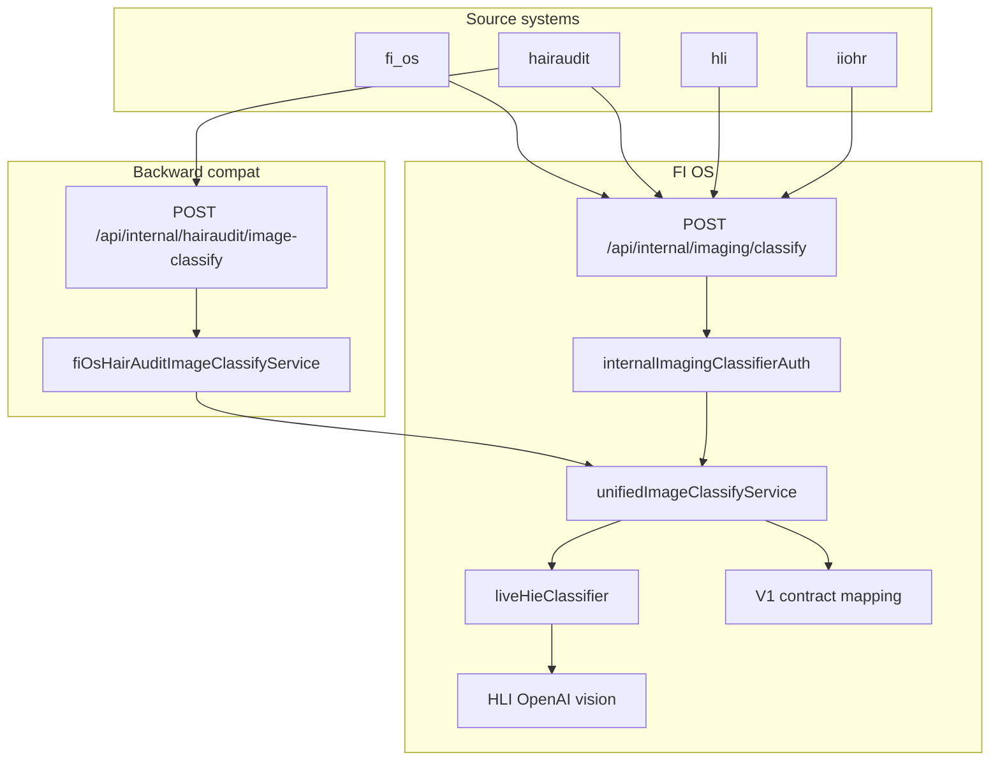

# FIN-IMAGING-1 — Unified Imaging Architecture Audit

**Status:** Audit complete (FIN-IMAGING-1)  
**Follow-up:** [FIN-IMAGING-2 unified classifier endpoint](./fin-imaging-2-unified-classifier-endpoint.md)

---

## Scope

Cross-product imaging audit covering HairAudit, HLI, IIOHR academy ingestion (PR-6), and FI OS native paths. Images remain in local storage per product; FI OS normalizes derived signals only.

---

## Findings (summary)

1. **Multiple classifier entry points** — HairAudit HTTP route, HLI shared classifier, ImagingOS stub pipeline, FI patient image adapter.
2. **Contracts defined but unwired** — `ImageClassificationResultV1`, `NormalizedImageSignalV1`, `PhotoCategoryV1` in `packages/intelligence-core/contracts/` had no runtime consumer.
3. **Live classifier null path** — HairAudit wrapper returned `null` before live invocation when prerequisites failed or dynamic import failed.
4. **IIOHR academy ingest** — `iiohr.images.uploaded` dual-writes to `fi_patient_images` without synchronous classification.

---

## Architecture (post FIN-IMAGING-2)

---

## Appendix A — FIN-IMAGING-2 implementation notes

| Item | FIN-IMAGING-1 gap | FIN-IMAGING-2 resolution |
|------|-------------------|--------------------------|
| Unified HTTP classify endpoint | Missing | `POST /api/internal/imaging/classify` |
| V1 contract runtime mapping | Contracts only | `contractMapping.ts` + `categoryMapping.ts` |
| Live HIE authority in FI OS | HairAudit-only/stub | `liveHieClassifier.server.ts` |
| Cross-source auth | HairAudit token only | `FI_INTERNAL_IMAGING_*` env + HMAC scaffold |
| IIOHR academy metadata | Ingest only | Classifier accepts academy_case_id / professional refs |
| Observability | Ad-hoc console | Structured `fi_imaging_classifier_*` events |

---

## Appendix B — Remaining gaps (FIN-IMAGING-3+)

- HairAudit production cutover to unified endpoint (staging shadow first)
- HLI shadow-mode migration
- Duplicate classifier code consolidation (intentionally deferred)
- Image storage migration (out of scope)
- UI changes (out of scope)

---

## Related documents

- [fin-imaging-2-unified-classifier-endpoint.md](./fin-imaging-2-unified-classifier-endpoint.md)
- [hairaudit-phase-3f-fi-classifier-endpoint.md](./hairaudit-phase-3f-fi-classifier-endpoint.md)
- [imaging-os-architecture.md](./imaging-os-architecture.md)
- `packages/intelligence-core/contracts/` — wire format definitions
