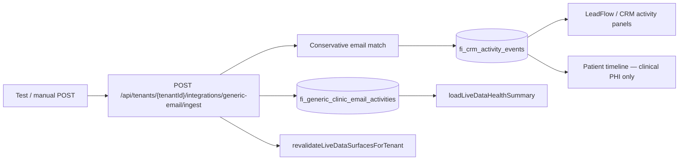

# Generic clinic email activity ingestion

Audit date: 2026-07-03  
Ticket: FI-LIVE-DATA-INPUT-RECOVERY-2

## Purpose

Provide a **safe, tenant-scoped, metadata-only** projection layer for generic clinic inbound/outbound email activity. This is intentionally **not** a full mailbox client and is **fully isolated** from pathology email ingestion (`fi_pathology_*` tables and `/api/integrations/pathology-email/inbound`).

## Architecture



### Canonical destination

| Layer | Table / surface | When used |
|-------|-----------------|-----------|
| **Primary store** | `fi_generic_clinic_email_activities` | All ingested email metadata |
| **Operational projection** | `fi_crm_activity_events` (`email.clinic.inbound` / `email.clinic.outbound`) | Single confident lead match only |
| **Patient timeline** | Synthetic feed from CRM activity | High-confidence match + viewer has clinical PHI role |

Pathology email continues to use `fi_pathology_inbound_email_messages` → inbox documents only.

## Data model

### `fi_generic_clinic_email_routes`

Tenant inbound address configuration (mirrors pathology routes pattern but separate table).

### `fi_generic_clinic_email_activities`

Stores safe metadata only:

- `tenant_id`, `source`, `external_message_id`, `external_thread_id`
- `direction`: `inbound` | `outbound`
- `from_email` (normalized counterparty for inbound)
- `to_email_hashes` (SHA-256 of recipient addresses)
- `to_email_preview` (masked, admin diagnostics only)
- `subject_preview`, `body_preview` (truncated; no raw MIME)
- `received_at` / `sent_at`
- `matched_lead_id`, `matched_patient_id`, `match_confidence`, `match_reason`, `match_status`
- `match_audit` (JSON audit trail of automatic match decisions)
- `crm_activity_event_id` (nullable link after projection)

Idempotency: unique `(tenant_id, source, external_message_id)`.

## Matching policy (conservative)

1. Resolve counterparty email:
   - **Inbound** → `from_email`
   - **Outbound** → first `to_emails` entry
2. Match against tenant `fi_persons` via `email_normalized` / `email` (reuse `findPersonIdsWithEmailInTenant`).
3. Resolve linked `fi_crm_leads` and `fi_patients` for matched person(s).
4. **Ambiguous** when multiple persons, leads, or patients match — no CRM projection.
5. **Matched** when exactly one lead (and optionally one patient) — append CRM activity.
6. Patient timeline shows email CRM events only when `viewerCanReadClinicalPhi === true`.

## Manual / test ingestion

Enable:

```env
GENERIC_CLINIC_EMAIL_INGESTION_ENABLED=true
GENERIC_CLINIC_EMAIL_WEBHOOK_SECRET=<min-32-chars>
```

Configure at least one active row in `fi_generic_clinic_email_routes` for diagnostics to report configured.

```http
POST /api/tenants/{tenantId}/integrations/generic-email/ingest
Authorization: Bearer {GENERIC_CLINIC_EMAIL_WEBHOOK_SECRET}
Content-Type: application/json

{
  "source": "manual_test",
  "external_message_id": "msg-001",
  "direction": "inbound",
  "from_email": "lead@example.com",
  "to_emails": ["clinic@example.com"],
  "subject": "Follow up question",
  "body_text": "Short preview text only",
  "received_at": "2026-07-03T10:00:00.000Z"
}
```

Duplicate `external_message_id` returns `{ duplicate: true }` without creating a second row.

## Diagnostics

`loadLiveDataHealthSummary()` exposes:

| Field | Meaning |
|-------|---------|
| `genericEmailConfigured` | Env enabled + active route row |
| `genericEmailLastIngestedAt` | Latest activity `created_at` |
| `genericEmailRecentActivityCount` | Activities in last 24h |
| `genericEmailUnmatchedCount` | Unmatched in last 24h |
| `genericEmailAmbiguousMatchCount` | Ambiguous in last 24h |

Warnings fire for configured-but-never-ingested, stale ingest (>48h), unmatched spikes (≥25/24h), and ambiguous matches.

Visible on **Settings → Integrations** via `LiveDataHealthDiagnosticsCard`.

## UI surfaces

| Surface | Visibility |
|---------|------------|
| LeadFlow dashboard / `LeadActivityFeed` | Matched lead CRM events (`email.clinic.*`) |
| CRM lead slide-over | Same CRM activity feed |
| Patient treatment timeline | CRM email events only for clinical PHI roles |
| Integrations health card | Counts + warnings (no message body) |

## Revalidation

After ingest, `revalidateLiveDataSurfacesForTenant(tenantId, { includeIntegrationsSettings: true })` refreshes LeadFlow, CRM, calendar/reception shells, and integrations settings.

## What is explicitly out of scope (this sprint)

- Gmail API / IMAP / SMTP polling
- Full mailbox UI
- Storing raw MIME or full email bodies
- Merging with pathology routes or webhooks

## Key files

| File | Role |
|------|------|
| `supabase/migrations/202610017030_onboarding_os_generic_clinic_email_activity.sql` | Schema |
| `src/lib/integrations/genericEmail/genericEmailActivityCore.ts` | Pure preview/match helpers |
| `src/lib/integrations/genericEmail/genericEmailActivityMatch.server.ts` | Tenant person/lead/patient lookup |
| `src/lib/integrations/genericEmail/genericEmailActivityIngestion.server.ts` | Ingest + CRM projection |
| `app/api/tenants/[tenantId]/integrations/generic-email/ingest/route.ts` | Manual/test endpoint |
| `src/lib/integrations/liveDataHealth.server.ts` | Diagnostics extension |
| `src/lib/integrations/genericEmail/genericEmailActivity.test.ts` | Unit tests |

## Related docs

- `docs/live-data-input-audit.md` — FI-LIVE-DATA-INPUT-RECOVERY-1
- `docs/runbooks/pathology-email-ingestion-production.md` — pathology-only ingest (unchanged)
