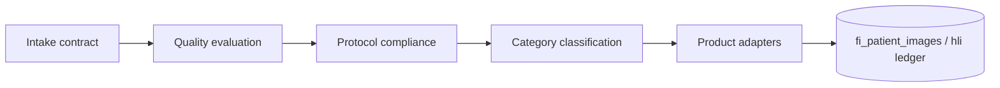

# ImagingOS Architecture

**Product:** Follicle Intelligence OS — shared medical image intelligence engine  
**Phase:** IM-1 foundation (contracts + stub pipeline)  
**Date:** 2026-06-17

---

## Purpose

ImagingOS is the **shared intelligence layer** for clinical hair-restoration photography inside FI OS. It normalizes how images enter the platform, how quality and protocol compliance are evaluated, and how view/category classification is produced — regardless of which product uploaded the image.

Goals:

- One canonical category vocabulary across products
- One intake metadata contract for external and internal uploads
- One pipeline orchestration point (quality → protocol → classification)
- Safe stub mode for integration testing without AI or storage I/O

---

## Product Consumers

| Consumer | Intake surface | IM-1 status |
|----------|----------------|-------------|
| **HairAudit** | `POST /api/internal/hairaudit/image-classify` | Stub wired via `fiOsHairAuditImageClassifyService` |
| **FI OS clinic uploads** | `fi_patient_images` + patient image API | Existing upload path; ImagingOS contracts ready |
| **HLI (Hair Longevity Intelligence)** | HLI adapters + `hli_image_classifications` | Uses HLI categories today; alias map in ImagingOS |
| **IIOHR** | Future portal uploads | Intake contract includes `iiohr` source_system |
| **Global intelligence network** | Future cross-tenant analytics | Out of scope until IM-5 |

---

## Module Layout (IM-1)

```
src/lib/imaging-os/
├── index.ts           # Public exports + runImagingOsStubPipeline()
├── types.ts           # Shared enums and snapshot type
├── categories.ts      # Canonical categories + mapExternalCategoryToCanonical()
├── intake.ts          # Intake record builder / validation
├── quality.ts         # Quality result contract + evaluateImageQualityStub()
├── protocol.ts        # Protocol evaluation pure helpers + stub
└── classification.ts  # Classification result + classifyImageCategoryStub()
```

**Related (pre-existing, not replaced in IM-1):**

- `src/lib/imagingOs/` — FI OS guided capture UI/server (protocol sessions, scalp maps)
- `src/lib/hair-intelligence/imageClassification/` — HLI OpenAI classifier + persistence
- `src/lib/hairaudit/` — HairAudit HTTP contract + auth

---

## Canonical Category Contract

Fifteen canonical categories:

`front`, `top`, `crown`, `left`, `right`, `donor`, `recipient`, `hairline`, `temporal`, `vertex`, `graft_tray`, `immediate_post_op`, `follow_up`, `microscopic`, `other`

External labels (HairAudit `patient_current_front`, HLI `left_profile`, etc.) map deterministically via `mapExternalCategoryToCanonical()`.

Confidence bands: `high` (≥0.85), `medium` (≥0.65), `low` (≥0.4), `insufficient` (<0.4).

---

## Pipeline Stages



IM-1 implements intake + stub quality + stub protocol + stub classification. No storage download or model invocation.

---

## Phase Roadmap

| Phase | Focus | Key deliverables |
|-------|--------|------------------|
| **IM-1** | Foundation contracts | `src/lib/imaging-os/*`, HairAudit stub wire-up, audit docs, tests |
| **IM-2** | Quality + storage | Heuristic blur/lighting/angle scores; optional signed URL fetch; no AI |
| **IM-3** | Live classification | Wire `classifyClinicalHairImageFromModelUrl` through ImagingOS; case protocol sets for HairAudit |
| **IM-4** | Persistence | ImagingOS analysis snapshot table or unified HLI ledger extensions |
| **IM-5** | Global network | Cross-product analytics, HairAudit repo migration to canonical-only responses |

---

## HairAudit Response Mapping (stub)

HairAudit expects seven response fields (Phase 3F contract):

| Field | IM-1 stub source |
|-------|------------------|
| `category` | External category from request (HairAudit taxonomy) |
| `canonical_photo_category` | ImagingOS canonical from `classifyImageCategoryStub()` |
| `confidence` | Deterministic stub confidence |
| `quality_status` | `evaluateImageQualityStub()` → `not_evaluated` |
| `protocol_status` | `evaluateImageProtocolStub()` → `not_evaluated` |
| `classifier_version` | `fi-os-stub-v1` (HairAudit compat) |
| `notes` | `"Stub classification only"` |

---

## Non-Goals (IM-1)

- No real AI / OpenAI / Claude / Gemini calls in ImagingOS modules
- No image byte fetch or storage download
- No public UI changes
- No broad schema migrations
- No HairAudit repository changes
- No migration of HairAudit classification logic back into FI OS live path (IM-3+)

---

## Future Migration Back Into HairAudit

When IM-3+ stabilizes the live ImagingOS pipeline:

1. HairAudit worker continues POSTing to FI OS internal endpoint
2. FI OS returns canonical categories; HairAudit stores both external slot label + canonical
3. HairAudit local classifier (`dry_run` / legacy) retires in favor of FI OS provider
4. Shared protocol compliance runs on FI OS case image sets, not per-upload stubs

Rollback: set `HAIRAUDIT_FI_IMAGE_CLASSIFIER_PROVIDER=dry_run` on HairAudit; FI OS stub mode via `HAIRAUDIT_IMAGE_CLASSIFIER_MODE=stub`.

---

## Verification

```bash
npm run typecheck
npm run test:imaging-os-im1
npm run test:upload-phase3f
npm run build
```

---

## References

- [imaging-os-phase-im1-foundation-audit.md](./imaging-os-phase-im1-foundation-audit.md)
- [hairaudit-phase-3f-fi-classifier-endpoint.md](./hairaudit-phase-3f-fi-classifier-endpoint.md)
- `supabase/migrations/20260624130001_fi_imaging_os.sql`
- `supabase/migrations/20260729120001_fi_os_stage8a_hli_ai_image_classification.sql`
