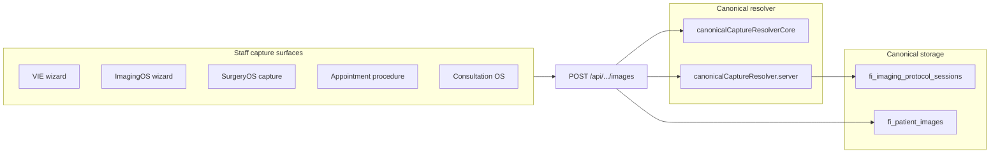

# ImageOS Capture Unification (IMAGING-CAPTURE-UNIFY-1)

## Overview

Staff clinical photography now flows through a single canonical protocol/session resolver before `fi_patient_images` rows are created. Legacy VIE/HLI catalog reads remain for slot metadata, but new writes resolve into `fi_imaging_protocol_sessions` with audit metadata describing the catalog source.

## Architecture

## Data flow

1. Staff upload hits `POST /api/tenants/[tenantId]/patients/[patientId]/images`.
2. `resolvePatientImageUploadCaptureSource` normalises `capture_source`.
3. `assertCanonicalStaffCaptureSource` rejects generic uploads without a source.
4. `ensureCanonicalStaffCapture` creates or reuses a canonical protocol session when required.
5. `mergeCanonicalCaptureMetadata` stamps audit fields on image metadata.
6. `createPatientImageRecord` runs the existing post-capture pipeline (quality, HLI classify, clinical AI).
7. Graft tray slots additionally call `linkGraftTrayImageAfterCapture` (see graft tray bridge doc).

## Protocol policy

| Source | Protocol required | Notes |
|--------|-------------------|-------|
| `surgery_os`, `vie_capture_wizard`, `appointment_procedure`, … | Yes | Auto-resolves session when missing |
| `legacy_follow_up`, `follow_up_encounter` | No | Preserves legacy follow-up imaging |
| `hairaudit`, `patient_portal` | No | Server-ingested / patient paths |
| `appointment_procedure_admin_fallback` | No | Env-gated admin escape hatch |

Template resolution (`resolveTemplateSlugForCaptureContext`):

- `surgery_os` → `surgery_day`
- `appointment_procedure` → booking-type aware (`hair_loss_consultation`, `follow_up_review`, `surgery_day`)
- Explicit `imaging_protocol_template_slug` from client always wins

## HairAudit dual-write

`dualWriteHairAuditImagesToPatientLibrary` projects HairAudit uploads into `fi_patient_images` when a foundation patient mapping exists. Metadata includes:

- `capture_source: hairaudit`
- `fi_event_id`, `fi_upload_id`, `source_case_id`
- `dual_write: imagingos_phase1_foundation`

Staff-only AI metadata (clinical analysis, graft signals) is not exposed to patient portal, PDF, or share links — existing patient-safe export mappers unchanged.

## Feature flags / env

| Variable | Default | Purpose |
|----------|---------|---------|
| `FI_ALLOW_APPOINTMENT_ADMIN_FALLBACK` | off | Admin-key fallback uploads for appointment procedures |
| `FI_IMAGING_REQUIRE_GRAFT_TRAY_CAPTURE` | off | See graft tray bridge doc |

## Staff workflow

1. Start capture from **Start Capture Protocol**, ImagingOS guided capture, SurgeryOS VIE panel, or appointment procedure button.
2. Each shot must include a protocol slot (`imaging_protocol_slot_slug`).
3. Session is created automatically if none is active for the template/context.
4. Generic patient profile uploads without protocol context are rejected with a clear message.

## Known limitations

- VIE/HLI read paths remain for slot labels and legacy sessions; not all historical sessions have canonical audit metadata.
- HairAudit dual-write skips when `foundation_patient_id` is missing on the case.
- Admin fallback uploads bypass protocol enforcement (intentional, env-gated).

## Next sprint: IMAGING-AI-GRAFT-PILOT-1

- AI graft counting on linked `graft_tray` images
- Populate `mismatch_reason` on `fi_imaging_graft_tray_links`
- Compare AI count vs manual SurgeryOS tray totals