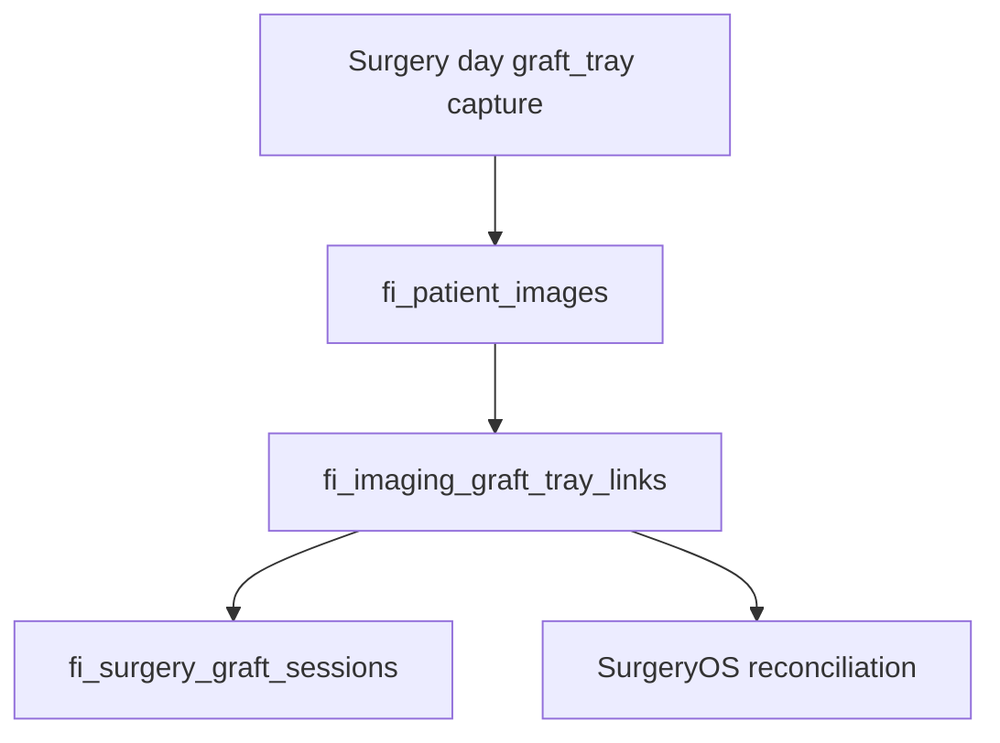

# Graft Tray → SurgeryOS Bridge (IMAGING-GRAFT-LINK-1)

## Overview

`graft_tray` protocol captures are linked to SurgeryOS graft counting context via `fi_imaging_graft_tray_links`. This provides reconciliation photo evidence for manual counts and a foundation for the AI graft pilot.

## Architecture

## Data flow

1. Staff captures `graft_tray` slot during surgery day protocol (`capture_source: surgery_os`).
2. After image insert, `linkGraftTrayImageAfterCapture`:
   - Resolves `surgery_id` from explicit id, metadata, case, or booking
   - Resolves `graft_session_id` when a session exists
   - Upserts `fi_imaging_graft_tray_links` (unique per tenant + image)
   - Patches image metadata: `graft_tray_link_id`, `graft_tray_review_reasons`, `graft_tray_reconciliation_evidence`
3. SurgeryOS command centre loads links into `graftSummary.trayImageLinks`.
4. Graft Counting Assistant shows linked photos with links to patient imaging.

## Link record fields

| Field | Purpose |
|-------|---------|
| `tenant_id`, `patient_id`, `image_id` | Core identity |
| `surgery_id`, `surgery_case_id`, `booking_id` | Surgery context |
| `graft_session_id`, `graft_count_event_id` | Graft workflow (event id reserved for pilot) |
| `protocol_session_id`, `protocol_slot_slug` | Imaging protocol evidence |
| `captured_at`, `captured_by_staff_id` | Provenance |
| `status` | `linked`, `review_required`, `mismatch_flagged`, `superseded` |
| `review_required`, `mismatch_reason` | Review + future AI mismatch |

## Reconciliation gate

When `FI_IMAGING_REQUIRE_GRAFT_TRAY_CAPTURE=true`:

- `reconcileGrafts` and phase transitions to recovery/complete call `assertGraftReconciliationGate` with `requireTrayCapture` and `trayImageCount`.
- Staff see: *"At least one graft tray photo is required before final reconciliation. Open Surgery Day capture and photograph the graft tray."*

**Default: off** — safe for production; enable in staging first.

## Review queue integration

Graft tray review reasons (staff-only):

- `graft_tray_missing_protocol_slot`
- `graft_tray_reconciliation_evidence_required`
- `graft_tray_count_mismatch_placeholder` (reserved for AI pilot)
- `graft_tray_quality_review`

Surfaced via `collectImagingReviewReasons` → `imagingClinicalReviewQueue`.

## Staff workflow

1. During surgery, open SurgeryOS → capture graft tray photo in surgery day protocol.
2. Continue manual tray counting in Graft Counting Assistant.
3. Before reconciliation, confirm tray photo appears under **Graft tray photo evidence**.
4. Complete reconciliation when counts balance and trays are nurse-confirmed.

## Feature flags

| Variable | Default | Effect |
|----------|---------|--------|
| `FI_IMAGING_REQUIRE_GRAFT_TRAY_CAPTURE` | `false` | Blocks final reconciliation without linked tray photo |

## Known limitations

- No AI graft counting yet — `mismatch_reason` is a placeholder.
- Links require resolvable surgery context (surgery id, case, or booking).
- Pre-migration tray photos are not backfilled automatically.

## Next sprint: IMAGING-AI-GRAFT-PILOT-1

Recommended next step over IMAGING-AI-SIGNALS-1 because:

- Link table and reconciliation gate are in place
- Manual counts provide ground truth for pilot evaluation
- Review reasons and metadata bridge are ready for AI mismatch flags

Pilot scope:

- Vision model count on `graft_tray` images
- Compare vs latest confirmed tray count event
- Set `mismatch_flagged` status and route to clinical review