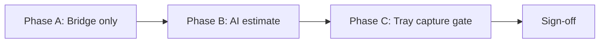

# Graft Tray Staging UAT Checklist

End-to-end validation for Stage 1 (capture bridge) + Stage 2 (AI-assisted validation) before production enablement.

**Audience:** Theatre lead, imaging lead, engineering  
**Environment:** Staging only  
**Estimated time:** 2–3 hours with one mock surgery case

---

## 1. Prerequisites

### 1.1 Deployments & migrations

| # | Check | Pass criteria |
|---|--------|---------------|
| P-1 | Staging deploy includes commits through `9b38bffc` (graft tray AI) | Build deployed |
| P-2 | Migration `20260703120001_fi_imaging_graft_tray_links.sql` applied | Table exists |
| P-3 | Migration `20260703130001_fi_imaging_graft_tray_ai_estimates.sql` applied | Table + job kind constraint updated |

**SQL smoke (service role or Supabase SQL editor):**

```sql
select count(*) from fi_imaging_graft_tray_links;
select count(*) from fi_imaging_graft_tray_ai_estimates;
select distinct analysis_kind from fi_imaging_ai_analysis_jobs;
-- expect graft_tray_count_estimate in distinct list after first job
```

### 1.2 Staging environment variables

Set in Vercel/hosting **Preview/Staging** — not production initially.

| Variable | Staging value | Notes |
|----------|---------------|-------|
| `FI_IMAGING_ENABLE_GRAFT_TRAY_AI_COUNT` | `true` | Master AI switch |
| `FI_IMAGING_GRAFT_TRAY_AI_PROVIDER` | `stub` | Start with stub; repeat subset with `openai_vision` if key configured |
| `FI_IMAGING_GRAFT_TRAY_COUNT_TOLERANCE_PERCENT` | `5` | Default tolerance |
| `FI_IMAGING_REQUIRE_GRAFT_TRAY_CAPTURE` | `false` | Enable only in Phase C |
| `FI_IMAGING_AI_ANALYSIS_CRON_SECRET` | set (≥16 chars) | Cron job drain |
| `CRON_SECRET` | set (if used) | Fallback for cron auth |

Leave production flags **off** until sign-off at end of this checklist.

### 1.3 Test fixtures

| # | Requirement |
|---|-------------|
| P-4 | Staging tenant with at least one patient on an active surgery case today |
| P-5 | Surgery case has `fi_surgeries` row linked to patient (case or booking resolvable) |
| P-6 | Staff test accounts: theatre nurse (tray count), surgeon/manager (reconcile), imaging reviewer |
| P-7 | Surgery day imaging protocol session available (SurgeryOS VIE capture or ImagingOS guided capture) |

### 1.4 URLs (replace `{tenantId}`, `{patientId}`)

| Surface | Path |
|---------|------|
| SurgeryOS graft counting | `/fi-admin/{tenantId}/surgery-os/graft-counting` |
| SurgeryOS board | `/fi-admin/{tenantId}/surgery-os` |
| Imaging review queue | `/fi-admin/{tenantId}/imaging/review` |
| Patient imaging | `/fi-admin/{tenantId}/patients/{patientId}/imaging` |

---

## 2. Phased rollout (recommended order)



| Phase | Flags | Goal |
|-------|-------|------|
| **A** | AI off, tray gate off | Prove capture → link → SurgeryOS evidence |
| **B** | AI on (`stub`), tray gate off | Prove job → estimate → review → UI |
| **C** | AI on, tray gate on | Prove reconciliation blocked without tray photo |

---

## Phase A — Capture bridge (Stage 1)

### TC-A1: Graft tray capture creates canonical image

| Step | Action |
|------|--------|
| 1 | Open SurgeryOS for today's surgery case |
| 2 | Start Surgery Day capture; select **graft_tray** slot |
| 3 | Upload/capture a tray photo |
| 4 | Confirm upload succeeds (no generic bypass error) |

| Pass | Fail |
|------|------|
| Image appears in patient imaging timeline | 400 "capture source required" or missing protocol session |
| `capture_source` is `surgery_os` (staff metadata) | Image created without protocol context |

### TC-A2: Bridge link created

| Step | Action |
|------|--------|
| 1 | After TC-A1, query `fi_imaging_graft_tray_links` for the image id |
| 2 | Open Graft Counting Assistant for the surgery |

| Pass | Fail |
|------|------|
| Link row exists with `surgery_id` populated | No link row or `surgery_id` null when surgery exists |
| `protocol_slot_slug` = `graft_tray` | Wrong slot |
| Graft Counting Assistant shows **Graft tray photo evidence (1)** | Panel missing or "No graft tray photos linked" |
| "View in imaging" link works | Broken deep link |

### TC-A3: Manual graft counting unchanged

| Step | Action |
|------|--------|
| 1 | Enter a tray count in SurgeryOS (manual) |
| 2 | Nurse confirms tray |
| 3 | Verify extracted/implanted totals update as before |

| Pass | Fail |
|------|------|
| Manual counts work identically to pre-sprint behaviour | Regression in tray entry, confirm, or totals |

### TC-A4: Legacy paths still work

| Step | Action |
|------|--------|
| 1 | Complete a legacy follow-up imaging upload (if used in tenant) |
| 2 | Upload HairAudit image to a mapped case (if HairAudit staging ingest enabled) |

| Pass | Fail |
|------|------|
| Legacy follow-up not blocked by canonical resolver | Follow-up upload fails |
| HairAudit dual-write still projects to timeline when patient mapped | Timeline missing expected HairAudit row |

---

## Phase B — AI estimate & review (Stage 2)

**Enable:** `FI_IMAGING_ENABLE_GRAFT_TRAY_AI_COUNT=true`

### TC-B1: Job enqueued only for graft_tray

| Step | Action |
|------|--------|
| 1 | Capture a **non–graft_tray** surgery day photo (e.g. donor) |
| 2 | Capture a **graft_tray** photo (new or re-use TC-A1) |
| 3 | Inspect `fi_imaging_ai_analysis_jobs` |

| Pass | Fail |
|------|------|
| `graft_tray_count_estimate` job exists for tray image only | Job created for donor/scalp photo |
| No job when `FI_IMAGING_ENABLE_GRAFT_TRAY_AI_COUNT=false` | Jobs enqueue with flag off |

### TC-B2: Job processes to estimate

| Step | Action |
|------|--------|
| 1 | Wait for cron (`/api/cron/fi-imaging-ai-analysis`, ~15 min) **or** trigger manually with cron secret |
| 2 | Confirm job `status = completed` |
| 3 | Check `fi_imaging_graft_tray_ai_estimates` |

| Pass | Fail |
|------|------|
| Estimate row exists for tray `image_id` | Job stuck failed/queued >30 min |
| `review_status = pending_review` | Auto-accepted without staff |
| `provider` = `stub` (or `openai_vision` if testing live) | Missing provider version |
| `mismatch_band` populated | Null band with assessable image |

### TC-B3: SurgeryOS shows AI validation (non-authoritative copy)

| Step | Action |
|------|--------|
| 1 | Refresh Graft Counting Assistant |
| 2 | Expand tray evidence for linked photo |

| Pass | Fail |
|------|------|
| Shows **AI estimate** and **Manual count** side by side | AI fields missing with flag on + completed job |
| Shows mismatch band and confidence band | UI says "confirmed count" or implies clinical truth |
| Pending review shows CTA to imaging review queue | No guidance when `pending_review` |

### TC-B4: Imaging review queue — graft tray AI panel

| Step | Action |
|------|--------|
| 1 | Open `/fi-admin/{tenantId}/imaging/review` |
| 2 | Locate tray image item |
| 3 | Verify graft tray AI validation panel |

| Pass | Fail |
|------|------|
| Review reasons include graft tray AI labels | Item absent despite pending estimate |
| Thumbnail, patient, AI vs manual counts visible | Missing comparison data |
| Actions present: Accept AI, Accept manual, Reject AI, Request retake, Correct count | Actions missing or error on click |

### TC-B5: Staff review — accept manual (source of truth preserved)

| Step | Action |
|------|--------|
| 1 | Note current SurgeryOS manual/extracted totals |
| 2 | Click **Accept manual** in review queue |
| 3 | Re-check SurgeryOS totals and estimate `review_status` |

| Pass | Fail |
|------|------|
| `review_status` → `accepted_manual` | Status unchanged or error |
| SurgeryOS manual counts **unchanged** | Silent overwrite of graft session totals |
| Original AI estimate still auditable in DB/metadata | AI estimate deleted |

### TC-B6: Staff review — correct count

| Step | Action |
|------|--------|
| 1 | Enter corrected count (e.g. `115`) and click **Correct count** |
| 2 | Verify estimate record |

| Pass | Fail |
|------|------|
| `review_status` → `corrected` | Failed validation |
| `corrected_graft_count` stored | Corrected count only in UI, not DB |
| SurgeryOS manual totals still unchanged | Manual counts mutated without explicit SurgeryOS action |

### TC-B7: Staff review — reject AI & request retake

| Step | Action |
|------|--------|
| 1 | On a second tray image, click **Reject AI** |
| 2 | On a third (or same), click **Request retake** |

| Pass | Fail |
|------|------|
| Reject → `review_status = rejected_ai` | — |
| Retake → `review_status = retake_requested`; retake flag in queue | Retake not surfaced |
| Link `review_required` updated appropriately | Orphan link state |

### TC-B8: Mismatch bands (stub tolerance test)

| Step | Action |
|------|--------|
| 1 | Enter manual confirmed tray count **far from** stub estimate (e.g. manual 50 if estimate ~120) |
| 2 | Re-capture or re-process estimate (new job if needed) |

| Pass | Fail |
|------|------|
| `mismatch_band` = `material_mismatch` or `minor_mismatch` | Always `within_tolerance` regardless of delta |
| Review reasons include mismatch labels | No mismatch reason when band is material |

### TC-B9: Manual count missing path

| Step | Action |
|------|--------|
| 1 | Capture tray photo **before** any manual tray count entered |
| 2 | Process AI job |

| Pass | Fail |
|------|------|
| `mismatch_band` = `manual_count_missing` | Crash or null band |
| Review reason: manual count missing for tray comparison | — |

---

## Phase C — Tray capture reconciliation gate

**Enable:** `FI_IMAGING_REQUIRE_GRAFT_TRAY_CAPTURE=true`  
**Keep:** `FI_IMAGING_ENABLE_GRAFT_TRAY_AI_COUNT=true` (optional)

### TC-C1: Gate blocks reconciliation without tray photo

| Step | Action |
|------|--------|
| 1 | Use a surgery case with **no** linked graft_tray image |
| 2 | Balance manual counts (remaining = 0, trays confirmed) |
| 3 | Attempt **Complete reconciliation** |

| Pass | Fail |
|------|------|
| Blocked with message mentioning graft tray photo / Surgery Day capture | Reconciliation succeeds without tray photo |

### TC-C2: Gate allows reconciliation with tray photo

| Step | Action |
|------|--------|
| 1 | Capture graft_tray photo for the case (TC-A1) |
| 2 | Complete manual reconciliation prerequisites |
| 3 | Attempt reconciliation |

| Pass | Fail |
|------|------|
| Reconciliation succeeds | Still blocked despite linked tray |

### TC-C3: Gate off in production config

| Step | Action |
|------|--------|
| 1 | Confirm production env has `FI_IMAGING_REQUIRE_GRAFT_TRAY_CAPTURE=false` until explicit go-live |

| Pass | Fail |
|------|------|
| Production unchanged | Gate accidentally on in prod |

---

## 4. Patient safety (mandatory)

### TC-S1: Patient portal / export redaction

| Step | Action |
|------|--------|
| 1 | Open patient portal imaging export or visual summary for the test patient |
| 2 | Inspect exported cards / PDF if applicable |

| Pass | Fail |
|------|------|
| No graft counts, AI estimates, confidence, or mismatch text | Any graft/AI metadata visible to patient |
| Graft tray images excluded or redacted from patient-safe cards | "graft tray" or count data in patient view |

### TC-S2: Share links

| Step | Action |
|------|--------|
| 1 | Generate patient imaging share link (if feature enabled in staging) |

| Pass | Fail |
|------|------|
| No `graft_tray_ai_estimate` fields in response | Staff AI metadata leaked |

---

## 5. Regression smoke (quick)

| # | Area | Pass |
|---|------|------|
| R-1 | Generic staff upload without protocol → blocked with clear message | ☐ |
| R-2 | Appointment procedure capture via Start Capture Protocol | ☐ |
| R-3 | VIE / guided capture sessions complete without error | ☐ |
| R-4 | Existing imaging clinical review (non–graft-tray) still works | ☐ |
| R-5 | `npm run test:imaging-capture-unify` passes in CI | ☐ |

---

## 6. Observability & ops

| # | Check | Pass |
|---|--------|------|
| O-1 | Cron `/api/cron/fi-imaging-ai-analysis` returns 200 with valid secret | ☐ |
| O-2 | Failed jobs retry then mark `failed` after 3 attempts | ☐ |
| O-3 | No PII in application logs for `raw_provider_metadata` | ☐ |
| O-4 | Estimate rows include `provider_version` for audit | ☐ |

**Manual cron trigger (staging):**

```bash
curl -sS -H "Authorization: Bearer $FI_IMAGING_AI_ANALYSIS_CRON_SECRET" \
  "https://<staging-host>/api/cron/fi-imaging-ai-analysis?tenantId=<tenant-uuid>"
```

---

## 7. Sign-off

| Role | Name | Date | Phase A | Phase B | Phase C | Patient safety |
|------|------|------|---------|---------|---------|----------------|
| Engineering | | | ☐ | ☐ | ☐ | ☐ |
| Theatre / clinical lead | | | ☐ | ☐ | ☐ | ☐ |
| Imaging lead | | | ☐ | ☐ | ☐ | ☐ |

### Production go-live recommendation (fill after UAT)

| Flag | Go-live value | Rationale |
|------|---------------|-----------|
| `FI_IMAGING_ENABLE_GRAFT_TRAY_AI_COUNT` | | |
| `FI_IMAGING_GRAFT_TRAY_AI_PROVIDER` | | |
| `FI_IMAGING_REQUIRE_GRAFT_TRAY_CAPTURE` | | |

### Blockers / follow-ups

| ID | Issue | Severity | Owner |
|----|-------|----------|-------|
| | | | |

---

## 8. After UAT — suggested next sprint

If Phase B passes with stub provider:

1. **Stage 3:** Real graft-tray vision model + composition-aware comparison  
2. Tie estimates to specific `graft_count_event_id` on nurse confirm  
3. Optional: block reconciliation on `material_mismatch` + `pending_review`  
4. Theatre metrics dashboard (mismatch rate, review SLA)

---

## Related docs

- [imaging-os-graft-tray-bridge.md](./imaging-os-graft-tray-bridge.md) — Stage 1 bridge  
- [imaging-os-ai-graft-tray-validation.md](./imaging-os-ai-graft-tray-validation.md) — Stage 2 AI validation  
- [imaging-os-capture-unification.md](./imaging-os-capture-unification.md) — Canonical capture