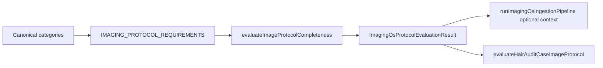

# ImagingOS Phase IM-3 — Protocol Completeness Engine

**Date:** 2026-06-17  
**Scope:** Pure protocol evaluation logic for clinical imaging workflows  
**Repository:** Follicle Intelligence (FI OS)

---

## What IM-3 Adds

Phase IM-3 introduces a **Protocol Completeness Engine** in `src/lib/imaging-os/protocol.ts` that evaluates whether a set of uploaded images satisfies the requirements for a specific clinical workflow.

| Module | Purpose |
|--------|---------|
| `protocol.ts` (extended) | Protocol registry, completeness evaluation, workflow recommendation |
| `adapters/hairAuditCaseProtocolAdapter.ts` | HairAudit case label → baseline protocol evaluation |
| `pipeline.ts` (extended) | Optional protocol context on `runImagingOsIngestionPipeline()` |

Key behaviors:

- **12 clinical protocols** with required/optional category sets
- **Completeness scoring** as a percentage of required categories present
- **Workflow readiness** bands: ready (100%), partial_ready (70–99%), not_ready (&lt;70%)
- **Case-level evaluation** via `evaluateCaseImageSet()`
- **Source-system recommendation** via `recommendProtocolForWorkflow()`
- **Pipeline integration** without breaking IM-2 single-image stub behavior

---

## What IM-3 Deliberately Does Not Add

IM-3 is **pure logic only**. It does **not**:

- Add database schema migrations
- Change UI or upload routes
- Invoke AI or model classification
- Fetch images from storage
- Change the HairAudit classify endpoint response shape
- Remove IM-1 or IM-2 behavior

---

## Protocol Architecture



Each protocol entry defines:

```typescript
{
  required: CanonicalHairImageCategory[];
  optional: CanonicalHairImageCategory[];
  minimum_required_count: number;
  description: string;
}
```

The evaluator deduplicates categories, compares the present set against `required`, and tracks which `optional` categories were supplied.

---

## Supported Protocols

| Protocol | Required views | Min count | Typical workflow |
|----------|----------------|-----------|------------------|
| `hairaudit_baseline` | front, left, right, top, crown, donor | 6 | HairAudit case intake |
| `consultation_basic` | front, left, right, top | 4 | Initial consultation |
| `consultation_advanced` | front, left, right, top, crown, donor | 6 | Advanced consultation |
| `surgery_planning` | front, left, right, top, crown, donor, recipient | 7 | Pre-operative planning |
| `surgery_immediate_postop` | immediate_post_op, front, donor, recipient | 4 | Day-of surgery |
| `surgery_followup_14day` | follow_up, front, top, crown | 4 | 14-day follow-up |
| `surgery_followup_6month` | follow_up, front, top, crown, left, right | 6 | 6-month follow-up |
| `surgery_followup_12month` | follow_up, front, top, crown, left, right, donor | 7 | 12-month follow-up |
| `hli_diagnostic` | front, top, crown, left, right, donor | 6 | HLI diagnostic intake |
| `donor_analysis` | donor, left, right | 3 | Donor-focused review |
| `recipient_analysis` | recipient, front, top, crown, hairline | 5 | Recipient-focused review |
| `microscopic_analysis` | microscopic | 1 | Trichoscopy set |

Optional categories (e.g. `microscopic` on baseline protocols) contribute to `optional_present` but do not affect completeness score.

---

## Completeness Scoring Logic

```
completeness_score = round((present_required / total_required) * 100)
```

Where:

- `total_required` = count of unique entries in the protocol's `required` array
- `present_required` = count of required categories found in the uploaded set
- Duplicate uploads of the same category count once

Optional categories never increase or decrease the score.

---

## Workflow Readiness Logic

| Completeness | `status` | `workflow_readiness` |
|--------------|----------|----------------------|
| 100% | `complete` | `ready` |
| 70–99% | `partial` | `partial_ready` |
| &lt; 70% | `incomplete` | `not_ready` |
| Unknown protocol | `invalid` | `not_ready` |

Example: `hairaudit_baseline` with 5 of 6 required views → 83% → `partial` / `partial_ready`.

---

## Public API

### Core evaluation

```typescript
evaluateImageProtocolCompleteness({
  protocol: "hairaudit_baseline",
  categories: ["front", "left", "right", "top", "crown", "donor"],
});

evaluateCaseImageSet({
  protocol: "surgery_planning",
  images: [{ canonical_category: "front" }, { canonical_category: "recipient" }],
});
```

### Workflow recommendation

```typescript
recommendProtocolForWorkflow({
  source_system: "hairaudit",
  upload_surface: "audit_upload",
}); // → "hairaudit_baseline"
```

### HairAudit adapter

```typescript
evaluateHairAuditCaseImageProtocol([
  "patient_current_front",
  "patient_current_donor",
  // ...
]);
```

Maps labels via `mapExternalCategoryToCanonical()` and evaluates against `hairaudit_baseline`.

### Pipeline integration (IM-2 compatible)

```typescript
runImagingOsIngestionPipeline(request); // IM-2 unchanged

runImagingOsIngestionPipeline(request, {
  protocol: "hairaudit_baseline",
  case_categories: ["front", "left", "right", "top", "crown", "donor"],
}); // adds protocol_completeness on result
```

When `protocol` is omitted, `protocol_completeness` is undefined and `protocol` remains the IM-1/IM-2 stub (`not_evaluated`).

---

## Future IM-4 Integration

IM-4 is expected to:

1. **Persist** `ImagingOsProtocolEvaluationResult` snapshots alongside case or session records
2. **Wire live quality scores** into protocol deviation detection (IM-2 quality heuristics + IM-3 completeness)
3. **Expose protocol status** in FI OS admin surfaces and HairAudit case dashboards
4. **Trigger workflow gates** (e.g. block surgery planning sign-off until `workflow_readiness === "ready"`)
5. **Unify** HLI photo protocol sessions with ImagingOS canonical protocol types

IM-3 keeps evaluation pure so IM-4 can persist results without changing scoring rules.

---

## Verification

```bash
npm run test:imaging-os-im1
npm run test:imaging-os-im2
npm run test:imaging-os-im3
npm run test:upload-phase3f
npm run build
```

---

## References

- [imaging-os-architecture.md](./imaging-os-architecture.md)
- [imaging-os-phase-im1-foundation-audit.md](./imaging-os-phase-im1-foundation-audit.md)
- [imaging-os-phase-im2-universal-ingestion.md](./imaging-os-phase-im2-universal-ingestion.md)
- `src/lib/imaging-os/protocol.ts`
- `tests/imagingOsPhaseIm3.test.ts`
