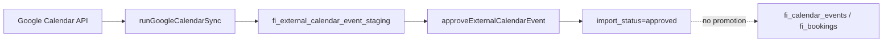

# Live Data Input Audit (FI-LIVE-DATA-INPUT-RECOVERY-1)

Audit date: 2026-07-03

## Executive summary

Live external data visibility regressed primarily due to **cache/revalidation gaps** and **staging-vs-promoted table mismatches**, not missing connectors. Fixes in this recovery:

1. Shared `revalidateLiveDataSurfacesForTenant()` after Google Calendar sync (cron/webhook/manual), Timely webhooks, HubSpot LeadFlow drain, and CRM import actions.
2. `revalidateTag` for tenant reference-data cache (`fi-tenant-{id}`, `fi-reference-data`).
3. HubSpot F5 import **updates existing mapped** `fi_crm_leads` instead of failing with "already mapped".
4. Tenant diagnostics via `loadLiveDataHealthSummary()` on **Settings → Integrations**.

---

## A. Google Calendar / Timely

### End-to-end map (operational — what the calendar UI uses)

```mermaid
flowchart LR
  GC[Google Calendar API] --> Sync[syncGoogleCalendarEvents]
  Cron[/api/cron/google-calendar/sync] --> Sync
  Webhook[/api/google/calendar/webhook] --> Inc[syncGoogleCalendarIncrementalForWebhook]
  Inc --> Sync
  Sync --> Review{GC-7 conflict?}
  Review -->|yes| Queue[fi_calendar_sync_review_items]
  Review -->|no| Events[fi_calendar_events]
  Queue -->|manual import| Events
  Events --> Loader[loadOperationalCalendarGridData]
  Timely[Timely Zapier webhook] --> Bookings[fi_bookings]
  Bookings --> Loader
  Loader --> UI[/fi-admin/{tenantId}/calendar]
```

### Parallel OnboardingOS path (staging only — not calendar UI)



### Source → staging → promoted → loader → UI

| Source | Staging | Promoted | Loader | UI route |
|--------|---------|----------|--------|----------|
| Google Calendar (CalendarOS) | `fi_calendar_sync_review_items` (conflicts only) | `fi_calendar_events` | `operationalCalendarLoader.server.ts` | `/fi-admin/{tenantId}/calendar` |
| Google Calendar (OnboardingOS F3) | `fi_external_calendar_event_staging` | **none** (approve is audit-only) | `googleCalendarConnector.server.ts` loaders | Onboarding / configuration panels |
| Timely (Zapier) | `fi_integration_webhook_events` (audit) | `fi_bookings` via `fi_external_entity_mappings` | `operationalCalendarLoader.server.ts` | `/fi-admin/{tenantId}/calendar` |
| Timely ICS URL | stored in `fi_staff_calendar_links` | **not synced** (no ICS parser) | — | — |

### Identified breakpoints (calendar)

| Breakpoint | Impact | Fix / action |
|------------|--------|--------------|
| Cron/webhook sync wrote `fi_calendar_events` but **no revalidatePath** | Calendar/home/reception served stale SSR until hard refresh | **Fixed:** `revalidateLiveDataSurfacesForTenant` after sync |
| OnboardingOS approve does not promote | Users expect approved Google events on calendar | **Documented:** use CalendarOS inbound sync; staging is preview |
| Two Google registries (`fi_calendar_integrations` vs `fi_tenant_external_integrations`) | OAuth in one stack does not wire the other | Connect via **Settings → Integrations** (CalendarOS) |
| GC-7 conflicts skipped from auto-insert | Events missing until manual review import | Use Sync Review card on integrations page |
| Timely requires patient webhook first | Appointment 404 if patient not synced | Ensure Zapier patient step runs before appointment |

---

## B. HubSpot

### End-to-end maps

**OnboardingOS connector (F4/F5)**

```mermaid
flowchart LR
  HS[HubSpot API] --> Sync[runHubspotSync]
  Sync --> StgC[fi_external_hubspot_contact_staging]
  Sync --> StgD[fi_external_hubspot_deal_staging]
  StgC --> Approve[approveHubspotLead]
  Approve --> F5[createFiLeadFromHubspotContact]
  F5 --> CRM[fi_crm_leads + fi_persons]
  CRM --> CrmUI[/fi-admin/{tenantId}/crm]
```

**LeadFlow webhooks (real-time)**

```mermaid
flowchart LR
  WH[HubSpot webhook] --> Queue[fi_external_events]
  Cron[Cron drain] --> Proc[hubspotLeadFlowProcessor]
  Queue --> Proc
  Proc --> LF[fi_leads]
  LF --> LeadUI[/fi-admin/{tenantId}/leadflow]
```

### Source → staging → promoted → loader → UI

| Source | Staging | Promoted | Loader | UI route |
|--------|---------|----------|--------|----------|
| OnboardingOS API sync | `fi_external_hubspot_*_staging` | `fi_crm_leads` (F5) | CRM shell loaders | `/crm`, `/onboarding-os/import-review` |
| LeadFlow webhook | `fi_external_events` | `fi_leads` | `leadFlowOperatorDashboardLoader.server.ts` | `/leadflow` |
| CSV Import Centre | `stg_hubspot_contacts_imports` | `fi_crm_leads` | `leadFlowDashboardLoader.server.ts` | `/settings/imports/hubspot`, `/crm` |
| HubSpot timeline webhooks | `fi_integration_webhook_events` | `fi_patient_timeline` | `loadPatientTimeline.server.ts` | `/patients/{id}/timeline` |

### Identified breakpoints (HubSpot)

| Breakpoint | Impact | Fix / action |
|------------|--------|--------------|
| F5 import blocked on existing `fi_external_record_mappings` | HubSpot updates silently rejected | **Fixed:** update existing `fi_crm_leads` when mapping exists |
| LeadFlow cron had no revalidation | `/leadflow` stale after webhook processing | **Fixed:** revalidate after queue drain |
| CRM dashboard HubSpot widget reads CSV staging only | OnboardingOS staging invisible on `/crm` | Use import review + live data health panel |
| Parallel lead tables (`fi_leads` vs `fi_crm_leads`) | Operators look at wrong surface | Webhooks → LeadFlow; F5 → CRM |

---

## C. Email / activity

| Path | Status | Writes | UI |
|------|--------|--------|-----|
| Pathology inbound email | **Implemented** (env-gated) | `fi_pathology_inbound_email_messages`, inbox docs | `/pathology/inbox`, `/configuration/pathology-email` |
| HubSpot email timeline webhook | **Implemented** | `fi_patient_timeline` | Patient timeline |
| CRM communications (manual/ReceptionOS) | **Implemented** | `fi_crm_lead_communications` | Reception OS communication timeline |
| Generic clinic email ingest | **Not implemented** | — | — |

Activity tables: `fi_crm_activity_events`, `fi_lead_activity`, `fi_timeline_events`, `fi_patient_timeline`.

---

## D. Cache and revalidation

| Mechanism | Location | Issue | Fix |
|-----------|----------|-------|-----|
| `unstable_cache` (300s) | `referenceDataCache.server.ts` | Tags never invalidated | **Fixed:** `revalidateTag` in `revalidateLiveDataSurfacesForTenant` |
| `force-dynamic` + `noStore` | Home, reception, operations, calendar | OK for DB freshness | — |
| Missing `revalidatePath` for `/reception`, `/operations`, home | Many actions | Shared operational dashboard stale | **Fixed:** central path list |
| Today feed polling | `useTodayFeedRefresh` | Compensates but laggy | Revalidation reduces need for hard refresh |

---

## E. Tenant and source mapping

- All integration tables are `tenant_id` scoped.
- CalendarOS uses `fi_calendar_integrations`; OnboardingOS uses `fi_tenant_external_integrations` — verify correct tenant on connect.
- Timely mappings: `fi_external_entity_mappings` with `source_system='timely'`.
- HubSpot F5 mappings: `fi_external_record_mappings` with `integration_id`.
- LeadFlow: `fi_leads.hubspot_contact_id` per tenant.

---

## F. Visual freshness by surface

| Surface | Source table(s) | Loader | Cache | Refresh trigger |
|---------|-----------------|--------|-------|-----------------|
| Calendar V1/V2 | `fi_bookings`, `fi_calendar_events` | `operationalCalendarLoader.server.ts` | `noStore`, no `unstable_cache` | Sync cron/webhook, Timely webhook, manual sync |
| Tenant home / Today | `tenantOperationalDashboardLoader` | entity attention queries | `noStore`; shell bootstrap cached 300s | Polling + **revalidate after sync** |
| LeadFlow | `fi_leads` | `leadFlowOperatorDashboardLoader` | `noStore` | Webhook drain cron + revalidate |
| CRM / pipeline | `fi_crm_leads` | CRM loaders | `noStore` | F5 import, HubSpot sync actions + revalidate |
| Reception / Operations | shared operational loader | `tenantOperationalDashboardLoader` | `noStore` + tagged bootstrap | **revalidate after external sync** |
| Integrations settings | connection + health tables | page loaders | `noStore` | `loadLiveDataHealthSummary` on each load |

---

## Fix plan (completed in this recovery)

1. ✅ `src/lib/integrations/revalidateLiveDataPaths.server.ts` — shared invalidation
2. ✅ `src/lib/integrations/liveDataHealth.server.ts` — tenant health summary
3. ✅ Live data diagnostics card on `/fi-admin/{tenantId}/settings/integrations`
4. ✅ Google Calendar sync + incremental webhook revalidation
5. ✅ Timely appointment webhook revalidation
6. ✅ HubSpot LeadFlow drain revalidation
7. ✅ HubSpot F5 idempotent **update** for existing external mappings
8. ✅ Unit tests for health + HubSpot update path

## Diagnostic helper

```ts
import { loadLiveDataHealthSummary } from "@/src/lib/integrations/liveDataHealth.server";

const health = await loadLiveDataHealthSummary(tenantId);
// health.googleCalendarConnected, health.warnings, ...
```

## Verification checklist

- [ ] Connect Google Calendar → run inbound sync → calendar shows new `fi_calendar_events` without hard refresh
- [ ] Timely appointment webhook → booking appears on calendar and home attention counts update
- [ ] HubSpot webhook → LeadFlow queue drains → `/leadflow` shows updated lead
- [ ] Re-import approved HubSpot staging contact with existing mapping → `fi_crm_leads` summary/metadata updates
- [ ] Integrations page shows live data health warnings when staging exists without promotion
