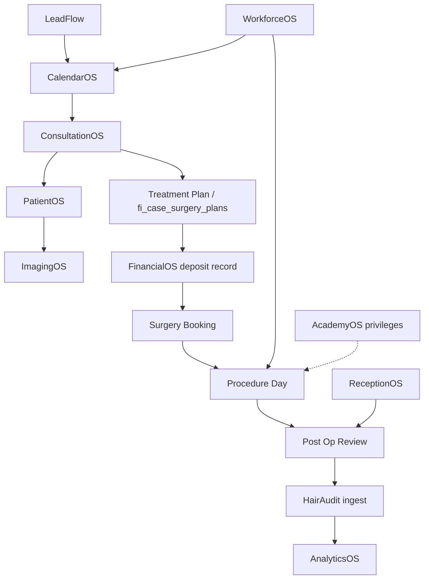

# Evolved Hair Restoration — End-to-End Workflow Matrix

**Sprint:** FI-PH1 — Production Hardening  
**Production tenant:** Evolved Hair Restoration (Perth)  
**Purpose:** Map the full patient journey from lead intake through analytics closure — modules, tables, integrations, dependencies, and production risk.

**Related docs**

- [Operational validation framework](./evolved-operational-validation.md)
- [Production blockers](./evolved-production-blockers.md)
- [Platform architecture registry](../platform-architecture/README.md)
- [Workflow events audit](../audits/fi-workflow-events-audit.md)

**Risk legend**

| Level | Meaning |
|-------|---------|
| **Low** | Validated pattern; FI-native SoR; limited external dependency |
| **Medium** | Partial automation, parallel data models, or manual reconciliation required |
| **High** | External SoR, legacy API, staging-only sync, or known production gap |

---

## Journey overview

```text
Lead Created
    ↓
Consultation Booked
    ↓
Consultation Completed
    ↓
Patient Created
    ↓
Images Uploaded
    ↓
Treatment Plan Created
    ↓
Deposit Paid
    ↓
Surgery Booked
    ↓
Procedure Day
    ↓
Post Op Review
    ↓
HairAudit Generated
    ↓
Analytics Updated
```

---

## Step 1 — Lead Created

| Field | Value |
|-------|-------|
| **Module responsible** | LeadFlow |
| **Tables affected** | `fi_crm_leads`, `fi_crm_pipeline_stages`, `fi_crm_lead_stage_history`, `fi_crm_activity_events`; optional `fi_leads`, `fi_lead_activity`; optional `fi_external_events` (HubSpot queue) |
| **External integrations triggered** | HubSpot import centre (batch, dry-run first); reminder cron on `lead.created` (`FI_REMINDER_CRON_SECRET`); Resend/Twilio only if reminder live delivery enabled |
| **Dependencies** | Authenticated CRM staff; tenant RLS; pipeline stages seeded for Evolved |
| **Risk level** | **Medium** — parallel CRM/native lead models (`fi_crm_leads` vs `fi_leads`); HubSpot inbound webhooks not in codebase |

---

## Step 2 — Consultation Booked

| Field | Value |
|-------|-------|
| **Module responsible** | CalendarOS (+ ClinicOS surfaces) |
| **Tables affected** | `fi_bookings`, `fi_booking_resource_requirements`, `fi_clinic_rooms`, `fi_service_room_eligibility`, `fi_service_staff_eligibility`, `fi_crm_activity_events` (`booking.created`) |
| **External integrations triggered** | Google Calendar sync (if connected): `fi_calendar_integrations`, `fi_calendar_events`, `fi_calendar_sync_runs`, `fi_platform_events`; Timely webhook → `/integrations/timely/appointment` |
| **Dependencies** | Lead or patient context; Perth timezone (`Australia/Perth`); staff/room eligibility migrations applied |
| **Risk level** | **Medium** — Google staged import approve does **not** create FI bookings (`no_fi_booking_created: true` in onboarding connector); sync conflicts require GC-7 review |

---

## Step 3 — Consultation Completed

| Field | Value |
|-------|-------|
| **Module responsible** | ConsultationOS |
| **Tables affected** | `fi_consultations`, consultation form instance tables, `fi_crm_activity_events`, optional `fi_crm_tasks` (automation handoff) |
| **External integrations triggered** | None required for core completion; optional OpenAI if consultation checklist AI enabled |
| **Dependencies** | Booking linked via `fi_consultations.booking_id`; consultant via `consultant_staff_id`; form templates configured for Evolved |
| **Risk level** | **Medium** — consultation automation handoffs (`runConsultationCompletionAutomation`) tenant-policy dependent; workflow engine v1 handlers are placeholders |

---

## Step 4 — Patient Created

| Field | Value |
|-------|-------|
| **Module responsible** | PatientOS (+ LeadFlow conversion) |
| **Tables affected** | `fi_persons`, `fi_person_roles`, `fi_patients`, `fi_patient_clinical_details`, `fi_patient_source_ids`, `fi_timeline_events`, `fi_crm_activity_events` |
| **External integrations triggered** | HLI `hli.intake.submitted` via legacy `/api/fi/events` (if enabled) → foundation dual-write; Timely patient mapping via `fi_external_entity_mappings` |
| **Dependencies** | Lead conversion atomicity; source ID mapping to prevent duplicates |
| **Risk level** | **Low–Medium** — conversion path is FI-native; HLI ingest requires legacy API gate |

---

## Step 5 — Images Uploaded

| Field | Value |
|-------|-------|
| **Module responsible** | ImagingOS (consumer: PatientOS UI) |
| **Tables affected** | `fi_patient_images`, Supabase Storage objects; optional `hli_image_classifications`; optional `fi_analytics_events` (`imaging_os`) |
| **External integrations triggered** | HairAudit classify endpoint (`POST /api/internal/hairaudit/image-classify`) if used — bearer auth; IM-1 stub pipeline (no external AI by default) |
| **Dependencies** | Storage bucket policies; signed URL generation; patient tenant scope |
| **Risk level** | **Low** for upload/display; **Medium** if operators expect live AI — IM-1 is stub unless IM-12 explicitly activated |

---

## Step 6 — Treatment Plan Created

| Field | Value |
|-------|-------|
| **Module responsible** | ConsultationOS + SurgeryOS (surgery planning) |
| **Tables affected** | `fi_case_surgery_plans`, `fi_cases`, `fi_crm_quotes` (commercial plan); consultation handoff may seed draft plan fields |
| **External integrations triggered** | None required |
| **Dependencies** | Consultation completed or case exists; consultation automation may mutate `fi_case_surgery_plans` draft fields |
| **Risk level** | **Medium** — surgery plan history **not** on patient timeline by default ([patient timeline audit](../audits/patient-timeline-unification.md)); plan visibility relies on case UI |

---

## Step 7 — Deposit Paid

| Field | Value |
|-------|-------|
| **Module responsible** | FinancialOS |
| **Tables affected** | `fi_payment_records` (manual tracking), `fi_crm_quotes`, optional `fi_financial_transactions`, `fi_financial_transaction_audit_events`, `fi_revenue_pipeline` |
| **External integrations triggered** | Stripe webhook (`/api/fi-payments/stripe/webhook`) **only if** Stripe connected — otherwise **manual entry only** per [production readiness](../runbooks/fi-os-production-readiness.md) |
| **Dependencies** | Quote/case linkage; tax settings (`fi_tax_localisation_settings`); staff understanding that manual records ≠ bank settlement |
| **Risk level** | **High** if staff assume live payments; **Medium** for manual-only ops — clearance gating before surgery may be partial |

---

## Step 8 — Surgery Booked

| Field | Value |
|-------|-------|
| **Module responsible** | CalendarOS + SurgeryOS |
| **Tables affected** | `fi_bookings` (surgery service type), `fi_cases`, `fi_case_procedures`, `fi_crm_activity_events` |
| **External integrations triggered** | Google Calendar mirror (optional); platform bus `calendar.event.*` (best-effort) |
| **Dependencies** | Deposit/clearance expectations recorded; room/staff eligibility; case linked to patient |
| **Risk level** | **Medium** — financial clearance engine not fully automated; calendar external sync staging gap |

---

## Step 9 — Procedure Day

| Field | Value |
|-------|-------|
| **Module responsible** | SurgeryOS (+ WorkforceOS for team) |
| **Tables affected** | `fi_case_procedures` (V1.1 team + milestones), `fi_surgery_graft_sessions`, `fi_surgery_graft_count_events`, `fi_surgery_os_graft_clinical_safety`, `fi_staff_event_assignments` |
| **External integrations triggered** | None required for core procedure day |
| **Dependencies** | Migration `20260718120002_fi_case_procedures_v11_team_milestones.sql`; staff PIN for sensitive actions (**To verify** floor); AcademyOS procedure privileges (**partial**) |
| **Risk level** | **Medium** — V1.1 migration mandatory; graft reconciliation and safety rules tenant-configured |

---

## Step 10 — Post Op Review

| Field | Value |
|-------|-------|
| **Module responsible** | SurgeryOS + PatientOS (+ optional MedicationOS post-op bundles) |
| **Tables affected** | `fi_case_post_op_tracking`, `fi_patient_images` (follow-up photography), optional `fi_patient_therapy_plans`, `fi_patient_therapy_events` (MedicationOS v1 tables) |
| **External integrations triggered** | ReceptionOS follow-up communications (dry-run during pilot); reminder cron |
| **Dependencies** | Post-op form/workflow configured; MedicationOS therapy timeline mirror (**partial**) |
| **Risk level** | **Medium** — MedicationOS v1 tables exist but full peri-op UX may be incomplete; reception comms dry-run by default |

---

## Step 11 — HairAudit Generated

| Field | Value |
|-------|-------|
| **Module responsible** | AuditOS (+ external HairAudit product) |
| **Tables affected** | `fi_events`, `fi_event_links`, `fi_cases`, `fi_media_assets`, `fi_timeline_events`, `fi_scorecards`, `fi_reports`, `fi_model_runs`, `fi_jobs` |
| **External integrations triggered** | HairAudit producer → `POST /api/fi/events` with `hairaudit.case.submitted`, `hairaudit.images.uploaded` (requires `FI_LEGACY_FI_API_ENABLED` + secret **or** migrated auth); optional pipeline trigger via `maybeTriggerPipelineFromEvent` |
| **Dependencies** | Legacy FI API gate or tenant-scoped successor; ingest schema allow-list in `lib/fi/events/schema.ts`; HairAudit remains SoR for audit case |
| **Risk level** | **High** — cross-product ingest via legacy API; FI is derivative intelligence layer not HairAudit SoR; shadow `hairaudit.audit.completed` bus event is dev/test only |

---

## Step 12 — Analytics Updated

| Field | Value |
|-------|-------|
| **Module responsible** | AnalyticsOS |
| **Tables affected** | `fi_analytics_events`, `fi_financial_executive_snapshots`, parallel `fi_crm_activity_events` (not normalized analytics) |
| **External integrations triggered** | FI Platform Event Bus fan-out (partial); intelligence event log (`fi_intelligence_event_logs`) — **persistence off in production** by policy |
| **Dependencies** | Module publishers calling `analyticsEventCore`; valid `module_name` check constraint |
| **Risk level** | **Medium** — not all journey steps guarantee analytics emission today; bus Phase 2 idempotency incomplete |

---

## Dependency graph (critical path)



---

## Cross-step integration summary

| Integration | Journey steps | Production posture |
|-------------|---------------|-------------------|
| Google Calendar | 2, 8 | FI bookings authoritative; staged import ≠ booking create |
| Timely webhook | 2, 4 | Secret-gated; optional for Evolved |
| IIOHR HR sync | 4, 9 | Evolved Perth cron via `EVOLVED_PERTH_TENANT_ID` |
| Stripe | 7 | Manual records default; webhook if explicitly enabled |
| Resend / Twilio | 1, 10 | ReceptionOS dry-run; reminder cron separate flag |
| HairAudit `/api/fi/events` | 11 | Legacy API gated; high risk if enabled without rotation |
| HubSpot | 1 | Import centre only; no inbound webhook in codebase |
| Intelligence Bus | 11, 12 | Shadow/staged modes; production dispatch off |

---

## Highest-risk steps (production focus)

| Rank | Step | Risk | Primary reason |
|------|------|------|----------------|
| 1 | Deposit Paid | High | Manual vs Stripe confusion; clearance partial |
| 2 | HairAudit Generated | High | Legacy API ingest; external SoR |
| 3 | Consultation Booked | Medium | Calendar sync staging gap |
| 4 | Analytics Updated | Medium | Incomplete module publishers |
| 5 | Post Op Review | Medium | MedicationOS partial; comms dry-run |

---

## Validation evidence template

| Step | SMOKETEST- ID | Pass | Blocker ref | Date |
|------|---------------|:----:|-------------|------|
| Lead Created | | ☐ | | |
| Consultation Booked | | ☐ | | |
| Consultation Completed | | ☐ | | |
| Patient Created | | ☐ | | |
| Images Uploaded | | ☐ | | |
| Treatment Plan Created | | ☐ | | |
| Deposit Paid | | ☐ | | |
| Surgery Booked | | ☐ | | |
| Procedure Day | | ☐ | | |
| Post Op Review | | ☐ | | |
| HairAudit Generated | | ☐ | | |
| Analytics Updated | | ☐ | | |
