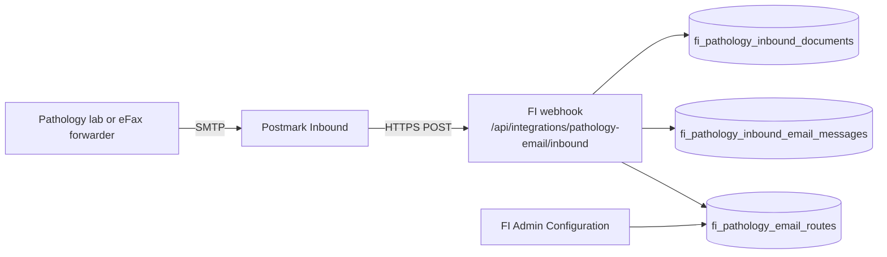

# Pathology email ingestion — production setup

Runbook for enabling inbound pathology lab PDF delivery via email webhooks in Follicle Intelligence (FI OS).

## Recommendation: Postmark Inbound first

Use **Postmark Inbound** as the primary production provider:

- Reliable inbound parsing with attachment support and webhook retries
- Simple DNS (MX to Postmark) plus a single HTTPS webhook
- Clear JSON payload for `To`, `From`, `Subject`, and base64 attachments
- Lower operational overhead than self-hosted Mailgun routes for a single-tenant inbox

**Mailgun** remains supported as an alternative via the same FI webhook normalizer (`provider: "mailgun"` or auto-detect). Configure only one primary inbound provider per address to avoid duplicate deliveries.

## Architecture overview



1. Email arrives at a tenant-specific inbound address (for example `pathology+evolved@inbound.yourdomain.com`).
2. Postmark (or Mailgun) POSTs JSON to FI.
3. FI resolves the `To` address against `fi_pathology_email_routes` (tenant-scoped, must be `active`).
4. PDF attachments become pathology inbox documents with `source_channel = email`.
5. Staff match and promote from **Pathology → Results inbox** — **no automatic reviewed status**.

## DNS and provider setup (Postmark)

1. Add an **Inbound domain** in Postmark (for example `inbound.yourdomain.com`).
2. Publish the MX records Postmark provides for that subdomain.
3. Create an inbound address or catch-all that delivers to your tenant route address.
4. Configure the Postmark inbound webhook:
   - **URL:** `https://<your-app-host>/api/integrations/pathology-email/inbound`
   - **Method:** POST
   - **Custom header:** `X-Pathology-Email-Webhook-Secret: <PATHOLOGY_EMAIL_WEBHOOK_SECRET>`

Register the same inbound address in FI under **Configuration → Pathology email routes** (or run the Evolved seed — see below).

## Webhook endpoint

| Item | Value |
|------|--------|
| Method | `POST` |
| Path | `/api/integrations/pathology-email/inbound` |
| Secret header | `X-Pathology-Email-Webhook-Secret` |
| Alternate auth | `Authorization: Bearer <PATHOLOGY_EMAIL_WEBHOOK_SECRET>` |

When ingestion is disabled or the secret is missing/invalid, the endpoint returns **503** or **401** and does not create inbox rows.

## Required environment variables

Set on Vercel (or your Node host) for production:

```bash
PATHOLOGY_EMAIL_INGESTION_ENABLED=true
PATHOLOGY_EMAIL_WEBHOOK_SECRET=<long-random-secret-min-32-chars>
PATHOLOGY_EMAIL_ALLOWED_SENDERS=
PATHOLOGY_EMAIL_MAX_ATTACHMENT_MB=15
PATHOLOGY_EMAIL_INBOUND_DOMAIN=yourdomain.com
```

| Variable | Purpose |
|----------|---------|
| `PATHOLOGY_EMAIL_INGESTION_ENABLED` | Master switch; must be `true` to accept webhooks |
| `PATHOLOGY_EMAIL_WEBHOOK_SECRET` | Shared secret validated on every inbound POST |
| `PATHOLOGY_EMAIL_ALLOWED_SENDERS` | Optional comma-separated sender allowlist; empty = accept all |
| `PATHOLOGY_EMAIL_MAX_ATTACHMENT_MB` | Max PDF attachment size (default 15) |
| `PATHOLOGY_EMAIL_INBOUND_DOMAIN` | Used by Evolved seed / docs to build `pathology+evolved@inbound.<domain>` |

Related (unchanged by this runbook):

- `PATHOLOGY_EXTRACTION_ENABLED` — optional queue of extraction jobs after inbox creation; does not auto-review results.

## Tenant route registration

Each inbound address must exist in `fi_pathology_email_routes` for the target tenant:

| Field | Example |
|-------|---------|
| `inbound_email` | `pathology+evolved@inbound.yourdomain.com` |
| `route_status` | `active` |
| `source_label` | `Evolved Pathology Inbox` |

**Admin UI:** `/fi-admin/<tenantId>/configuration/pathology-email`

**Evolved seed (idempotent):**

- SQL migration `202607029002_fi_pathology_email_routes_evolved_seed.sql` inserts the route when `fi_tenants.slug = 'evolved-hair'` exists.
- TypeScript helper `seedEvolvedPathologyEmailRoute()` resolves the same tenant by slug and uses `PATHOLOGY_EMAIL_INBOUND_DOMAIN`.

Update the inbound address in admin if your production domain differs from the migration default.

## Example Postmark payload mapping

Postmark inbound JSON (simplified) — set `"provider": "postmark"` or rely on auto-detect:

```json
{
  "provider": "postmark",
  "MessageID": "abc-123",
  "From": "lab@pathology.example",
  "To": "pathology+evolved@inbound.yourdomain.com",
  "Subject": "Blood results — Smith J",
  "Date": "Thu, 02 Jul 2026 12:00:00 +0000",
  "Attachments": [
    {
      "Name": "results.pdf",
      "ContentType": "application/pdf",
      "ContentLength": 12345,
      "Content": "<base64>"
    }
  ]
}
```

FI normalizes this to internal shape and creates one inbox document per accepted PDF attachment.

## Example Mailgun fallback

Mailgun inbound (multipart or JSON) — set `"provider": "mailgun"` or use Mailgun-specific fields (`recipient`, `sender`, `attachment-count`, etc.). Same webhook URL and secret header.

```json
{
  "provider": "mailgun",
  "Message-Id": "<msg@mailgun.org>",
  "sender": "lab@pathology.example",
  "recipient": "pathology+evolved@inbound.yourdomain.com",
  "subject": "Blood results",
  "attachments": [
    {
      "filename": "results.pdf",
      "content-type": "application/pdf",
      "size": 12345,
      "content": "<base64>"
    }
  ]
}
```

## Example eFax-forward-to-email workflow (no eFax API)

FI does **not** integrate with eFax APIs in this phase. Recommended pattern:

1. Configure eFax to **forward received faxes as email** to your Postmark inbound address.
2. Ensure the forwarded message includes a PDF attachment (not only a link).
3. Optionally restrict senders with `PATHOLOGY_EMAIL_ALLOWED_SENDERS` once the forward-from address is stable.
4. Set `source_label` on the route (for example `Evolved Pathology Inbox (eFax forward)`).

## Security notes

- Treat `PATHOLOGY_EMAIL_WEBHOOK_SECRET` like a webhook signing key; rotate via env + provider header update.
- In production, webhooks are rejected when the secret is shorter than 32 characters.
- Routes are globally unique by normalized `inbound_email` — one address maps to one tenant.
- Disabled routes behave as unknown addresses (**404** `Unknown inbound address.`) for inbound POSTs.
- Optional sender allowlist adds defense-in-depth; leave empty only when forwarders use varying From addresses.
- PDF-only attachments; non-PDF and oversized files are rejected without creating inbox documents.
- Dedup hashes prevent duplicate documents from provider retries.

## Test checklist

### Automated

```bash
npm run test:medical-intelligence-core
```

Includes `pathologyEmailIngestion.test.ts` and `pathologyEmailRoutes.test.ts`.

### Manual (staging / production)

1. Apply migrations (`202607029001` + `202607029002`).
2. Set env vars (ingestion enabled, webhook secret, inbound domain).
3. Open **Configuration → Pathology email routes**.
4. Confirm or add `pathology+evolved@inbound.yourdomain.com` (active).
5. Copy webhook URL and `X-Pathology-Email-Webhook-Secret` into Postmark.
6. POST a sample payload with a minimal PDF attachment and valid secret header.
7. Confirm **200** response with `created_inbound_document_ids`.
8. Open **Pathology → Results inbox** — document appears with source **Email**.
9. Disable the route in admin.
10. POST the same payload again — confirm **404** `Unknown inbound address.`

### Sample curl (generic provider)

```bash
curl -sS -X POST "https://<host>/api/integrations/pathology-email/inbound" \
  -H "Content-Type: application/json" \
  -H "X-Pathology-Email-Webhook-Secret: <secret>" \
  -d '{
    "provider": "generic",
    "providerMessageId": "manual-test-001",
    "fromEmail": "lab@pathology.example",
    "toEmails": ["pathology+evolved@inbound.yourdomain.com"],
    "subject": "Manual test",
    "attachments": [{
      "filename": "results.pdf",
      "contentType": "application/pdf",
      "sizeBytes": 4,
      "contentBase64": "JVBERi0="
    }]
  }'
```

## Related docs

- `docs/FI_OS_ENVIRONMENT_AND_PLATFORM_SETUP.md`
- `docs/runbooks/fi-os-production-env-and-cron.md`
- Migration: `supabase/migrations/202607029001_fi_pathology_email_ingestion.sql`
