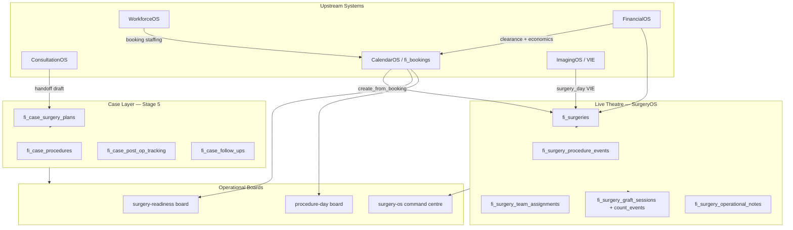
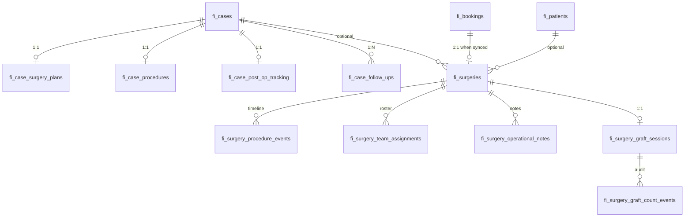

# SurgeryOS Architecture Audit V1

**Date:** 2026-07-01  
**Scope:** Full inventory of existing SurgeryOS infrastructure before new development  
**Goal:** Avoid duplicate systems and technical debt by understanding what exists, what can be reused, and what is missing.

**Related docs:** [`docs/platform-architecture/surgery-os.md`](../platform-architecture/surgery-os.md), [`docs/imaging-os-phase-im6-surgical-image-intelligence.md`](../imaging-os-phase-im6-surgical-image-intelligence.md)

---

## Executive Summary

SurgeryOS is a **mature but bifurcated** module. The codebase implements two parallel data layers:

| Layer | System of record | Purpose |
|-------|------------------|---------|
| **Case-centric (Stage 5)** | `fi_case_surgery_plans`, `fi_case_procedures`, `fi_case_post_op_tracking`, `fi_case_follow_ups` | Pre-op planning, static procedure-day summary, post-op, follow-ups |
| **Live theatre (SurgeryOS Phase 1–2)** | `fi_surgeries` + child tables | Real-time command centre, phases, timeline, graft intelligence, VIE capture |

**CalendarOS (`fi_bookings`)** remains the scheduling system of record. Live surgeries are optionally spawned from bookings via `createSurgeryFromBooking`.

**Highest duplicate-risk areas:**

1. Dual procedure tracking (`fi_case_procedures` vs `fi_surgeries` + events)
2. Dual staffing models (`fi_surgery_team_assignments` on `fi_users` vs `fi_staff_event_assignments` on `fi_staff`)
3. Dual readiness computation (board loaders vs case readiness vs SurgeryOS checklist)
4. Partial analytics/event bus (types exist; only `surgery_completed` is published)

**Recommended next build priority:** Unify cross-layer bridges (booking → live surgery → case procedure day sync; workforce surgery bridge wiring; case timeline ingestion of live events) before adding new subsystems.

---

## Architecture Overview



---

## 1. Surgery-Related Routes & Pages

### 1.1 Marketing / Public

| Route | File | Purpose |
|-------|------|---------|
| `/platform/surgery-os` | `app/platform/surgery-os/page.tsx` | Primary SurgeryOS marketing page |
| `/surgeons` | `app/surgeons/page.tsx` | Surgeon-focused landing; references SurgeryOS case intelligence |

**Adjacent marketing** (SurgeryOS mentioned, not dedicated routes): `/`, `/platform`, `/patient-twin`, `/clinic-owners`, `/platform/clinic-os`, `/platform/patient-os`, `/platform/imaging-os`, `/platform/progress`. Content source: `lib/marketing/platformPageContent.ts`.

### 1.2 FI Admin — SurgeryOS Core

| Route | File | Purpose |
|-------|------|---------|
| `/fi-admin/{tenantId}/cases` | `app/(fi-admin)/fi-admin/[tenantId]/cases/page.tsx` | SurgeryOS cases index — KPI dashboard + filterable worklist |
| `/fi-admin/{tenantId}/cases/{caseId}` | `.../cases/[caseId]/page.tsx` | Case detail hub — planning, procedure day, economics, post-op, timeline |
| `/fi-admin/{tenantId}/cases/{caseId}/summary` | `.../cases/[caseId]/summary/page.tsx` | Printable case summary |
| `/fi-admin/{tenantId}/surgery-readiness` | `.../surgery-readiness/page.tsx` | 14-day surgery readiness board |
| `/fi-admin/{tenantId}/procedure-day` | `.../procedure-day/page.tsx` | Today's procedure day board |
| `/fi-admin/{tenantId}/surgery-os` | `.../surgery-os/page.tsx` | Live surgical command centre |
| `/fi-admin/{tenantId}/surgery-os/graft-counting?surgery={uuid}` | `.../surgery-os/graft-counting/page.tsx` | Dedicated graft counting assistant |

**Nav wiring:** `src/components/fi-admin/FiAdminTenantNav.tsx` — SurgeryOS group links `/cases`, `/surgery-readiness`, `/procedure-day`. `/surgery-os` and `/graft-counting` are reached from boards/dashboards, not main nav chips.

### 1.3 FI Admin — Surgery-Adjacent

| Route | File | Purpose |
|-------|------|---------|
| `/fi-admin/{tenantId}/workforce-os/procedure-staffing` | `.../workforce-os/procedure-staffing/page.tsx` | Procedure staffing optimizer |
| `/fi-admin/{tenantId}/workforce-os` | `.../workforce-os/page.tsx` | Workforce command centre — surgical workforce intelligence |
| `/fi-admin/{tenantId}/financial-os/cost-models` | `.../financial-os/cost-models/page.tsx` | Surgery cost model configuration |
| `/fi-admin/{tenantId}/financial-os` | `.../financial-os/page.tsx` | FinancialOS with surgery economics filters |
| `/fi-admin/{tenantId}/financial-os/executive` | `.../financial-os/executive/page.tsx` | Executive finance with procedure-type filter |
| `/fi-admin/{tenantId}/financial/dashboard` | `.../financial/dashboard/page.tsx` | Financial dashboard with surgery readiness clearance |
| `/fi-admin/{tenantId}/reception-os` | `.../reception-os/page.tsx` | Upcoming surgery widget |
| `/fi-admin/{tenantId}/analytics` | `.../analytics/page.tsx` | AnalyticsOS with surgery module snapshot |
| `/fi-admin/{tenantId}/appointments/{appointmentId}` | `.../appointments/[appointmentId]/page.tsx` | Procedure metadata, photos, post-procedure plan |
| `/fi-admin/{tenantId}/patients/{patientId}` | `.../patients/[patientId]/page.tsx` | Previous procedures card |

### 1.4 Patient Portal

**No dedicated patient-portal surgery routes** under `app/patient/`. Surgery UI is embedded in staff-facing patient/appointment views (admin portal).

### 1.5 API Routes

| Route | File | Purpose |
|-------|------|---------|
| `GET/POST /api/tenants/{tenantId}/surgery-os` | `app/api/tenants/[tenantId]/surgery-os/route.ts` | Command centre payload + mutations (create from booking, phases, events, notes, team, graft counts, reconciliation) |
| `POST .../patients/{patientId}/images` | `app/api/tenants/[tenantId]/patients/[patientId]/images/route.ts` | Image upload with `procedure_day_id`; surgery_os capture path |
| `POST .../vie/capture/accept` | `.../vie/capture/accept/route.ts` | Accept VIE capture; revalidates surgery-os |
| `POST .../vie/capture/retake` | `.../vie/capture/retake/route.ts` | Retake VIE capture |
| `GET/POST/PATCH .../appointments` | `app/api/tenants/[tenantId]/appointments/` | Appointments with procedure metadata |
| `POST /api/cron/financial-os/clearance-snapshots` | `app/api/cron/financial-os/clearance-snapshots/route.ts` | Cron: financial clearance snapshots for upcoming surgery bookings |

### 1.6 Server Actions

| File | Purpose |
|------|---------|
| `lib/actions/fi-surgery-os-actions.ts` | Server actions mirroring surgery-os API mutations |
| `lib/actions/fi-case-surgery-planning-actions.ts` | Upsert case surgery planning |
| `lib/actions/fi-case-procedure-day-actions.ts` | Procedure day mutations |
| `lib/actions/financial-os-surgery-economics-actions.ts` | Surgery economics actions |

### 1.7 UI Component Groups

| Directory | Count | Role |
|-----------|-------|------|
| `src/components/fi-admin/surgery-os/` | 16 files | Live command centre, graft counting, VIE capture, widgets |
| `src/components/fi-admin/surgery/` | 4 files | Readiness board, procedure day board, diagnostics |
| `src/components/fi-admin/cases/` | 8 surgery-related | Case planning, procedure day, team panels, cases index dashboard |
| `src/components/fi/appointments/` | 3 procedure-related | Procedure section, photos, post-procedure plan |
| `src/components/fi/financial/` | 3 surgery-related | Economics, pipeline, clearance |
| `src/components/fi-admin/workforce/` | 1 | Surgical workforce intelligence section |
| `src/components/fi/workforce/` | 1 | Procedure staffing optimizer client |

---

## 2. Database Tables & Schemas

### 2.1 Dual-Layer Model



### 2.2 Case-Centric Tables (Stage 5)

| Table | Migration(s) | Key columns / notes |
|-------|--------------|---------------------|
| `fi_case_surgery_plans` | `20260616120001`, `20260718120005` | Planning status, procedure type, graft estimates, zones, strategy notes; `metadata` for consultation handoff provenance. **No RLS** — service role access. |
| `fi_case_procedures` | `20260617120001`, `20260718120002` | Procedure date/status, team (`fi_users`), milestones (jsonb), location, technique, graft totals, intra-op notes. **No RLS**. |
| `fi_case_post_op_tracking` | `20260618120001` | Post-op status, aftercare, recovery, satisfaction score. |
| `fi_case_follow_ups` | `20260618120001` | Checkpoints (day_1 → month_12), linked images. |

### 2.3 Live Theatre Tables (SurgeryOS Phase 1–2)

| Table | Migration(s) | Key columns / notes |
|-------|--------------|---------------------|
| `fi_surgeries` | `20260919130001`, `20260919130002` | Anchors: patient, case, booking (unique), clinic, surgeon. Status, live_status, procedure_phase, graft target, schedule/actual times, readiness checklist. **RLS: SELECT tenant member; writes service_role**. |
| `fi_surgery_procedure_events` | Phase 1, 1B, 2 | Append-only timeline: phase transitions, graft events, tray counts, custom events. **RLS: SELECT only**. |
| `fi_surgery_team_assignments` | Phase 1 | Surgeon/nurse/technician on `fi_users`. **RLS: SELECT only**. |
| `fi_surgery_operational_notes` | Phase 1 | Clinical notes by kind/severity. **RLS: SELECT only**. |
| `fi_surgery_graft_sessions` | `20260919130003`, `20260919130005` | One session per surgery; extraction/implantation totals, composition, reconciliation, theatre tablet locks. **RLS: SELECT only**. |
| `fi_surgery_graft_count_events` | Phase 2, 2B, 2C | Append-only graft audit with idempotency (`client_submission_id`). **RLS: SELECT only**. |

### 2.4 Financial Surgery Tables

| Table | Migration | Purpose |
|-------|-----------|---------|
| `fi_surgery_cost_models` | `20260921120001`, `20260921120002` | Tenant cost config per procedure type (surgeon fee, hourly rates, consumables). **RLS: SELECT tenant member**. |
| `fi_surgery_profitability_snapshots` | Phase 2 economics | Immutable profitability per surgery/case. **RLS: SELECT; INSERT service_role; UPDATE/DELETE revoked**. |

### 2.5 Workforce / Academy / Staffing

| Table | Migration | Purpose |
|-------|-----------|---------|
| `fi_staff_procedure_privileges` | `20260922120005` | AcademyOS procedure authorization. **RLS: privileged roles for mutations**. |
| `fi_procedure_privilege_requirements` | Same | Event type + role → minimum privilege. |
| `fi_workforce_procedure_staffing_recommendations` | `202610017008` | Cached team recommendations per `surgery_id`. **RLS: HR/admin only**. |
| `fi_staff_event_assignments` | `20260922120001` | Clinical rostering; `event_source` includes `'surgery'`. **RLS: SELECT tenant member**. |
| `fi_staff_shifts` | Workforce migrations | `shift_type` includes `surgery_day`, `procedure_day`. |

### 2.6 Theatre / Booking Infrastructure

| Table | Migration | Surgery relevance |
|-------|-----------|-------------------|
| `fi_clinic_rooms` | `20260712120001` | `room_type = 'surgery'` |
| `fi_bookings` | `20260610120001` | `booking_type = 'surgery'`; links patient, case, surgeon |
| `fi_services` | `20260625120001` | Service catalog with surgery booking type |
| `fi_service_resource_requirements` | `20260713120001` | Room/staff requirements per service |
| `fi_booking_resource_assignments` | Same | Extra staff/rooms per booking |

### 2.7 Cross-Module Linked Tables

| Table | Surgery link |
|-------|--------------|
| `fi_patient_therapy_plans` | `surgery_plan_id` → `fi_case_surgery_plans` |
| `fi_revenue_attribution_events` | Optional `surgery_id` |
| `fi_revenue_pipeline` | Stage `surgery_booked`, `procedure_type` |
| `fi_deposit_rules` | `blocks_surgery_readiness_when_unpaid` |
| `hli_image_classifications` / `fi_patient_images` | `surgery_stage`, `graft_tray`, `clinical_use_context = 'surgery'` |
| `hli_photo_protocol_templates/slots` | `surgery_pre_op`, `surgery_immediate_post_op`, `graft_tray` |
| `fi_vie_capture_intelligence` | VIE capture for surgery_day protocols |
| `fi_imaging_protocol_templates` | Seeded `surgery_day`, `post_op_review`, `repair_surgery_review` |

### 2.8 TypeScript Types (No Generated DB Types)

Hand-written types live in:

- `src/lib/cases/surgeryPlanningTypes.ts`, `procedureDayTypes.ts`, `postOpTypes.ts`
- `src/lib/cases/surgeryPlanningLoaders.ts`, `procedureDayLoaders.ts`, `postOpLoaders.ts`
- `src/lib/cases/caseReadinessTypes.ts`
- `src/lib/surgeryOs/surgeryOsBoardModel.ts`, `surgeryOsBoardModel.types.ts`
- `src/lib/surgeryOs/surgeryOsGraftModel.ts`, `surgeryOsPolicy.ts`
- `src/lib/surgeryOs/surgeryOsVieCapture.types.ts`
- `src/lib/academy-os/procedurePrivilegeTypes.ts`
- `src/lib/surgery/surgeryReadinessBoardModel.ts`

---

## 3. Logic Files — `src/lib/surgery/*` and `src/lib/surgeryOs/*`

> **Note:** The user query references `src/lib/surgery/*`. That directory contains **operational board logic only** (4 source files). The **live theatre command centre** lives in `src/lib/surgeryOs/*` (14 source files). Both are documented below.

### 3.1 `src/lib/surgery/` — Scheduling Boards

| File | Exports | Purpose |
|------|---------|---------|
| `surgeryReadinessBoardModel.ts` | `buildSurgeryReadinessIssues`, KPI aggregators | Pure readiness kanban logic (consent, pathology, clearance) |
| `surgeryReadinessBoardLoader.server.ts` | `loadSurgeryReadinessBoardPayload` | Server loader: bookings + cases + financial + workforce staffing |
| `procedureDayBoardModel.ts` | `deriveSurgeryDayPipelinePhase`, `buildProcedureDayActionItems` | Pure procedure-day pipeline phases |
| `procedureDayBoardLoader.server.ts` | `loadProcedureDayBoardPayload` | Today's schedule from bookings + case procedures + clearance |

### 3.2 `src/lib/surgeryOs/` — Live Command Centre

| File | Exports | Purpose |
|------|---------|---------|
| `surgeryOsBoardModel.ts` | Phases, checklist keys, readiness math, alerts, widget visibility | Pure domain model |
| `surgeryOsBoardModel.types.ts` | `SurgeryOsCommandCentrePayload`, live surgery shapes | Payload types |
| `surgeryOsBoardPayloadSchema.ts` | Zod schema + parser | Payload validation |
| `surgeryOsCommandCentreLoader.server.ts` | `loadSurgeryOsCommandCentrePayload` | Aggregates all live surgery data |
| `surgeryOsAccess.server.ts` | `resolveSurgeryOsViewerContext` | Auth/persona resolution |
| `surgeryOsPolicy.ts` | `surgeryOsActionAllowed`, phase transitions | RBAC + phase policy (pure) |
| `surgeryOsMutationAccess.server.ts` | Mutation guards | Server-side authorization |
| `surgeryMutations.server.ts` | `createSurgeryFromBooking`, `transitionSurgeryPhase`, `logSurgeryProcedureEvent`, team/notes | Write paths for live surgery |
| `surgeryOsLoaderResilience.ts` | `emptySurgeryOsIntelligence`, fallbacks | Safe degradation when tables missing |
| `surgeryOsGraftModel.ts` | Graft math, reconciliation gates, alerts | Pure graft domain |
| `surgeryGraftMutations.server.ts` | All graft count mutations + loaders | DB writes for graft sessions/events |
| `surgeryOsVieCapture.types.ts` | VIE capture summary types | Types |
| `surgeryOsVieCaptureCore.ts` | VIE completeness/alignment logic | Pure VIE policy |
| `surgeryOsVieCapture.server.ts` | VIE session loaders | Server VIE integration |

### 3.3 `src/lib/cases/` — Case Surgery Layer

| File | Purpose |
|------|---------|
| `surgeryPlanningTypes.ts`, `surgeryPlanningLoaders.ts`, `surgeryPlanningUpdate.ts`, `surgeryPlanningLabels.ts` | Surgery plan CRUD |
| `procedureDayTypes.ts`, `procedureDayLoaders.ts`, `procedureDayUpdate.ts`, `procedureDayLabels.ts` | Procedure day CRUD |
| `procedureDayMilestonesModel.ts` | Intra-op milestone tracking |
| `procedureDayMismatchModel.ts` | Booking vs procedure day divergence warnings |
| `caseProcedureDayLinkedBooking.ts` | Resolve linked surgery booking date |
| `postOpTypes.ts`, `postOpLoaders.ts`, `postOpUpdate.ts`, `postOpLabels.ts` | Post-op + follow-ups |
| `caseReadinessBuild.ts` | Computed readiness from case page data |
| `caseTimelineBuild.ts` | Unified case timeline (read-only aggregation) |
| `surgeryOsDashboardDerive.ts` | Cases index surgery queue KPIs |

### 3.4 Presentation Layer

| File | Purpose |
|------|---------|
| `src/lib/fiAdmin/surgeryPresentation.ts` | Shared UI transforms for readiness board, procedure day board, command centre |

### 3.5 Adjacent Logic (Reuse Candidates)

| Domain | Path | Role |
|--------|------|------|
| Financial surgery | `src/lib/financialOs/financialSurgery*` (6 files) | Pipeline status, clearance, economics, snapshots |
| Workforce intelligence | `src/lib/workforce/surgicalWorkforceIntelligenceCore.ts` | Tomorrow readiness, staffing risks |
| Procedure staffing | `src/lib/workforce/procedureStaffingOptimizer*.ts` | Cost-aware team recommendations |
| Workforce bridge | `src/lib/workforce-os/workforceEventAssignmentBridge.server.ts` | Booking → staff assignments |
| Clinical mapping | `src/lib/workforce-os/workforceClinicalEventMapping.ts` | Surgery entity → workforce events |
| Academy privileges | `src/lib/academy-os/procedurePrivilege*.ts` | Procedure authorization |
| Imaging surgical | `src/lib/imaging-os/surgical.ts` | Surgical image readiness domains |
| Room scheduling | `src/lib/rooms/roomAvailabilityCore.ts`, `roomSchedulingReadinessCore.ts` | Surgery room overlap rules |
| Workflows | `src/lib/workflows/surgeryWorkflow.ts` | Placeholder procedure_completed handler |
| Medication post-op | `src/lib/medicationOs/surgeryPostopMedicationBundle.server.ts` | Post-op med bundle instantiation |
| CRM prefill | `src/lib/crm/acceptedCrmQuoteSurgeryPrefill.ts` | Quote → surgery appointment prefill |
| Demo seed | `src/lib/enterprise-demo/enterpriseDemoSurgeries*.ts` | Demo surgery data generation |

---

## 4. Procedure Scheduling Systems

### 4.1 What Exists

| Component | Location | Role |
|-----------|----------|------|
| **Booking system of record** | `fi_bookings`, `src/lib/bookings/bookings.ts` | Surgery slots with `booking_type: 'surgery'`, case_id, procedure metadata |
| **Resource requirements** | `fi_service_resource_requirements`, `fi_booking_resource_assignments` | Room type `surgery`, staff roles per service |
| **Surgery rooms** | `fi_clinic_rooms` where `room_type = 'surgery'` | No dedicated OR table |
| **Room overlap** | `src/lib/rooms/roomAvailabilityCore.ts` | Multi-resource scheduling conflicts |
| **Financial clearance guard** | `bookingSurgeryFinancialClearanceGuardCore.ts` | Blocks confirmation within 14 days without clearance |
| **Readiness board** | `surgeryReadinessBoardLoader.server.ts` + `/surgery-readiness` | 14-day pre-op pipeline from bookings |
| **Procedure day board** | `procedureDayBoardLoader.server.ts` + `/procedure-day` | Today's schedule + flow lanes |
| **Live surgery spawn** | `createSurgeryFromBooking` in `surgeryMutations.server.ts` | Creates `fi_surgeries` from booking |
| **Calendar integration** | `operationalCalendarLoader.server.ts`, `tomorrowBoardLoader.server.ts` | Surgery bookings in calendar views |
| **Reception widget** | `ReceptionOsUpcomingSurgery.tsx` | 14-day upcoming surgery snapshot |

### 4.2 What Can Be Reused

- `fi_bookings` + resource assignment model as single scheduling SoR
- `surgeryReadinessBoardLoader` and `procedureDayBoardLoader` as board data sources
- `createSurgeryFromBooking` as the booking → live theatre bridge
- `bookingSurgeryFinancialClearanceGuard` for pre-procedure financial gates
- `caseProcedureDayLinkedBooking.ts` for resolving booking ↔ case procedure day links

### 4.3 What Is Missing

- No dedicated surgery slot optimizer or capacity planner beyond room overlap checks
- Consultation handoff does **not** auto-create surgery bookings (plan only)
- No automatic `fi_surgeries` creation on booking confirmation (manual/API `create_from_booking`)
- Dashboard surgery pipeline uses proxy counts (`DashboardSurgeryPipeline.tsx` comment: "estimated proxies until Stage 2 loaders")

---

## 5. Procedure Tracking / Timeline Systems

### 5.1 What Exists — Two Parallel Tracks

#### Track A: Legacy Case Procedure Day (`fi_case_procedures`)

- Milestones in jsonb (`procedureDayMilestonesModel.ts`)
- Team on `fi_users` IDs
- Static graft totals (extracted/implanted)
- Emits foundation events on completion (`procedureDayUpdate.ts`)
- UI: `CaseProcedureDayCard`, `CaseProcedureDayForm`

#### Track B: Live SurgeryOS Theatre (`fi_surgeries` + events)

- Real-time phases: `pre_op` → `extraction` → `implantation` → `recovery` → `completed`
- Append-only `fi_surgery_procedure_events` timeline
- Operational notes (`fi_surgery_operational_notes`)
- UI: `SurgeryOsProcedureTimeline`, `SurgeryOsLiveSurgeryBoard`, `SurgeryOsNotesEvents`

#### Track C: Unified Case Timeline (Read-Only)

- `caseTimelineBuild.ts` merges plans, procedure day, bookings, images
- **Does NOT ingest** `fi_surgery_procedure_events` or live surgery data

### 5.2 What Can Be Reused

- `fi_surgery_procedure_events` as authoritative live timeline (append-only, auditable)
- `procedureDayMilestonesModel.ts` milestone keys for case-level summary
- `caseTimelineBuild.ts` as aggregation shell — extend to include live events
- `procedureDayMismatchModel.ts` for detecting booking/procedure/live divergence

### 5.3 What Is Missing

- **No sync** from live theatre completion → `fi_case_procedures` final totals
- Case timeline excludes live surgery events
- Post-op tracking (`fi_case_post_op_tracking`) not auto-triggered from procedure completion
- Workflow automation placeholder: `surgeryWorkflow.ts` uses `workflowPlaceholderSkipped`

---

## 6. Staffing Assignment Systems

### 6.1 What Exists — Three Parallel Models

| Model | Table / System | Identity | Used By |
|-------|----------------|----------|---------|
| **Calendar staffing** | `fi_bookings.assigned_staff_id` + `fi_booking_resource_assignments` | `fi_staff` | Calendar, readiness board, procedure day board |
| **Workforce clinical roster** | `fi_staff_event_assignments` (`event_source: booking\|surgery`) | `fi_staff` | WorkforceOS bridge, procedure staffing optimizer |
| **Live surgery team** | `fi_surgery_team_assignments` | `fi_users` | SurgeryOS command centre, team assignment board |

**Bridge:** `workforceEventAssignmentBridge.server.ts` syncs booking staff → `fi_staff_event_assignments`.  
**Optimizer:** `procedureStaffingOptimizer.server.ts` generates recommendations per `fi_surgeries`.  
**Privileges:** `procedurePrivileges.server.ts` gates assignments via AcademyOS.

### 6.2 What Can Be Reused

- `WORKFORCE_CLINICAL_INTEGRATION_MAP.ts` — canonical integration rules
- `loadClinicalStaffingSummariesForBookings` — already enriches surgery boards
- `procedureStaffingOptimizerCore.ts` — cost-aware recommendation engine
- `canStaffBeAssignedToProcedure` — clinical eligibility checks
- `fi_surgery_team_assignments` for intra-op live status during surgery

### 6.3 What Is Missing

- **`ensureSurgeryStaffingAssignment` is defined but never called** — surgery → workforce bridge for live theatre is scaffolded, not wired
- No auto-sync between `fi_surgery_team_assignments` (`fi_users`) and `fi_staff_event_assignments` (`fi_staff`)
- SurgeryOS team assignment board shows `fi_users` only, not WorkforceOS staffing gaps
- No bidirectional sync when live team status changes during surgery

---

## 7. Surgery Intelligence Engines

### 7.1 What Exists

| Engine | File | Scope |
|--------|------|-------|
| **Surgical workforce intelligence** | `surgicalWorkforceIntelligenceCore.ts` | Tomorrow surgery readiness, staffing quality, capacity, risks |
| **Workforce intelligence (exec)** | `workforceIntelligenceEngineCore.ts` | Includes `TomorrowSurgeryReadiness` slice |
| **Procedure staffing optimizer** | `procedureStaffingOptimizerCore.ts` | Cost-aware team recommendations |
| **SurgeryOS board intelligence** | `surgeryOsLoaderResilience.ts` → `emptySurgeryOsIntelligence()` | **Placeholder only** — policy/hints slot on command centre payload |
| **Graft intelligence** | `surgeryOsGraftModel.ts` | Progress %, reconciliation gates, operational alerts |
| **Readiness computation** | `surgeryOsBoardModel.ts` + `caseReadinessBuild.ts` + board loaders | Three separate readiness computations |
| **Financial economics** | `financialSurgeryEconomicsCore.ts` | Profitability, per-graft metrics |
| **Pre-surgical clinical intelligence** | `src/lib/hair-intelligence/` (donor, recipient, consultation checklist) | Feeds planning, not live theatre |

### 7.2 What Can Be Reused

- `surgicalWorkforceIntelligenceCore.ts` as primary workforce ↔ surgery intelligence
- `surgeryOsGraftModel.ts` for intra-op graft alerts and reconciliation
- `financialSurgeryEconomicsCore.ts` for profitability intelligence
- Hair intelligence modules for pre-op planning enrichment

### 7.3 What Is Missing

- No dedicated SurgeryOS operational intelligence engine (placeholder slot exists)
- No ML/AI intra-op decision support beyond graft math alerts
- Readiness intelligence fragmented across three computation paths
- Imaging surgical readiness (`evaluateSurgicalImageReadiness`) not wired to SurgeryOS checklist

---

## 8. Graft Tracking Systems

### 8.1 What Exists

| Layer | Tables / Files | Capabilities |
|-------|----------------|--------------|
| **Planning estimates** | `fi_case_surgery_plans.estimated_grafts_*` | Pre-op range |
| **Case procedure totals** | `fi_case_procedures.grafts_extracted/implanted` | Static post-procedure summary |
| **Live graft session** | `fi_surgery_graft_sessions` (1:1 per surgery) | Real-time totals, composition, reconciliation |
| **Audit trail** | `fi_surgery_graft_count_events` | Append-only with idempotency, tray confirm/reject |
| **Pure model** | `surgeryOsGraftModel.ts` | Validation, progress %, reconciliation gates, theatre locks |
| **Mutations** | `surgeryGraftMutations.server.ts` | Extraction/implantation/tray/reconcile/correct/discard |
| **UI** | `GraftCountingAssistant.tsx`, `SurgeryOsGraftIntelligence.tsx`, `SurgeryOsGraftActions.tsx` | Dedicated counting page + command centre widgets |
| **Clinical safety** | Migration `20260919130005` | Theatre tablet locks, reconciliation requirements |
| **Financial hook** | `financialSurgeryEconomicsSnapshotOrchestrator.server.ts` | Triggers profitability snapshot on reconciliation |

### 8.2 What Can Be Reused

- `fi_surgery_graft_sessions` + `fi_surgery_graft_count_events` as authoritative live graft SoR
- Full `surgeryOsGraftModel.ts` + `surgeryGraftMutations.server.ts` stack
- Graft counting assistant UI and device hook (`useGraftCountDevice.ts`)
- Reconciliation gate on phase transition (`assertGraftReconciliationForPhaseTransition`)

### 8.3 What Is Missing

- No sync from live graft totals → `fi_case_procedures` on completion
- No analytics publishing from graft mutations (event type `graft_count_recorded` exists but unused)
- No cross-surgery graft benchmarking or historical variance analytics
- Booking graft estimates not validated against live counts automatically

---

## 9. ImagingOS Integrations

### 9.1 What Exists

| Component | File | Role |
|-----------|------|------|
| **Surgical image intelligence** | `src/lib/imaging-os/surgical.ts` | Pure evaluation: graft_tray, extraction_documentation, readiness domains |
| **Protocol mapping** | `src/lib/imaging-os/protocol.ts` | `source_system: surgery_os` → `surgery_planning` |
| **Longitudinal progression** | `src/lib/imaging-os/progression.ts` | pre_op, immediate_post_op, month_12 timepoints |
| **VIE surgery capture** | `surgeryOsVieCapture.server.ts` | Creates `fi_imaging_protocol_sessions` with `template_slug: surgery_day` |
| **VIE capture policy** | `surgeryOsVieCaptureCore.ts` | Requires active session + slot; `capture_surface: surgery_os` |
| **HLI classifications** | DB + `fi_patient_images` | `surgery_stage`, `graft_tray` categories |
| **Photo protocols** | `hli_photo_protocol_templates/slots` | surgery_pre_op, surgery_immediate_post_op, graft_tray |
| **Image upload API** | `patients/[patientId]/images/route.ts` | Special surgery_os capture path |
| **UI** | `SurgeryOsVieCapturePanel.tsx`, `SurgeryOsCaptureEvidenceButton.tsx` | Command centre capture |
| **Attribution** | `fiImageAttributionTypes.ts` | `surgery_os` source + `graft_count` clinical field |

### 9.2 What Can Be Reused

- VIE surgery_day session lifecycle (`loadOrCreateSurgeryDayVieSession`)
- `buildSurgeryOsVieCaptureSummary` for completeness checks in command centre
- ImagingOS surgical readiness evaluators for pre-op evidence assessment
- Existing HLI photo protocol templates for surgery stages

### 9.3 What Is Missing

- `evaluateSurgicalImageReadiness` not wired to SurgeryOS readiness checklist (`photography_complete`)
- No automatic ImagingOS → surgery plan enrichment pipeline
- Case timeline includes images but not VIE session completeness status
- No post-op imaging protocol auto-trigger on procedure completion

---

## 10. WorkforceOS ↔ SurgeryOS Integrations

### 10.1 What Exists

| Integration | Files | Status |
|-------------|-------|--------|
| Booking → staff assignments | `workforceEventAssignmentBridge.server.ts`, `fi-booking-actions.ts` | **Active** — syncs on booking create/update |
| Board enrichment | Readiness board, procedure day board, calendar, appointment slide-over loaders | **Active** — reads staffing summaries |
| Surgery event identity | `WORKFORCE_CLINICAL_INTEGRATION_MAP.ts`, `workforceClinicalEventMapping.ts` | **Documented** |
| Procedure staffing optimizer | `procedureStaffingOptimizer.server.ts` + UI | **Active** — recommendations per surgery |
| Surgical workforce intel | `surgicalWorkforceIntelligenceCore.ts` → Workforce Command Centre | **Active** |
| Academy privilege gating | `procedurePrivileges.server.ts` via bridge | **Active** at assignment time |
| Live surgery staffing bridge | `ensureSurgeryStaffingAssignment` | **Scaffolded, never called** |
| Shift cost on surgery events | `shiftCostIntelligence.server.ts` | Queries surgery event assignments |
| Payroll time entries | `entry_type: surgery_day` | Workforce payroll integration |

### 10.2 Backward-Compatibility Rules (from integration map)

- `assigned_staff_id` stays calendar source of truth
- `fi_users`-based surgery team fields unchanged
- No auto-assignment without existing booking staff or admin action

### 10.3 What Is Missing

- Wire `ensureSurgeryStaffingAssignment` from `createSurgeryFromBooking` and team mutations
- Unified staffing view combining WorkforceOS gaps + SurgeryOS live team status
- Auto-propagate procedure staffing optimizer recommendations to live team assignments
- Surgery cancellation → workforce assignment cleanup workflow

---

## 11. Consultation Handoff into SurgeryOS

### 11.1 What Exists

| Step | File | Behavior |
|------|------|----------|
| Eligibility check | `consultationHandoffPure.ts` → `surgeryPlanningHandoffEligible` | Requires `proceed_surgery`, linked case, plan signals |
| Draft creation | `consultationHandoffMutations.server.ts` → `createSurgeryPlanningDraftFromConsultationSummary` | Idempotent upsert to `fi_case_surgery_plans` with `metadata.source_form_instance_id` |
| UI | `ConsultationHandoffPanel.tsx`, `ConsultationPostCompleteRouting.tsx` | Manual handoff after locked consultation form |
| Plan CRUD | `surgeryPlanningLoaders.ts`, `surgeryPlanningUpdate.ts` | Case surgery plan management |
| CRM quote prefill | `acceptedCrmQuoteSurgeryPrefill.ts` | Quote → booking prefill with graft estimate |
| Pathway launcher | `consultationPathwayLauncherModel.ts` | Transplant/repair routes toward surgery planning |

### 11.2 Handoff Flow

```
ConsultationOS (locked form)
  → manual handoff UI
  → fi_case_surgery_plans (draft)
  → [separate step] calendar booking
  → [separate step] createSurgeryFromBooking
  → fi_surgeries (live theatre)
```

### 11.3 What Can Be Reused

- Full handoff mutation pipeline (idempotent, provenance in metadata)
- Eligibility pure functions for gating UI
- Surgery plan schema and upsert logic
- CRM quote prefill for booking creation

### 11.4 What Is Missing

- **No auto-handoff** — `consultationWorkflow.ts` is placeholder (`workflowPlaceholderSkipped`)
- Handoff creates plan only; no booking or live surgery creation
- No consultation → donor/recipient intelligence auto-population of plan fields
- No notification/routing to surgery readiness board on handoff completion

---

## 12. Analytics Related to Surgery Metrics

### 12.1 What Exists

| Component | File | Status |
|-----------|------|--------|
| Event types | `analyticsEventTypes.ts` | `surgery_started`, `surgery_completed`, `graft_count_recorded`, `graft_integrity_scored` |
| Publisher | `analyticsModulePublishers.ts` → `publishSurgeryEvent` | Implemented |
| Actual publishing | `surgeryMutations.server.ts` | **Only `surgery_completed`** on `procedure_completed` event |
| Executive scoring | `analyticsExecutiveScoring.ts` | "Surgical efficiency" score from surgery signals |
| Financial metrics | `financialSurgeryEconomicsCore.ts`, profitability snapshots | Per-surgery/per-graft economics |
| Pipeline metrics | `financialSurgeryPipelineStatusCore.ts` | Booking financial pipeline for boards |
| Cases dashboard KPIs | `surgeryOsDashboardDerive.ts` | Planning queue, today, upcoming, completed counts |
| Event bus registry | `fiEventRegistry.ts` | `surgery.booked`, `surgery.completed` (v1) |
| Module entitlement | `tenantProvisioningTypes.ts` | `surgery_os_metrics` entity type |
| Analytics UI | `AnalyticsOsDashboard.tsx` | Executive analytics including surgical efficiency |
| Financial UI | `FinancialOsSurgeryEconomicsFilters.tsx` | Surgery economics reporting |

### 12.2 What Can Be Reused

- `publishSurgeryEvent` infrastructure for extending event coverage
- Profitability snapshot pipeline (triggered on reconciliation/completion)
- Cases index KPI derivation for operational dashboards
- Executive scoring framework for surgical efficiency

### 12.3 What Is Missing

- `surgery_started`, `graft_count_recorded`, `graft_integrity_scored` — types exist, **no publishers**
- Graft mutations write DB only — no analytics events
- Event bus: `surgery.booked` partial; `patient.checkin.completed`, `procedure.cancelled` planned but not implemented
- No dedicated surgery metrics dashboard (relies on AnalyticsOS executive slice + FinancialOS)
- Dashboard surgery pipeline uses proxy counts, not real SurgeryOS stage data

---

## Duplicate Risk Areas

| Risk | Systems Involved | Severity | Mitigation |
|------|------------------|----------|------------|
| **Dual procedure records** | `fi_case_procedures` vs `fi_surgeries` + events | **High** | Design single write path; sync on completion; extend case timeline |
| **Dual staffing models** | `fi_surgery_team_assignments` (`fi_users`) vs `fi_staff_event_assignments` (`fi_staff`) | **High** | Wire `ensureSurgeryStaffingAssignment`; document canonical SoR per context |
| **Triple readiness computation** | Board loaders, `caseReadinessBuild`, SurgeryOS checklist | **Medium** | Extract shared readiness core; single source of truth per lifecycle stage |
| **Dual graft totals** | Case procedure graft fields vs live graft session | **High** | Sync live → case on reconciliation/completion |
| **Parallel timeline systems** | Case timeline vs live procedure events | **Medium** | Extend `caseTimelineBuild` to ingest live events |
| **Analytics event gaps** | Types defined, partial publishing | **Low** | Extend publishers in existing mutation paths, don't create new event systems |
| **Workflow placeholders** | `surgeryWorkflow.ts`, `consultationWorkflow.ts` | **Medium** | Extend workflow engine, don't build parallel automation |
| **New scheduling subsystem** | CalendarOS already owns slots | **High** | Extend bookings/resource model, don't create OR scheduler |
| **New graft counting system** | Phase 2 complete with audit trail | **Critical** | Reuse `surgeryGraftMutations.server.ts` exclusively |
| **New imaging capture flow** | VIE surgery_day sessions exist | **High** | Extend VIE capture, don't build parallel upload path |

---

## What Exists — Summary Matrix

| Capability | Maturity | Primary Location |
|------------|----------|------------------|
| Surgery plan (pre-op) | **Production** | `fi_case_surgery_plans`, case UI |
| Surgery booking/scheduling | **Production** | `fi_bookings`, calendar, boards |
| Pre-op readiness board | **Production** | `/surgery-readiness` |
| Procedure day board | **Production** | `/procedure-day` |
| Live command centre | **Production** | `/surgery-os`, `src/lib/surgeryOs/` |
| Live graft counting | **Production** | Graft assistant + graft sessions/events |
| VIE surgery capture | **Production** | VIE integration in command centre |
| Case procedure day (static) | **Production** | `fi_case_procedures`, case UI |
| Post-op tracking | **Production** | `fi_case_post_op_tracking`, follow-ups |
| Financial clearance | **Production** | Guard + board integration |
| Surgery economics | **Production** | Cost models + profitability snapshots |
| Workforce booking staffing | **Production** | Event assignment bridge |
| Procedure staffing optimizer | **Production** | WorkforceOS page |
| Consultation handoff | **Production (manual)** | Handoff panel → surgery plan draft |
| Surgical workforce intelligence | **Production** | Workforce command centre |
| Live surgery → workforce bridge | **Scaffolded** | `ensureSurgeryStaffingAssignment` unused |
| Live → case sync | **Missing** | No completion sync |
| SurgeryOS intelligence engine | **Placeholder** | `emptySurgeryOsIntelligence()` |
| Workflow automation | **Placeholder** | Skipped handlers |
| Full analytics publishing | **Partial** | Only `surgery_completed` |
| Imaging → readiness auto-wire | **Missing** | Pure evaluators exist |

---

## Recommended Next Build Priority

Ordered by impact on duplicate-risk reduction and architectural coherence. **Do not build new parallel systems** — extend existing layers.

### P0 — Unify Cross-Layer Bridges (Before Any New Features)

1. **Live theatre → case procedure day sync**
   - On graft reconciliation / `procedure_completed`, write final totals to `fi_case_procedures`
   - Reuse `surgeryGraftMutations.server.ts` and `procedureDayUpdate.ts`

2. **Wire workforce surgery bridge**
   - Call `ensureSurgeryStaffingAssignment` from `createSurgeryFromBooking` and team status mutations
   - Document when to use `fi_users` (live intra-op) vs `fi_staff` (roster/compliance)

3. **Extend case timeline with live events**
   - Add `fi_surgery_procedure_events` ingestion to `caseTimelineBuild.ts`
   - Avoid building a third timeline system

### P1 — Complete Partial Integrations

4. **Analytics event publishing**
   - Add `publishSurgeryEvent` calls to existing mutation paths (graft counts, phase start)
   - Do not create new analytics tables

5. **Imaging readiness → SurgeryOS checklist**
   - Wire `evaluateSurgicalImageReadiness` to `photography_complete` readiness flag
   - Reuse pure evaluators in `imaging-os/surgical.ts`

6. **Consultation workflow automation**
   - Replace placeholder in `consultationWorkflow.ts` with handoff trigger (not a new pipeline)
   - Still manual booking step, but auto-route to readiness board

### P2 — Intelligence & Automation

7. **Populate SurgeryOS intelligence slot**
   - Replace `emptySurgeryOsIntelligence()` with composed signals from graft model + workforce intel + imaging
   - Reuse existing engines, don't build new intelligence framework

8. **Post-op workflow triggers**
   - Activate `surgeryWorkflow.ts` handler for medication bundle + post-op tracking seed
   - Reuse `surgeryPostopMedicationBundle.server.ts`

9. **Dashboard real pipeline metrics**
   - Replace proxy counts in `DashboardSurgeryPipeline.tsx` with loader-backed SurgeryOS stages

### P3 — Defer Until Bridges Complete

- New scheduling/capacity optimizer (extend CalendarOS instead)
- New graft counting subsystem (Phase 2 is complete)
- New staffing assignment UI (extend optimizer + bridge)
- Patient-portal surgery views (no foundation yet)
- ML/AI intra-op decision support (intelligence slot first)

---

## File Index — Quick Reference

### Routes
- `app/(fi-admin)/fi-admin/[tenantId]/surgery-os/`
- `app/(fi-admin)/fi-admin/[tenantId]/surgery-readiness/`
- `app/(fi-admin)/fi-admin/[tenantId]/procedure-day/`
- `app/(fi-admin)/fi-admin/[tenantId]/cases/`
- `app/api/tenants/[tenantId]/surgery-os/route.ts`

### Core Logic
- `src/lib/surgeryOs/` — live command centre (14 files)
- `src/lib/surgery/` — operational boards (4 files)
- `src/lib/cases/surgeryPlanning*`, `procedureDay*`, `postOp*`, `caseTimelineBuild.ts`
- `src/lib/fiAdmin/surgeryPresentation.ts`

### Key Migrations
- `20260616120001_fi_case_surgery_plans.sql`
- `20260617120001_fi_case_procedures.sql`
- `20260919130001_fi_surgery_os_phase1.sql` through `20260919130005_fi_surgery_os_graft_clinical_safety.sql`
- `20260921120001_fi_financial_os_phase2_surgery_economics_engine.sql`
- `202610017008_workforceos_phase_2_sprint_4_procedure_staffing_optimizer.sql`

### Integration Bridges
- `src/lib/workforce-os/workforceEventAssignmentBridge.server.ts`
- `src/lib/consultationForms/handoff/consultationHandoffMutations.server.ts`
- `src/lib/surgeryOs/surgeryOsVieCapture.server.ts`
- `src/lib/bookings/bookingSurgeryFinancialClearanceGuardCore.ts`
- `src/lib/financialOs/financialSurgeryEconomicsSnapshotOrchestrator.server.ts`

---

## Audit Methodology

This audit was produced by static codebase analysis across:

- `app/` routes and API handlers
- `src/lib/surgery/`, `src/lib/surgeryOs/`, `src/lib/cases/`, and adjacent modules
- `src/components/fi-admin/surgery*` and related UI
- `supabase/migrations/` for schema inventory
- `docs/platform-architecture/surgery-os.md` for declared vs implemented gaps
- Cross-reference of imports, DB foreign keys, and mutation paths

No new features were built. This document should be updated when P0 bridge work begins.

---

## P0 Implementation Notes (2026-07-01)

Cross-layer connective tissue added without new UI, duplicate models, or CalendarOS changes.

### Files changed

| Area | Files |
|------|-------|
| Live theatre → case sync | `src/lib/surgeryOs/liveTheatreCaseSyncCore.ts`, `src/lib/surgeryOs/liveTheatreCaseSync.server.ts`, `src/lib/surgeryOs/liveTheatreCaseSync.test.ts` |
| Completion triggers | `src/lib/surgeryOs/surgeryMutations.server.ts` (`procedure_completed`), `src/lib/surgeryOs/surgeryGraftMutations.server.ts` (`reconcileGrafts`) |
| Workforce surgery bridge | `src/lib/workforce-os/workforceEventAssignmentBridge.server.ts` (`ensureSurgeryStaffingFromBooking`), `src/lib/surgeryOs/surgeryMutations.server.ts` (`createSurgeryFromBooking`) |
| Case timeline ingestion | `src/lib/cases/caseTimelineTypes.ts`, `caseTimelineLoaders.ts`, `caseTimelineBuild.ts`, `caseTimelineLabels.ts` |
| Audit action registry | `src/lib/surgeryOs/surgeryOsPolicy.ts` (`live_theatre_case_sync` action) |
| Tests | `src/lib/workforce-os/workforceSurgeryStaffingBridge.test.ts` |

### Sync direction

```
fi_surgeries + fi_surgery_graft_sessions
  → fi_case_procedures (on procedure_completed or graft reconciliation)

fi_bookings (assigned_staff + resource assignments)
  → fi_staff_event_assignments (event_source: surgery)

fi_surgery_procedure_events
  → case timeline (read-only via caseTimelineBuild)
```

CalendarOS (`fi_bookings`) remains scheduling SoR. Live theatre writes flow back to the case procedure record; they do not replace manual procedure-day edits.

### Idempotency rules

**Case procedure sync**

- Skips when `_live_theatre_sync_*` milestones show the same surgery + trigger already applied and scalar fields are current.
- `procedure_completed` no-op when case procedure is already `completed` for that surgery.
- `graft_reconciliation_completed` re-runs when graft totals or `final_count_agreed` milestone changes.
- Existing case fields (notes, team, manually set times) are preserved; sync only fills gaps or advances status/graft totals.

**Workforce surgery staffing**

- `upsertWorkforceAssignment` returns existing active rows (staff + role dedup).
- `ensureSurgeryStaffingFromBooking` skips active surgery assignments before insert.
- Missing `fi_staff` records return `null` without throwing; surgery creation is not blocked.

**Audit**

- Each successful case sync appends a `fi_surgery_procedure_events` row (`custom`, `source_action: live_theatre_case_sync`).

### Remaining gaps (post-P0)

- Post-op tracking (`fi_case_post_op_tracking`) not auto-seeded on completion.
- `fi_surgery_team_assignments` (`fi_users`) still not bidirectionally synced with WorkforceOS roster.
- Analytics: only `surgery_completed` published; graft/phase events still unpublished.
- Consultation → booking automation still manual.

---

## SurgeryOS Sprint 1 Implementation Notes (2026-07-01)

First intelligence sprint: live procedural state + graft intelligence on the existing unified live theatre data layer. No duplicate procedure models, no CalendarOS changes, P0 sync preserved.

### Files added

| Area | Files |
|------|-------|
| Live procedure timeline engine | `src/lib/surgeryOs/liveProcedureTimelineCore.ts`, `src/lib/surgeryOs/liveProcedureTimelineCore.test.ts` |
| Graft intelligence engine | `src/lib/surgeryOs/graftIntelligenceCore.ts`, `src/lib/surgeryOs/graftIntelligenceCore.test.ts` |

### Files changed

| Area | Files |
|------|-------|
| Command centre payload | `src/lib/surgeryOs/surgeryOsBoardModel.types.ts`, `surgeryOsBoardPayloadSchema.ts`, `surgeryOsCommandCentreLoader.server.ts`, `surgeryOsLoaderResilience.ts` |
| UI | `src/components/fi-admin/surgery-os/SurgeryOsDashboard.tsx`, `widgets/SurgeryOsProcedureTimeline.tsx`, `widgets/SurgeryOsGraftIntelligence.tsx` |
| Tests | `src/lib/surgeryOs/surgeryOsBoardPayloadSchema.test.ts` |

### Engines created

**Live Procedure Timeline Engine** (`buildLiveProcedureTimeline`)

- Input: `fi_surgeries` timing fields + `fi_surgery_procedure_events`
- Output per surgery: `currentStage`, `status`, `elapsedMinutes`, `expectedCompletionTime`, `timelineItems`, `stageDurations`, `delaySignals`, `summary`
- Maps existing event kinds (e.g. `patient_arrived` → `patient_checked_in`, `graft_reconciliation_completed` → `graft_count_reconciled`)
- Configurable delay thresholds via `DEFAULT_LIVE_PROCEDURE_TIMELINE_THRESHOLDS`

**Graft Intelligence Engine** (`buildGraftIntelligence`)

- Input: graft session totals from `fi_surgery_graft_sessions` + tray review buckets
- Output per surgery: graft/hair totals, composition, confidence score, progress percentages, reconciliation status, warnings
- Preserves existing reconciliation gate semantics from `surgeryOsGraftModel.ts`

### API / payload integration

`GET /api/tenants/{tenantId}/surgery-os` and SSR loader now include:

- `liveTimeline: LiveProcedureTimelineSnapshot[]`
- `graftIntelligence: GraftIntelligenceSnapshot[]`

Existing payload fields unchanged (`procedureTimeline`, `graftSummary`, etc.).

### Data sources

| Engine | Primary tables |
|--------|----------------|
| Live timeline | `fi_surgeries`, `fi_surgery_procedure_events` |
| Graft intelligence | `fi_surgery_graft_sessions`, `fi_surgery_graft_count_events` (via existing loader helpers) |

### Empty-state rules

| Engine | Condition | Summary |
|--------|-----------|---------|
| Live timeline | No mappable procedure events | `"No live theatre events recorded yet."` |
| Graft intelligence | No extracted/implanted/composition data | `"No graft intelligence available yet."` |

Both engines clamp percentages 0–100, avoid division by zero, and never emit NaN.

### Case timeline compatibility

No new `fi_surgery_procedure_events` kinds added. Sprint 1 maps existing kinds to operational stage labels only inside the intelligence engines. Case timeline ingestion (`caseTimelineBuild`, `SURGERY_OS_PROCEDURE_EVENT_LABELS`) unchanged.

### Remaining gaps (post-Sprint 1)

- Tenant-configurable delay thresholds and expected-duration models.
- `intelligence.hints` slot still placeholder (`emptySurgeryOsIntelligence()`).
- Anaesthetic start / implantation complete stages depend on future explicit event kinds or phase metadata.
- Post-op auto-seed and analytics event bus still outstanding from P0 gap list.

---

## SurgeryOS Sprint 2 Implementation Notes (2026-07-01)

Procedural Performance Intelligence: real-time surgical efficiency, graft quality, and live risk detection on the existing unified live theatre layer. No duplicate models, no CalendarOS changes, Sprint 1 and P0 sync preserved.

### Files added

| Area | Files |
|------|-------|
| Extraction velocity engine | `src/lib/surgeryOs/extractionVelocityCore.ts`, `extractionVelocityCore.test.ts` |
| Transection monitoring engine | `src/lib/surgeryOs/transectionMonitoringCore.ts`, `transectionMonitoringCore.test.ts` |
| Implantation speed engine | `src/lib/surgeryOs/implantationSpeedCore.ts`, `implantationSpeedCore.test.ts` |
| Surgical risk detection engine | `src/lib/surgeryOs/surgicalRiskDetectionCore.ts`, `surgicalRiskDetectionCore.test.ts` |
| UI widget | `src/components/fi-admin/surgery-os/widgets/SurgeryOsProceduralPerformance.tsx` |

### Files changed

| Area | Files |
|------|-------|
| Command centre payload | `surgeryOsBoardModel.types.ts`, `surgeryOsBoardPayloadSchema.ts`, `surgeryOsCommandCentreLoader.server.ts`, `surgeryOsLoaderResilience.ts` |
| UI | `SurgeryOsDashboard.tsx` |
| Tests | `surgeryOsBoardPayloadSchema.test.ts` |

### Engines created

**Extraction Velocity Engine** (`buildExtractionVelocity`)

- Input: graft session extracted totals, `fi_surgery_procedure_events` (extraction start/pause/resume/end), graft count event deltas
- Output: `graftsExtracted`, `extractionRatePerHour`, `hourlyBreakdown`, `peakEfficiencyWindow`, `efficiencyDeclinePercent`, `fatigueSignal`, `trendDirection`, `summary`
- Thresholds: `DEFAULT_EXTRACTION_VELOCITY_THRESHOLDS` — fatigue at ≥15% first/second-half decline

**Transection Monitoring Engine** (`buildTransectionMonitoring`)

- Input: confirmed/pending `tray_count` events from graft count stream (`deltaDiscarded` = damaged units, note-based partial/full classification)
- Output: `totalGraftsReviewed`, `partialTransections`, `fullTransections`, `transectionRate`, `qualityScore`, `status`, `warnings`, `summary`
- Status thresholds (`DEFAULT_TRANSECTION_MONITORING_THRESHOLDS`): excellent &lt;2%, acceptable &lt;5%, watch &lt;10%, critical ≥10%

**Implantation Speed Engine** (`buildImplantationSpeed`)

- Input: graft session implanted totals, `implantation_started` / `procedure_completed` events, implant count deltas
- Output: `implantedGrafts`, `implantationRatePerHour`, `implantationDurationMinutes`, `efficiencyScore`, `trendDirection`, `summary`
- Benchmark: `DEFAULT_IMPLANTATION_SPEED_THRESHOLDS.optimalRatePerHour` = 600 grafts/hour

**Surgical Risk Detection Engine** (`buildSurgicalRiskDetection`)

- Input: composes Sprint 2 engines + Sprint 1 `liveTimeline` + `graftIntelligence`
- Detects: extraction slowing, high transection, behind schedule, graft inconsistency, implantation delay, operator fatigue, low implantation velocity
- Output: `totalRisks`, `criticalRisks`, `warningRisks`, `detectedRisks[]`, `summary`

### API / payload integration

`GET /api/tenants/{tenantId}/surgery-os` and SSR loader now include (Sprint 1 fields unchanged):

- `extractionVelocity: ExtractionVelocitySnapshot[]`
- `transectionMonitoring: TransectionMonitoringSnapshot[]`
- `implantationSpeed: ImplantationSpeedSnapshot[]`
- `surgicalRisks: SurgicalRiskDetectionSnapshot[]`

### Data sources

| Engine | Primary tables / streams |
|--------|--------------------------|
| Extraction velocity | `fi_surgery_graft_sessions`, `fi_surgery_graft_count_events`, `fi_surgery_procedure_events` |
| Transection monitoring | `fi_surgery_graft_count_events` (confirmed tray review + damaged/discarded units) |
| Implantation speed | `fi_surgery_graft_sessions`, `fi_surgery_graft_count_events`, `fi_surgery_procedure_events` |
| Surgical risk | Composed snapshots (no new tables) |

### Empty-state rules

| Engine | Summary |
|--------|---------|
| Extraction velocity | `"No extraction velocity data available."` |
| Transection monitoring | `"No transection monitoring data available."` |
| Implantation speed | `"No implantation speed data available."` |
| Surgical risk | `"No active procedural risks detected."` |

All engines clamp percentages 0–100, avoid division by zero, and never emit NaN.

### Remaining gaps (post-Sprint 2)

- Explicit partial/full transection capture in graft counting UI (currently note-keyword + damaged-unit inference).
- Tenant-configurable performance thresholds.
- Historical benchmarking across procedures / surgeon cohorts.
- Analytics bus publication for performance/risk signals.
- `intelligence.hints` slot still placeholder.

---

## SurgeryOS Sprint 3 Implementation Notes (2026-07-01)

Surgeon Performance Intelligence: longitudinal surgeon-level analytics across completed procedures. Extends Sprint 1 and Sprint 2 engines without duplicate models, CalendarOS changes, or UI redesign.

### Files added

| Area | Files |
|------|-------|
| Surgeon performance analytics | `src/lib/surgeryOs/surgeonPerformanceAnalyticsCore.ts`, `surgeonPerformanceAnalyticsCore.test.ts` |
| Procedure benchmark engine | `src/lib/surgeryOs/surgeryBenchmarkCore.ts`, `surgeryBenchmarkCore.test.ts` |
| Surgeon consistency engine | `src/lib/surgeryOs/surgeonConsistencyCore.ts`, `surgeonConsistencyCore.test.ts` |
| Surgeon risk pattern detection | `src/lib/surgeryOs/surgeonRiskPatternCore.ts`, `surgeonRiskPatternCore.test.ts` |
| Performance score engine | `src/lib/surgeryOs/surgeonPerformanceScoreCore.ts`, `surgeonPerformanceScoreCore.test.ts` |
| Shared record type + orchestrator | `surgeonPerformanceRecord.types.ts`, `surgeonPerformanceIntelligenceCore.ts` |
| UI widget | `src/components/fi-admin/surgery-os/widgets/SurgeryOsSurgeonPerformance.tsx` |

### Files changed

| Area | Files |
|------|-------|
| Command centre payload | `surgeryOsBoardModel.types.ts`, `surgeryOsBoardPayloadSchema.ts`, `surgeryOsCommandCentreLoader.server.ts`, `surgeryOsLoaderResilience.ts` |
| Widget registry | `surgeryOsBoardModel.ts` (`surgeon_performance_intelligence` widget key) |
| UI | `SurgeryOsDashboard.tsx` |

### Engines created

**Surgeon Performance Analytics Engine** (`buildSurgeonPerformanceAnalytics`)

- Input: historical `SurgeonProcedurePerformanceRecord[]` built from completed `fi_surgeries` via Sprint 2 engines
- Output per surgeon: `proceduresCompleted`, average duration/velocity/transection/hairs-per-graft, `consistencyScore`, `performanceScore`, `performanceGrade`, `trendDirection`, `summary`
- Minimum sample: `SURGEON_PERFORMANCE_MIN_SAMPLE` = 3 completed procedures per surgeon
- Trend: first-half vs second-half composite comparison; ±5% band = stable

**Procedure Benchmark Engine** (`buildSurgeryBenchmark`, `buildSurgeryBenchmarks`)

- Compares each surgeon against clinic-wide averages from all historical records
- Output: `surgeonBenchmarkRank`, clinic averages, `deviationPercentages`, `benchmarkStatus` (`above_average` | `average` | `below_average`), `summary`
- Status band: ±5% composite deviation from clinic average

**Surgeon Consistency Engine** (`buildSurgeonConsistency`)

- Window: last 10–20 procedures (`SURGEON_CONSISTENCY_WINDOW`)
- Tracks coefficient-of-variation for extraction speed, transection rate, duration, graft quality
- Output: `consistencyScore`, variance metrics, `status` (`elite` | `stable` | `inconsistent` | `concerning`), `summary`

**Surgeon Risk Pattern Detection** (`buildSurgeonRiskPatterns`)

- Detects over last 8 procedures (min 4): rising transection, slowing extraction, increasing duration, declining implantation, abnormal inconsistency
- Output: `totalRisks`, `detectedPatterns[]`, `summary`
- Empty state: `"No surgeon performance risks detected."`

**Performance Score Engine** (`buildSurgeonPerformanceScore`)

- Weighted composite (`SURGEON_PERFORMANCE_SCORE_WEIGHTS`):
  - Extraction efficiency 25%
  - Implantation efficiency 20%
  - Transection quality 25%
  - Consistency 15%
  - Procedure duration 10%
  - Graft quality 5%
- Grades: elite ≥90, excellent ≥80, strong ≥70, watch ≥50, poor &lt;50
- Output: `score`, `grade`, `percentile`, `summary`

### API / payload integration

`GET /api/tenants/{tenantId}/surgery-os` and SSR loader now include (Sprint 1 & 2 fields unchanged):

- `surgeonPerformance: SurgeonPerformanceSnapshot[]`
- `surgeryBenchmarks: SurgeryBenchmarkSnapshot[]`
- `surgeonConsistency: SurgeonConsistencySnapshot[]`
- `surgeonRiskPatterns: SurgeonRiskPatternSnapshot[]`
- `surgeonPerformanceScores: SurgeonPerformanceScoreSnapshot[]`

### Historical aggregation

| Setting | Value |
|---------|-------|
| Source status | `fi_surgeries.status = completed` |
| Lookback | 180 days from operational day |
| Limit | 150 most recent completed surgeries |
| Surgeon filter | `surgeon_fi_user_id IS NOT NULL` |
| Metric derivation | Reuses `buildExtractionVelocity`, `buildImplantationSpeed`, `buildTransectionMonitoring` per case |

### Empty-state rules

| Engine | Summary |
|--------|---------|
| Surgeon performance analytics | `"No surgeon performance data available."` (UI + insufficient sample) |
| Surgeon consistency | `"No surgeon consistency data available."` |
| Surgeon risk patterns | `"No surgeon performance risks detected."` |

All engines clamp scores 0–100, use safe division, and never emit NaN.

### Remaining gaps (post-Sprint 3)

- Tenant-configurable lookback window and minimum sample thresholds.
- Explicit surgeon consent / export policy for competency analytics (`intelligence.hints` still placeholder).
- Cross-clinic benchmarking (currently tenant-scoped clinic averages only).
- Automated IIOHR / competency graph export wiring.

### Sprint 3 Verification

- Sprint 3 unit tests: 19/19 pass
- `pnpm check:migrations`: pass
- `pnpm test:unit`: blocked by pre-existing server-only patch issue

---

*End of SurgeryOS Architecture Audit V1*
