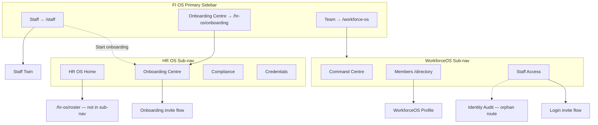
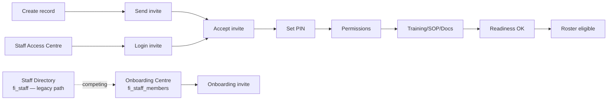

# WorkforceOS UI Cohesion Audit

**Date:** July 2026  
**Scope:** UX / navigation / information architecture — no backend removal  
**Principle:** One staff member · one profile · one lifecycle · one access state · one readiness state · one place to understand what needs doing.

---

## Executive summary

WorkforceOS is functionally rich but **fragmented across three parallel surfaces**:

| Surface | Route prefix | Primary data model | Typical admin mental model |
|---------|--------------|-------------------|---------------------------|
| **FI Staff Directory** | `/staff` | `fi_staff` | “Settings → add people” |
| **WorkforceOS** | `/workforce-os` | `fi_staff_members` + intelligence | “Team governance” |
| **HR OS** | `/hr-os` | HR sync + compliance + roster | “HR compliance hub” |

Admins currently need **4–6 pages** to answer: *“Is this person ready to work, can they log in, and what’s blocking them?”*

The highest-impact friction is **competing create/invite paths** and **inconsistent naming** (HR OS vs WorkforceOS vs Staff vs Access vs Onboarding).

---

## Route & component inventory

### WorkforceOS (`/workforce-os/*`)

| Route | Component | Title | Primary actions |
|-------|-----------|-------|-----------------|
| `/workforce-os` | `WorkforceCommandCentreClient` | Workforce Intelligence Centre | Planning, procedure staffing, payroll, HR reconciliation |
| `/workforce-os/planning` | `WorkforceOsPlanningClient` | Workforce planning engine | Date nav, refresh |
| `/workforce-os/procedure-staffing` | `WorkforceOsProcedureStaffingClient` | Procedure staffing optimizer | Optimizer actions |
| `/workforce-os/payroll` | `WorkforceOsPayrollClient` | Payroll & wage engine | Wage/timesheet, breaks |
| `/workforce-os/shift-cost` | `WorkforceOsShiftCostClient` | Shift cost intelligence | Analytics |
| `/workforce-os/recruitment` | `WorkforceOsRecruitmentClient` | Recruitment pipeline | Add candidate |
| `/workforce-os/hr-reconciliation` | `HrReconciliationClient` | Link staff to IIOHR | Approve links |
| `/workforce-os/directory` | `WorkforceOsDirectoryClient` | Workforce members | Filter lifecycle rows |
| `/workforce-os/staff/{id}` | `WorkforceOsStaffProfileClient` | Staff lifecycle profile | Edit, employment, archive, HR link |
| `/workforce-os/staff-access` | `StaffAccessCentreClient` | Staff Access Centre | Send/resend invite, PIN reset, suspend, revoke |
| `/workforce-os/staff-identity-audit` | `StaffIdentityReadinessAuditClient` | Staff identity readiness | Read-only audit |
| `/workforce-os/staff-access/accept/{token}` | `StaffAccessAcceptClient` | Staff access invitation | Accept + PIN |
| `/workforce-os/staff-access/pin-setup/{token}` | `StaffAccessPinSetupClient` | Set staff PIN | PIN submit |

**Nav gap:** Identity Audit is not in `WorkforceOsSubNav` or primary sidebar.

### HR OS (`/hr-os/*`)

| Route | Component | Title | Primary actions |
|-------|-----------|-------|-----------------|
| `/hr-os` | Dashboard + `HrOsSubNav` | HR OS | Links to sub-modules |
| `/hr-os/onboarding` | `OnboardingCentreClient` | Onboarding Centre | **Create staff member**, send/resend onboarding invite |
| `/hr-os/offboarding` | `OffboardingCentreClient` | Offboarding Centre | Offboard staff |
| `/hr-os/credentials` | `StaffCredentialsClient` | Credentials | Add credential |
| `/hr-os/certifications` | `StaffCertificationClient` | Certifications | Add/verify certification |
| `/hr-os/compliance` | `StaffComplianceClient` | Compliance | Run audit |
| `/hr-os/roster` | `RosterCommandCentreView` | Roster Command Centre | Assign staff to events |
| `/hr-os/staff-reconciliation` | `StaffReconciliationDecisionClient` | Staff Reconciliation | Approve merges |
| `/hr-os/duplicates` | `DuplicateReviewClient` | Duplicate Review | Merge/dismiss |
| `/hr-os/sync-health` | `HrSyncHealthClient` | HR sync health | Sync diagnostics |

**Nav gap:** Roster exists but is not in `HrOsSubNav` pills — only linked from HR OS home.

### FI Staff (`/staff/*`)

| Route | Component | Title | Primary actions |
|-------|-----------|-------|-----------------|
| `/staff` | `StaffDirectoryClient` | Staff Directory | ~~Add staff~~ → **Start onboarding** (fixed), Edit |
| `/staff/{id}/twin` | Staff Twin panels | Staff Twin | Read-only + admin PIN |
| `/staff/link-users` | `StaffLinkUsersClient` | Link staff to login users | Bulk link |
| `/staff/role-review` | `StaffRoleReviewClient` | Assign staff roles | Save roles |

### Settings & legacy

| Route | Purpose |
|-------|---------|
| `/settings/staff-access` | Module entitlements + field access (`StaffAccessSection`) — **not** login/PIN provisioning |
| `/hr/staff-readiness` | Legacy readiness export + HR sync |
| `/hr/staff-import` | IIOHR import |
| `/onboarding/invite/{token}` | New-hire onboarding accept flow |

### Training / SOP / documents

| Concern | Where it lives | Gap |
|---------|----------------|-----|
| Training checklist | Onboarding Centre — “Mark training done” | No per-staff training hub in FI |
| Training compliance | Staff Twin IIOHR card, `/hr/staff-readiness` | Not linked from profiles |
| SOP acknowledgements | Readiness engine scoring only | **No SOP management UI** |
| HR documents | IIOHR (external) | No FI documents centre per staff |

---

## Navigation topology (current)

---

## Findings by audit category

### 1. Duplicate or competing entry points

| Intent | Competing paths | Severity |
|--------|-----------------|----------|
| Add/create staff | Staff Directory inline create; Onboarding Centre create; dead `WorkforceCommandCentreView` “Add staff” | **Critical** — fixed primary CTA |
| Send invite | Onboarding Centre (onboarding invite); Staff Access Centre (login invite) | **Critical** — different invitation types |
| View staff profile | Staff Twin; WorkforceOS profile; Directory inline edit | **High** |
| Workforce “command centre” | `/workforce-os` (Intelligence); `/staff` mislabeled in HR OS home; legacy orphaned component | **High** |
| Staff readiness | Intelligence Centre; `/hr/staff-readiness`; Staff Twin card; Identity Audit | **Medium** |
| Compliance | HR OS Compliance; Twin IIOHR card; directory compliance pills | **Medium** |
| Settings staff access | `/settings/staff-access` (entitlements) vs `/workforce-os/staff-access` (login/PIN) | **High** — name collision |

### 2. Dead or confusing buttons

| Location | Issue |
|----------|-------|
| Staff Directory | ~~“Add staff” opened inline create competing with Onboarding~~ → **Fixed: “Start onboarding”** |
| `WorkforceCommandCentreView.tsx` | Orphaned component with “Add staff”, “Assign training” — never mounted |
| HR OS home / Offboarding footer | Links `/staff` as “Workforce Command Centre” — wrong destination |
| Identity Audit | Recommended actions are text-only, not deep links |
| Onboarding Centre | Shows “Access suspended” but no suspend/revoke actions |

### 3. Pages that should be tabs/panels inside Staff Profile

| Current standalone page | Recommended profile tab |
|---------------------------|-------------------------|
| Staff Access row actions | **Access** tab (embed queue row) |
| Onboarding checklist | **Onboarding** tab |
| Credentials / certifications (per person) | **Documents** tab |
| Training / SOP state | **Training** / **SOPs** tabs |
| Roster availability | **Roster** tab |
| Identity audit row | **Audit history** tab |
| WorkforceOS lifecycle panel | **Overview** tab |

### 4. Same staff state shown differently

| Dimension | Staff Directory | Staff Access | Onboarding | Identity Audit | Staff Twin |
|-----------|----------------|--------------|------------|----------------|------------|
| Employment | Active/Inactive only | Raw employment_status | employment in queue | Employment column | Active/Inactive badge |
| Login/access | Not shown | Login + invite labels | Invite + suspended | Login + workspace | FI login panel |
| PIN | Edit panel only | PIN column | Checklist item | PIN column | PIN panel |
| Readiness | Score pill | Not shown | Not shown | Onboarding column | Full card |
| Compliance | Pill | Not shown | Training checklist | Not shown | IIOHR card |
| Lifecycle | Not shown | Archived filter | Queue status | Recommended action | Workforce identity |

### 5. Missing cross-links

| From | To | Status |
|------|-----|--------|
| Staff Directory | Onboarding Centre | **Fixed** |
| Staff Directory | Staff Access | **Fixed** |
| Staff Profile | Staff Access state | Missing |
| Staff Profile | Onboarding checklist | Missing |
| Staff Profile | Compliance/Training/SOP | Missing |
| Staff Profile | Roster/eligibility | Missing |
| Onboarding Centre | Staff Access | One-way info notice only |
| Identity Audit | Action surfaces | Text recommendations only |
| Workforce Command Centre | Blocker surfaces | Partial via module tiles |

### 6. Confusing labels

| Term | Current usage | Recommended |
|------|---------------|-------------|
| HR OS | Sub-nav module name, onboarding host | Keep for HR sync/compliance; avoid in staff lifecycle CTAs |
| WorkforceOS / Team | Sidebar “Team”, Intelligence Centre title | **“Workforce”** for operating area |
| Staff | Directory, Twin, members, access | Qualify: “Staff Directory”, “Staff Profile”, “Staff Access” |
| Workforce Command Centre | Used for `/staff`, `/workforce-os`, legacy view | Reserve for `/workforce-os` landing only |
| Staff Access | Two routes with same name | Settings: “Staff entitlements”; Ops: “Staff Access” |

### 7. Permission states as broken buttons

- Staff Access actions correctly hidden when `canManage` is false — good pattern.
- Onboarding Centre shows read-only notice when cannot manage — good.
- Staff Directory edit/create gated by `canManageStaff` — create path de-emphasized.
- Settings `StaffAccessSection` may show Save when user lacks grant — verify per existing RBAC (out of scope for this pass).

### 8. Staff lifecycle gaps

**Gaps identified:**

1. **Two create paths** — `fi_staff` inline vs `fi_staff_members` onboarding (partially addressed).
2. **Two invite types** — onboarding vs login; no in-flow guidance on which to use.
3. **No unified profile** bridging `fi_staff` ↔ `fi_staff_members`.
4. **Identity Audit** not discoverable; fixes require manual navigation.
5. **Roster** disconnected from access/readiness state in UI.
6. **SOP** invisible except in engine scores.

---

## Per-area audit notes

### Staff Directory (`/staff`)

- **Before:** Primary CTA “Add staff” opened inline `fi_staff` create — bypassed onboarding lifecycle.
- **After (immediate fix):** Primary CTA “Start onboarding” → `/hr-os/onboarding`; lifecycle guidance card; cross-links to Staff Access and Command Centre.
- **Remaining:** Row cards still show readiness/compliance without access/onboarding state; edit panel still allows direct record mutation (intentionally retained for existing staff configuration).

### Staff Profile

Three non-tabbed surfaces with no cross-navigation. Target: single profile with tabs (see plan).

### Onboarding Centre

Well-scoped for new hires. Missing links to Staff Access, WorkforceOS profile, Identity Audit.

### Staff Access Centre

Correct operational queue for existing staff login/PIN. Footer points to Onboarding for new hires — good. Should be embeddable in profile Access tab.

### Workforce Command Centre

Live page is **Workforce Intelligence Centre** (executive KPIs). Does not yet surface per-staff blocker queue aligned to user’s target IA. Legacy `WorkforceCommandCentreView` had attention queue — consider porting pattern.

### Staff Identity Readiness Audit

Strong diagnostic surface; orphan route; read-only; recommended actions not clickable.

### Documents & Compliance / Training / SOP

Organisation-level list pages under HR OS. No person-centric hub. SOP has no admin UI.

### Roster Command Centre

Functional assignment editor. No staff lifecycle cross-links. Candidate eligibility uses server signals not surfaced in profile.

### HR OS / WorkforceOS nav

- Sidebar: Staff, Onboarding Centre, Team (→ workforce-os).
- Dashboard “Team” card → `/hr-os` (different from sidebar Team).
- `WorkforceOsSubNav` missing Identity Audit and Roster.
- `HrOsSubNav` missing Roster.

### Settings → Staff

`/settings/staff-access` = module entitlements (different from login provisioning). `/staff` linked from clinic settings nav.

---

## Immediate fixes applied (this sprint)

1. Staff Directory primary action renamed **“Start onboarding”** → routes to Onboarding Centre.
2. Lifecycle guidance copy and cross-links added to Staff Directory.
3. Empty state updated: “New staff start in Onboarding Centre.”
4. Foundation: `staffLifecycleUxCore.ts` + `StaffStatusCard.tsx` + unit tests for action resolution.

---

## Risk register (do not break)

| Flow | Risk if changed | Mitigation |
|------|-----------------|------------|
| Onboarding invite lifecycle | Breaking accept/PIN path | No changes to token routes or actions |
| Login invite lifecycle | Wrong invite type sent | Keep centres separate; improve copy/links only |
| PIN setup/reset | Admin vs staff paths | No changes to `StaffPinSettingsPanel` or access actions |
| Suspend/revoke | Security regression | Action logic unchanged; UX core wraps existing flags |
| Sidebar scrolling | Layout regression | No layout changes in this pass |
| Navigation loading feedback | Pending state loss | Continue using `FiOsPendingActionButton` pattern |

---

## Appendix: file reference

| Area | Key paths |
|------|-----------|
| Directory UI | `src/components/fi/staff/StaffDirectoryClient.tsx`, `StaffDirectorySecondaryView.tsx` |
| Onboarding | `src/components/fi-admin/hr/OnboardingCentreClient.tsx` |
| Access | `src/components/fi/workforce/StaffAccessCentreClient.tsx` |
| Command centre | `src/components/fi-admin/workforce/WorkforceCommandCentreClient.tsx` |
| Identity audit | `src/components/fi/workforce/StaffIdentityReadinessAuditClient.tsx` |
| Roster | `src/components/fi/workforce/RosterCommandCentreView.tsx` |
| Lifecycle UX core | `src/lib/workforce/staffLifecycleUxCore.ts` |
| Nav | `src/lib/fiAdmin/fiOsShellPrimaryNav.ts`, `WorkforceOsSubNav.tsx`, `HrOsSubNav.tsx` |
