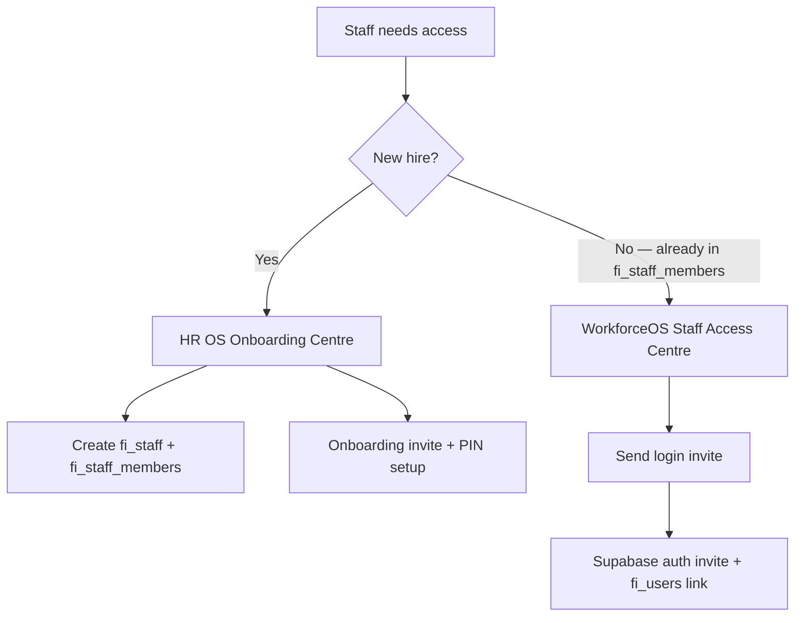

# WorkforceOS — Staff Access Centre

Provision **login access** for existing active staff who already exist in `fi_staff_members` without creating a new staff record through the Onboarding Centre.

## Route

| Route | Purpose |
|-------|---------|
| `/fi-admin/[tenantId]/workforce-os/staff-access` | Staff Access Centre — login invites, PIN status, permission templates |

Related routes:

| Route | Purpose |
|-------|---------|
| `/fi-admin/[tenantId]/workforce-os/directory` | Workforce members — employment & HR link |
| `/fi-admin/[tenantId]/hr-os/onboarding` | **New hires** — create staff + onboarding PIN flow |
| `/fi-admin/[tenantId]/staff/link-users` | Bulk repair — link unlinked `fi_staff` to `fi_users` |
| `/fi-admin/[tenantId]/settings/staff-access` | SA-1 permission template configuration |

## When to use which workflow

## Staff Access Centre columns

| Column | Source |
|--------|--------|
| Name / email | `fi_staff_members` |
| Role | `fi_staff_members.role_code` |
| Employment status | `fi_staff_members.employment_status` |
| Login status | `fi_staff.fi_user_id` → `fi_users.auth_user_id` → Supabase auth confirmation |
| PIN status | `fi_staff_pins` (derived) |
| Permission template | `role_code` → SA-1 `fi_role_permission_templates` label |
| Invite status | `fi_staff_login_invitations` |

### Login status values

| Status | Meaning |
|--------|---------|
| **Login Active** | Auth user confirmed or has signed in |
| **Invite Pending** | `fi_users` linked to auth user, awaiting first sign-in |
| **No Login** | No linked auth user — eligible for invite when active + email |
| **Suspended** | `employment_status = suspended` or access blocked |
| **Revoked** | `system_access_revoked = true` |

## Actions

| Action | Effect |
|--------|--------|
| **Send login invite** | Creates/reuses `fi_users`, links `fi_staff.fi_user_id`, sends Supabase auth invite, records `fi_staff_login_invitations` |
| **Resend invite** | Refreshes `invited_at` / `expires_at` on pending invitation and regenerates auth link |
| **Copy invite link** | Returns stored Supabase magic link for manual delivery |
| **Suspend access** | Sets `employment_status = suspended`, `system_access_revoked`, disables PIN |
| **Revoke access** | Unlinks `fi_user_id`, revokes SA-1 grants, disables PIN, marks invites revoked |

## Eligibility rules

Staff **can** receive a login invite when:

- `archived_at` is null
- `employment_status` is not departed (`terminated`, `resigned`, `contract_ended`, `contract_expired`, `merged`)
- Has a non-empty email
- No active login (`Login Active` status)
- `system_access_revoked` is false

Staff **cannot** receive a login invite when:

- Archived
- Departed employment status
- Already has **Login Active**
- Missing email

No new `fi_staff_members` row is required. If `fi_staff_id` is missing, a projection row in `fi_staff` is created and linked automatically before invite provisioning.

## Screenshots

> Placeholder — capture from `/fi-admin/[tenantId]/workforce-os/staff-access` after deployment.

*Figure 1: Staff Access Centre table with login, PIN, permission template, and invite columns.*

*Figure 2: Send login invite for active staff without linked auth user.*

## Database

Migration: `supabase/migrations/202610017018_workforceos_staff_access_centre.sql`

Table: `fi_staff_login_invitations` — isolated from onboarding invitations (`fi_staff_onboarding_invitations`).

## Tests

Pure eligibility tests: `src/lib/workforce/staffAccessCentreCore.test.ts`

- Active staff without login can receive invite
- Active staff with login shows Login Active
- Departed staff cannot receive invite
- Archived staff cannot receive invite
- Resend updates invitation timestamp

## Permissions

Same gate as WorkforceOS HR operations: owner, `fi_admin`, admin, or `hr_manager` (via `assertWorkforceHrManageAllowed`).
